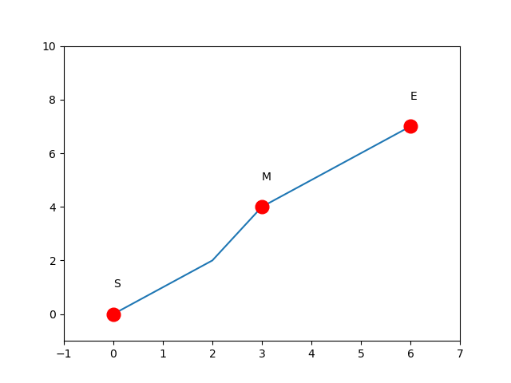
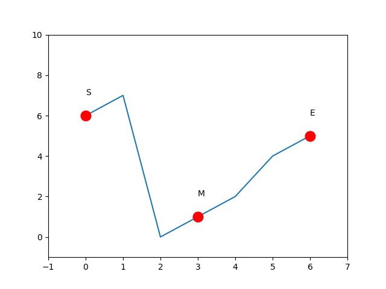
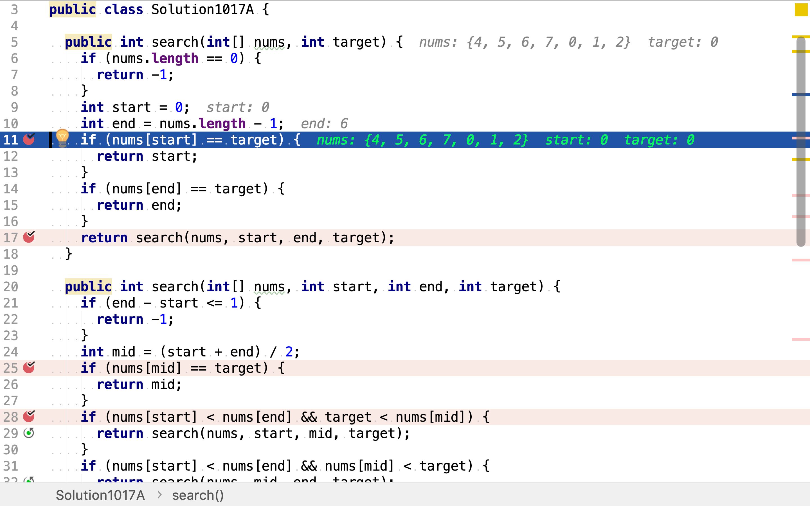
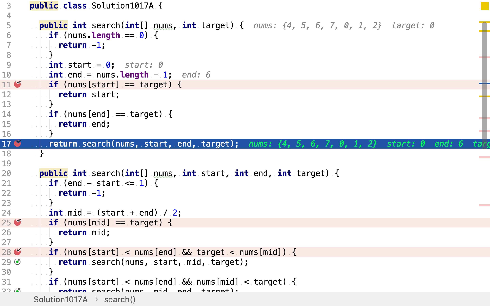
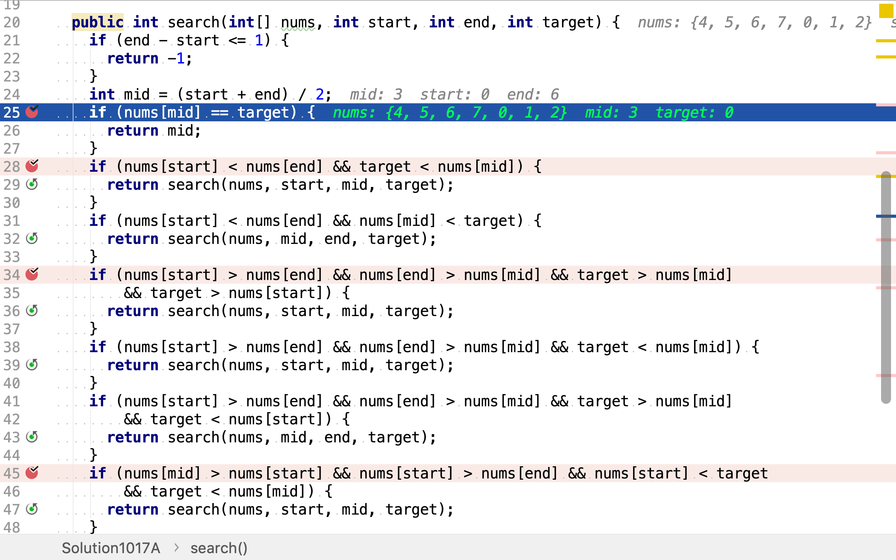
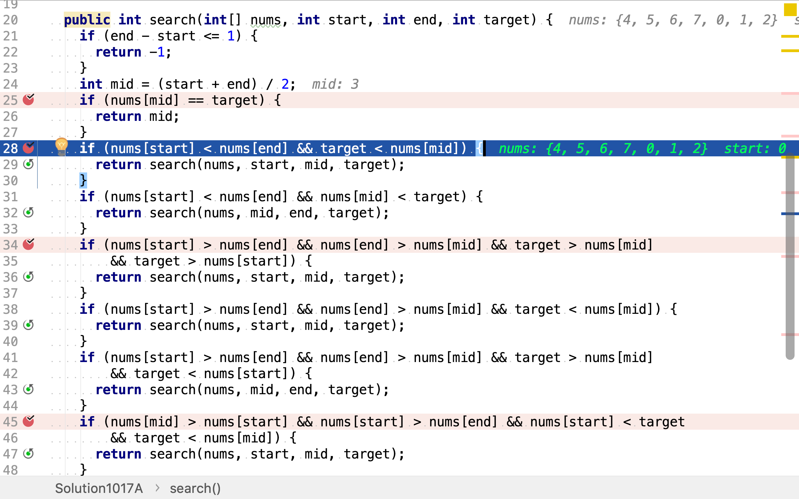
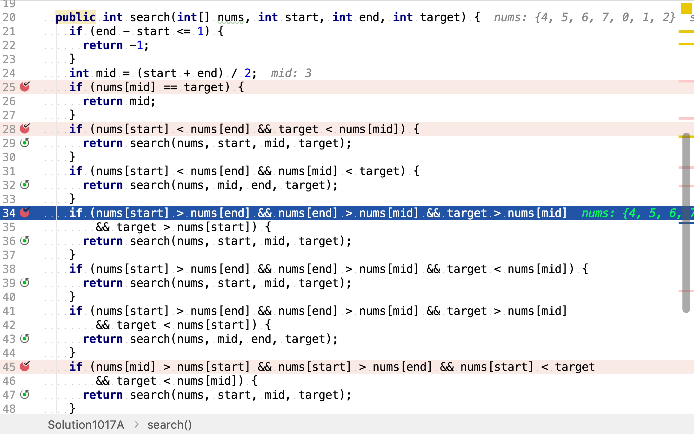
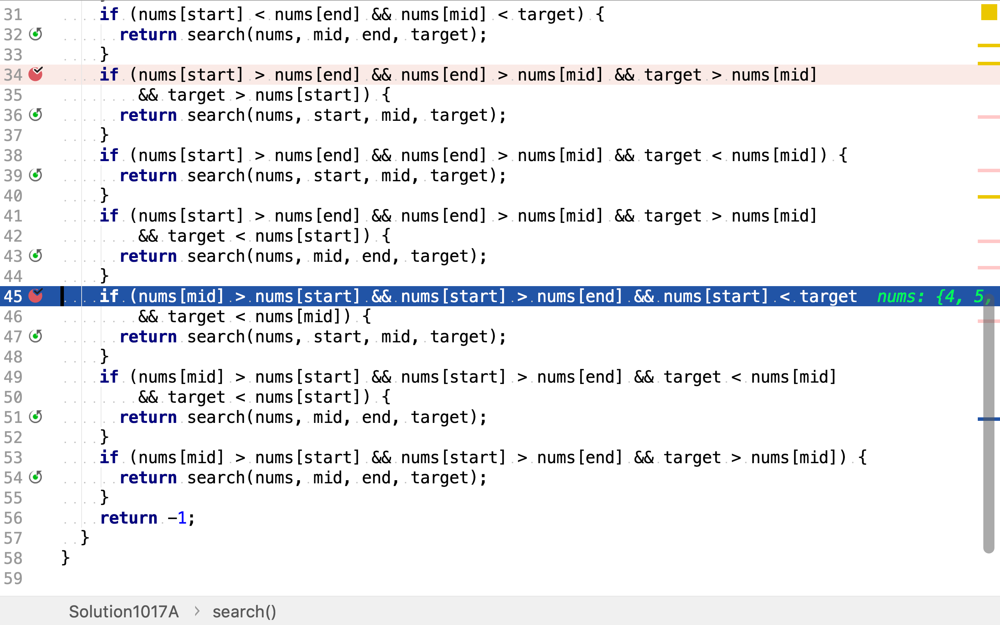

# 搜索旋轉排序數組

## 題目

>假設按照升序排序的數組在預先未知的某個點上進行了旋轉。
>
>(例如，數組`[0,1,2,4,5,6,7]`可能變為`[4,5,6,7,0,1,2]`)。
>
>搜索一個給定的目標值，如果數組中存在這個目標值，則返回它的索引，否則返回`-1`。
>
>你可以假設數組中不存在重複的元素。
>
>你的算法時間複雜度必須是 O(log n) 級別。
>
>**示例1：**
>
>```
>輸入: nums = [4,5,6,7,0,1,2], target = 0
>輸出: 4
>```
>
>**示例2：**
>
>```
>輸入: nums = [4,5,6,7,0,1,2], target = 3
>輸出: -1
>```

## 二分搜尋法

>在電腦科學中，二分搜尋（英語：binary search），也稱折半搜尋（英語：half-interval search）、對數搜尋（英語：logarithmic search），是一種在有序陣列中尋找某一特定元素的搜尋演算法。搜尋過程從陣列的中間元素開始，如果中間元素正好是要尋找的元素，則搜尋過程結束；如果某一特定元素大於或者小於中間元素，則在陣列大於或小於中間元素的那一半中尋找，而且跟開始一樣從中間元素開始比較。如果在某一步驟陣列為空，則代表找不到。這種搜尋演算法每一次比較都使搜尋範圍縮小一半。
>
>二分搜尋在情況下的複雜度是對數時間，進行$$O(\log n)$$次比較操作（$$n$$在此處是陣列的元素數量，$$O$$是大O記號，$$\log$$是對數）。二分搜尋使用常數空間，無論對任何大小的輸入資料，演算法使用的空間都是一樣的。除非輸入資料數量很少，否則二分搜尋比線性搜尋更快，但陣列必須事先被排序。儘管特定的、為了快速搜尋而設計的資料結構更有效（比如雜湊表），二分搜尋應用面更廣。

舉個例子，給定升序有序數列`[0,1,2,4,5,6,7]`，搜尋`2`。

首先，檢測最中間的元素`4`不是所搜尋的值，且`4`大於`2`。因為數列是升序有序的，所以如果`2`存在則肯定在`4`的左邊。

然後，在`4`的左邊半個數組中搜尋。先檢測左半個數組的中間值`1`不是所搜尋的值，且`1`小於`2`。因為數組是升序有序的，所以若`2`存在則肯定在`2`與`4`之間的四分之一數組中。

再然後，在`2`和`4`之間的四分之一數組中搜尋。先檢測中間值`2`是所搜尋的目標值。至此找到目標值。

將上述不斷縮小搜尋範圍的過程以二叉樹的形式展示為：

```plantuml
digraph d {
    root [shape=record, label="0|1|2|4|5|6|7"]
    a [shape=record, label="0|1|2"]
    b [shape=record, label="5|6|7"]
    root -> a
    root -> b

    aa [shape=record, label="0"]
    ab [shape=record, label="2", style=filled, fillcolor=green]
    a -> aa
    a -> ab
}
```

本題中的數組有些不同，是被旋轉過的升序有序數組。搜尋方式依舊使用「二分搜尋法」，但判斷目標值在左或右半部數組的方法有些許不同。

記旋轉過的升序有序數組的第一個元素值為`S`，最後一個元素值為`E`，中間元素值為`M`。`S, M, E`之間的關係可分為三類：

1. 數組沒有旋轉，`S`和`E`之間都是升序有序的，$$S < M < E $$。若目標值`T`小於`M`，則其一定位於`M`左側`S`和`M`之間；若目標值`T`大於`M`，則其一定位於`M`右側`M`和`E`之間。



2. 數組在`S`和`M`之間旋轉，$$M < E < S$$。若目標值`T`小於`M`則其一定位於`S`和`M`之間；若目標值`T`大於`S`則其一定位於`S`和`M`之間；若目標值`T`大於`M`且小於`S`則其一定位於`M`和`E`之間。



3. 數組在`M`和`E`之間旋轉，$$E < S < M$$。若目標值`T`大於`S`且小於`M`則其一定位於`S`和`M`之間；若目標值`T`小於`M`且小於`S`則其一定位於`M`和`E`之間；若目標值`T`大於`M`則其一定位於`M`和`E`之間。


### 代碼

[include](../../../src/main/java/io/github/rscai/leetcode/bytedance/array/Solution1017A.java)

首先，檢測頭尾是否為目標值。



然後，開始二分搜尋。



二分搜尋先計算中間位置並檢測目標值是否位於中間位置。



若目標值不位於中間位置，則判斷其位於中間位置左側或右側。這𥚃分三種情況。

第一種，數組沒有旋轉。若目標值小於中間值則其位於左側，若目標值大於中間值則其位於右側。



第二種，數組在`S`和`M`之間旋轉了。若目標值大於中間值且大於頭部值，則其位於左側；若目標值小於中間值，則其位於左側；若目標值大於中間值且小於頭部值，則其位於右側。



第三種，數組在`M`和`E`之間旋轉了。若目標值大於頭部值且小於中間值，則其位於大側；若目標值小於中間值且小於頭部值，則其位於右側；若目標值大於中間值，則其位於右側。



### 複雜度分析

#### 時間複雜度

最壞情況下，將數組二分至僅有一個元素。將一個$$n$$長的數組二分至僅有一個元素，而要$$\log{n}$$次。所以時間複雜度為$$\mathcal{O}(\log{n})$$。

#### 空間複雜度

使用了三個局部變量`start, end, mid`。空間複雜度為$$\mathcal{O}(1)$$。

## 參考

* [二分搜尋演算法](https://zh.wikipedia.org/wiki/二分搜尋演算法)