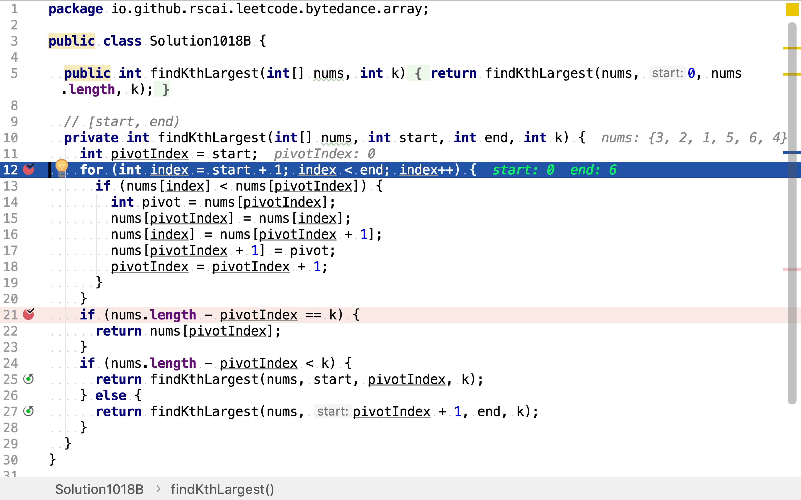
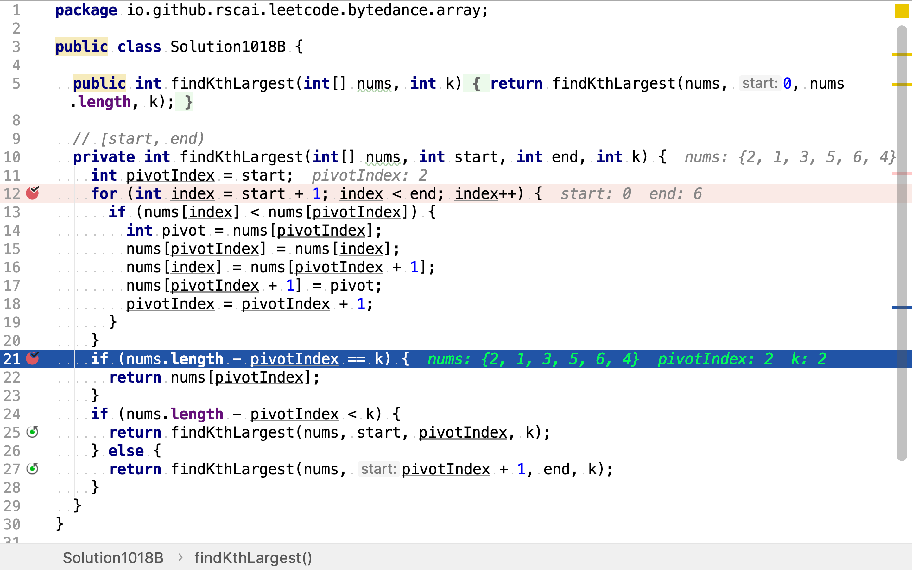

# 數組中的第K個最大元素

## 題目

>在未排序的數組中找到第 k 個最大的元素。請注意，你需要找的是數組排序後的第 k 個最大的元素，而不是第 k 個不同的元素。
>
>**示例 1:**
>
>```
>輸入: [3,2,1,5,6,4] 和 k = 2
>輸出: 5
>```
>
>**示例 2:**
>
>```
>輸入: [3,2,3,1,2,4,5,5,6] 和 k = 4
>輸出: 4
>```
>
>**說明:**
>
>你可以假設 k 總是有效的，且 1 ≤ k ≤ 數組的長度。

## 快速排序法

先使用JDK提供的快速排序算法排序數組，再取倒數第k個值。

>### 快速排序
>
>快速排序（英語：Quicksort），又稱劃分交換排序（partition-exchange sort），簡稱快排，一種排序演算法，最早由東尼·霍爾提出。在平均狀況下，排序$$n$$個項目要$${\displaystyle \ O(n\log n)}$$（大O符號）次比較。在最壞狀況下則需要$${\displaystyle O(n^{2})}$$次比較，但這種狀況並不常見。事實上，快速排序$${\displaystyle \Theta (n\log n)}$$通常明顯比其他演算法更快，因為它的內部迴圈（inner loop）可以在大部分的架構上很有效率地達成。
>
>#### 演算法
>
>快速排序使用分治法（Divide and conquer）策略來把一個序列（list）分為較小和較大的2個子序列，然後遞迴地排序兩個子序列。
>
>步驟為：
>
>1. 挑選基準值：從數列中挑出一個元素，稱為「基準」（pivot），
>2. 分割：重新排序數列，所有比基準值小的元素擺放在基準前面，所有比基準值大的元素擺在基準後面（與基準值相等的數可以到任何一邊）。在這個分割結束之後，對基準值的排序就已經完成，
>3. 遞迴排序子序列：遞迴地將小於基準值元素的子序列和大於基準值元素的子序列排序。
>
>遞迴到最底部的判斷條件是數列的大小是零或一，此時該數列顯然已經有序。

### 代碼

[include](../../../src/main/java/io/github/rscai/leetcode/bytedance/array/Solution1018A.java)


```java
    /*
     * Sorting methods. Note that all public "sort" methods take the
     * same form: Performing argument checks if necessary, and then
     * expanding arguments into those required for the internal
     * implementation methods residing in other package-private
     * classes (except for legacyMergeSort, included in this class).
     */

    /**
     * Sorts the specified array into ascending numerical order.
     *
     * <p>Implementation note: The sorting algorithm is a Dual-Pivot Quicksort
     * by Vladimir Yaroslavskiy, Jon Bentley, and Joshua Bloch. This algorithm
     * offers O(n log(n)) performance on many data sets that cause other
     * quicksorts to degrade to quadratic performance, and is typically
     * faster than traditional (one-pivot) Quicksort implementations.
     *
     * @param a the array to be sorted
     */
    public static void sort(int[] a) {
        DualPivotQuicksort.sort(a, 0, a.length - 1, null, 0, 0);
    }
```

### 複雜度分析

#### 時間複雜度

`Arrays.sort`實現的是「Dual-Pivot」快速排序。時間複雜度是$$\mathcal{O}(n \log{n})$$。

## 二分定位法

快速排序使用「基準（pivot）」將數組分為大小兩個子數組，再遞歸排序兩個子數組。當大小兩個數組劃分完成時，基準所處的位置即其在有序數組中最終所處的位置。所有小數子數組中的元素其最終位置都小於基準，所有大數子数組中的元素其最終位置都大於基準。所以，在確定基準元素所處位置後，就可以確定所求第k個元素處於大小兩個子數組中的某一個。

舉個例子，給定數組`[3,2,1,5,6,4]`，求第2大的值。

首先，以`3`為基準，將小於`3`的值都移到左側﹐大於等於`3`的值都移到右側，得到數組`[2,1,3,5,6,4]`。基準`3`位置`2`(0-based)，其是第4大元素，第2大的元素在右側大於`3`的子數組中。

然後，在右側子數組`[5,6,4]`中，以`5`為基準，將小於`5`的元素都移至其左側，大於等於`5`的元素移至右側，得到數組`[4,5,6]`。基準`5`位置`1`，正是所求第`2`大的元素。

```plantuml
digraph d {
    root [shape=record, label="3|2|1|5|6|4"]
    a [shape=record, label="2|1"]
    p [shape=record, label="3"]
    b [shape=record, label="5|6|4"]
    root -> a
    root -> p
    root -> b

    ba [shape=record, label="4"]
    bp [shape=record, label="5"]
    bb [shape=record, label="6"]
    b -> ba
    b -> bp
    b -> bb
}
```

### 代碼

[include](../../../src/main/java/io/github/rscai/leetcode/bytedance/array/Solution1018B.java)

先使用「快速排序」中使用的基準法，將數組分為小於和大於基準的兩部份。



然後，判斷基準是否就是所求第k大值。若是則計算結束；若第k大值在小於基準的子數組中，則在其中遞歸尋找第k大值；若第k大值在大於基準的子數組中，則在其中遞歸尋找第k大值。



### 複雜度分析

#### 時間複雜度

一般情況下，每一次基準都把數組分成相等的兩部份。設初始數組長度$$n$$，則每一次劃分後的一個數組長度為$$\frac{n}{2^0}, \frac{n}{2^1}, \frac{n}{2^2}, ..., 1$$。時間複雜度為所有數組長度的累和：

$$
\begin{aligned}
C_{time} &= \frac{n}{2^0} + \frac{n}{2^1} + \frac{n}{2^2} + ... + 1 \\
&= \frac{2 \times (\frac{n}{2^0} + \frac{n}{2^1} + \frac{n}{2^2} + ... + 1) - 1 \times (\frac{n}{2^0} + \frac{n}{2^1} + \frac{n}{2^2} + ... + 1)}{2 - 1} \\
&= (2n + \frac{n}{2^0} + \frac{n}{2^1}  + ... + 2) - (\frac{n}{2^0} + \frac{n}{2^1} + \frac{n}{2^2} + ... + 1) \\
&= 2n +1 \\
&= \mathcal{O}(n)
\end{aligned}
$$

#### 空間複雜度

使用四個變量`start, end, pivotIndex, pivot`。空間複雜度為$$\mathcal{O}(1)$$。

## 參考

* [快速排序](https://zh.wikipedia.org/wiki/快速排序)