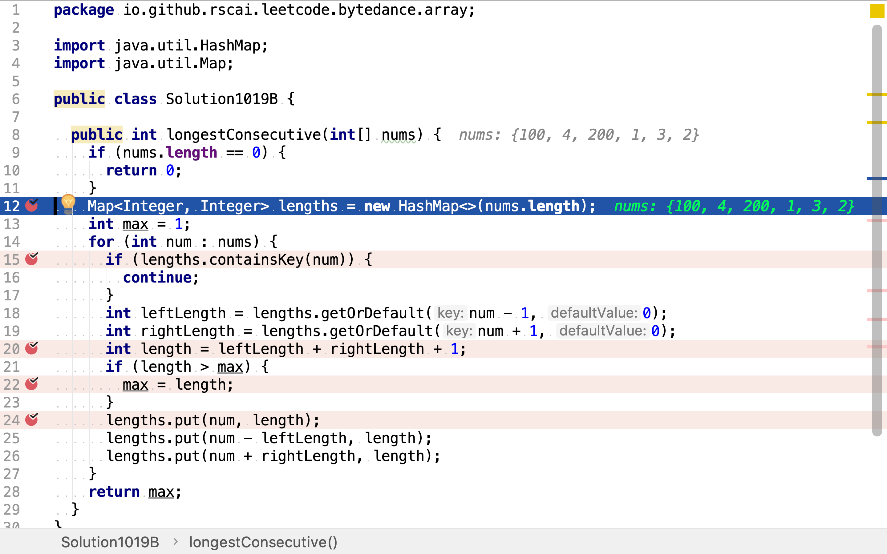
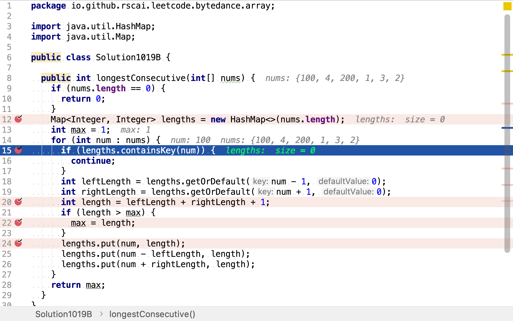
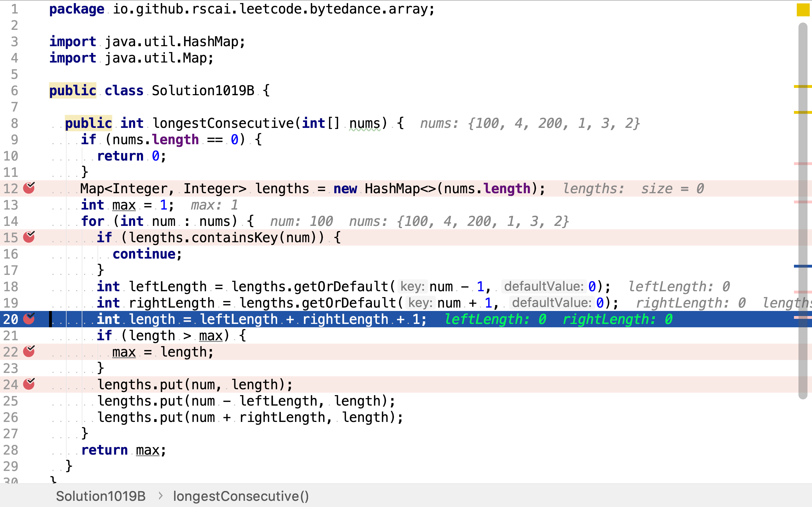
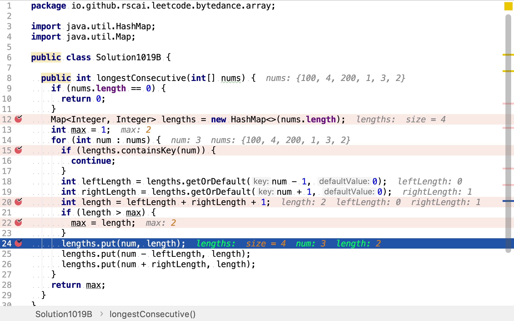
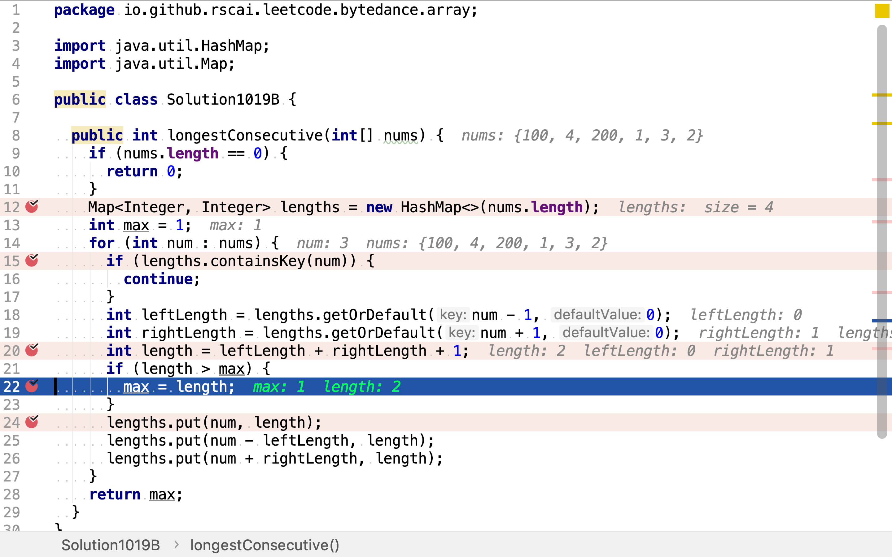

# 最長連續序列

## 題目

>給定一個未排序的整數數組，找出最長連續序列的長度。
>
>要求算法的時間複雜度為 O(n)。
>
>**示例:**
>
>```
>輸入: [100, 4, 200, 1, 3, 2]
>輸出: 4
>解釋: 最長連續序列是 [1, 2, 3, 4]。它的長度為 4。
>```

## 快速排序法

先使用「快速排序」將無序數組轉換為有序遞增數組，再一次遍歷找出最長連續序列。

>### 快速排序
>
>快速排序（英語：Quicksort），又稱劃分交換排序（partition-exchange sort），簡稱快排，一種排序演算法，最早由東尼·霍爾提出。在平均狀況下，排序$$n$$個項目要$${\displaystyle \ O(n\log n)}$$（大O符號）次比較。在最壞狀況下則需要$${\displaystyle O(n^{2})}$$次比較，但這種狀況並不常見。事實上，快速排序$${\displaystyle \Theta (n\log n)}$$通常明顯比其他演算法更快，因為它的內部迴圈（inner loop）可以在大部分的架構上很有效率地達成。

### 代碼

[include](../../../src/main/java/io/github/rscai/leetcode/bytedance/array/Solution1019A.java)

`Arrays.sort`實現了Dual-Pivot快速排序。

```java
    /*
     * Sorting methods. Note that all public "sort" methods take the
     * same form: Performing argument checks if necessary, and then
     * expanding arguments into those required for the internal
     * implementation methods residing in other package-private
     * classes (except for legacyMergeSort, included in this class).
     */

    /**
     * Sorts the specified array into ascending numerical order.
     *
     * <p>Implementation note: The sorting algorithm is a Dual-Pivot Quicksort
     * by Vladimir Yaroslavskiy, Jon Bentley, and Joshua Bloch. This algorithm
     * offers O(n log(n)) performance on many data sets that cause other
     * quicksorts to degrade to quadratic performance, and is typically
     * faster than traditional (one-pivot) Quicksort implementations.
     *
     * @param a the array to be sorted
     */
    public static void sort(int[] a) {
        DualPivotQuicksort.sort(a, 0, a.length - 1, null, 0, 0);
    }
```

### 複雜度分析

#### 時間複雜度

`Arrays.sort`實現的Dual-Pivot快速排序時間複雜度為$$\mathcal{O}(n \log{n})$$，一次遍歷數組時間複雜度為$$\mathcal{O}(n)$$。總體時間複雜度為：

$$
\begin{aligned}
C_{time} &= \mathcal{O}(n \log{n}) + \mathcal{O}(n) \\
&= \mathcal{O}(n \log{n})
\end{aligned}
$$

#### 空間複雜度

`Arrays.sort`創建一個臨時數組用於排序。所以空間複雜度為$$\mathcal{O}(n)$$。

```java
        // Use or create temporary array b for merging
        int[] b;                 // temp array; alternates with a
        int ao, bo;              // array offsets from 'left'
        int blen = right - left; // space needed for b
        if (work == null || workLen < blen || workBase + blen > work.length) {
            work = new int[blen];
            workBase = 0;
        }
        if (odd == 0) {
            System.arraycopy(a, left, work, workBase, blen);
            b = a;
            bo = 0;
            a = work;
            ao = workBase - left;
        } else {
            b = work;
            ao = 0;
            bo = workBase - left;
        }
```

## 動態規劃法

>### 動態規劃
>
>動態規劃（英語：Dynamic programming，簡稱DP）是一種在數學、管理科學、電腦科學、經濟學和生物資訊學中使用的，通過把原問題分解為相對簡單的子問題的方式求解複雜問題的方法。
>
>動態規劃常常適用於有重疊子問題和最佳子結構性質的問題，動態規劃方法所耗時間往往遠少於樸素解法。
>
>動態規劃背後的基本思想非常簡單。大致上，若要解一個給定問題，我們需要解其不同部分（即子問題），再根據子問題的解以得出原問題的解。
>
>通常許多子問題非常相似，為此動態規劃法試圖僅僅解決每個子問題一次，從而減少計算量：一旦某個給定子問題的解已經算出，則將其記憶化儲存，以便下次需要同一個子問題解之時直接查表。這種做法在重複子問題的數目關於輸入的規模呈指數增長時特別有用。

一個整數所處於的連續子序列等於以其前繼值為邊的連續序列加其自身再加以甚後繼值為邊緣點的連續序列。遞推公式為：

$$
f(n) = f(n-1) + 1 + f(n+1)
$$

舉個例子，給定數組`[100, 4, 200, 1, 3, 2]`。`100`所處的連續序列長度等於以`99`為右邊端點的連續序列長度加`100`自身長度1再加以`101`為左邊端點的連續序列長度。依此類推，`4`所處的連續序列長度等於以`3`為右邊端點連續序列長度加自身長度1再加以`5`為左邊端點的連續序列長度。

將子問題之間的關係以樹的形式展現，可以發現有很多子樹是重復的，即這些子問題的解被依賴多次。存儲些子問題的解可以避免重復計算。

```plantuml
digraph d {
    root [label=""]
    a [label="f(100)"]
    b [label="f(4)"]
    c [label="f(200)"]
    d [label="f(1)"]
    e [label="f(3)"]
    f [label="f(2)"]
    root -> a
    root -> b
    root -> c
    root -> d
    root -> e
    root -> f

    aa [label="f(99)"]
    ab [label="f(101)"]
    a -> aa
    a -> ab

    ba [label="f(3)"]
    bb [label="f(5)"]
    b -> ba
    b -> bb

    baa [label="f(2)"]
    bab [label="f(4)"]
    ba -> baa
    ba -> bab

    bba [label="f(4)"]
    bbb [label="f(6)"]
    bb -> bba
    bb -> bbb

    ca [label="f(199)"]
    cb [label="f(201)"]
    c -> ca
    c -> cb

    da [label="f(0)"]
    db [label="f(2)"]
    d -> da
    d -> db

    daa [label="f(-1)"]
    dab [label="f(2)"]
    da -> daa
    da -> dab

    dba [label="f(1)"]
    dbb [label="f(3)"]
    db -> dba
    db -> dbb

    ea [label="f(2)"]
    eb [label="f(4)"]
    e -> ea
    e -> eb

    eaa [label="f(1)"]
    eab [label="f(3)"]
    ea -> eaa
    ea ->eab

    eba [label="f(3)"]
    ebb [label="f(5)"]
    eb -> eba
    eb -> ebb

    fa [label="f(1)"]
    fb [label="f(3)"]
    f -> fa
    f -> fb

    faa [label="f(0)"]
    fab [label="f(2)"]
    fa -> faa
    fa -> fab

    fba [label="f(2)"]
    fbb [label="f(4)"]
    fb -> fba
    fb -> fbb
}
```

### 代碼

[include](../../../src/main/java/io/github/rscai/leetcode/bytedance/array/Solution1019B.java)

首先，創建一個HashMap用以存儲子問題的解。



然後，遍歷數組，逐一計算子問題--包含某個元素的最長連續序列長度及邊緣端點。若該子問題已被計算過（HashMap中已包含該問題的解）則略過；



否則，計算該子問題。計算方法為：以其前繼為邊緣端點的連續序列長度加上以其後繼為邊緣端點的連續序列長度再加上自身長度1。



將子問題解存儲起來。同時得到了該點所處最長連續序列的左右邊緣點的解，同時也存儲起來。連續序列之間存在互相包含關係，如`[1, 2, 3]`包含`[1, 2]`。



在計算子問題的同時，尋找最長連續子序列。



### 複雜度分析

#### 時間複雜度

本演算法祇遍歷了一次數組，HashMap的讀寫操作都是常數時間複雜度。所以：

$$
\begin{aligned}
C_{time} &= \mathcal{O}(n) + \mathcal{O}(1) \\
&= \mathcal{O}(n)
\end{aligned}
$$

#### 空間複雜度

假設數組長度為$$n$$，HashMap最多保存$$n$$個鍵值對。空間複雜度為$$\mathcal{O}(n)$$。

## 參考

* [快速排序](https://zh.wikipedia.org/wiki/快速排序)
* [動態規劃](https://zh.wikipedia.org/wiki/動態規劃)