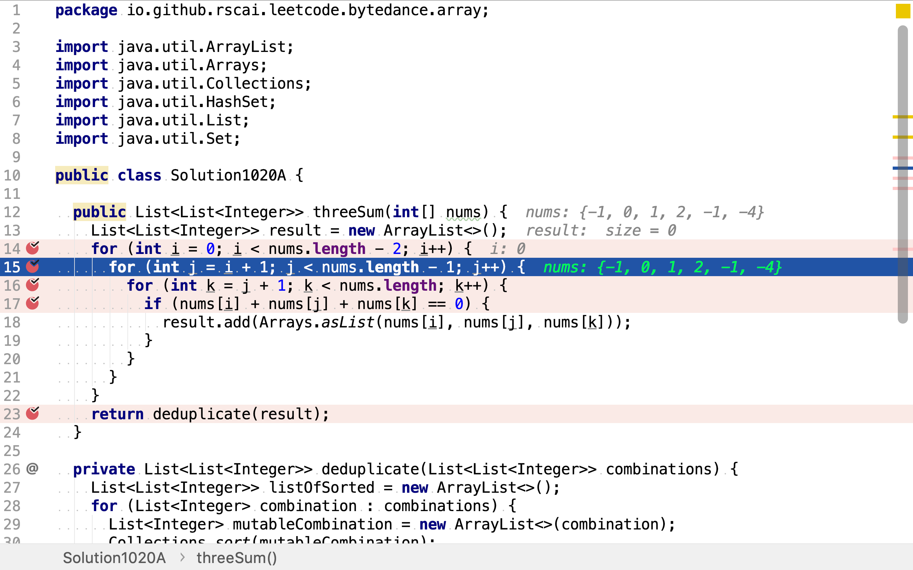

# 三數之和

## 題目

>給定一個包含 n 個整數的數組 nums，判斷 nums 中是否存在三個元素 a，b，c ，使得 a + b + c = 0 ？找出所有滿足條件且不重複的三元組。
>
>**注意：**答案中不可以包含重複的三元組。
>
>```
>例如, 給定數組 nums = [-1, 0, 1, 2, -1, -4]，
>
>滿足要求的三元組集合為：
>[
>  [-1, 0, 1],
>  [-1, -1, 2]
>]
>```

## 窮舉法

使用窮舉法羅列所有三元組組合。三元組由以下步驟產生：

1. 從數組中取出一個整數
2. 再從上個取出的整數後面取出一個整數
3. 再從上個取出的整數後面取出一個整數

**為避免產生重復的三元組，每個整數都是從三元組中上一個整數之後的剩餘整數中選取。（但元素值有重復的，所以依舊會有重復的三元組，但數量大幅減少了。）

然後再選取出和為0的三元組。

舉個例子，給定整數數組`[-1, 0, 1, 2, -1, -4]`。

1. 首先，從數組中取出一個整數。有`-1, 0, 1, 2`四種選擇。因為是三元組且第二個和第三個整數是從第一個整數之後的整數中選取的。所以第一個整數之後的剩餘整數不能少於2。
2. 然後，從第一個整數之後的剩餘整數中選取一個整數。若第一個整數選了第一個-1，則第二個整數有`0, 1, 2, -1`四種選擇；若第一個整數選了第二個0，則第二個整數有`1, 2, -1`三種選擇；依此類推。。。
3. 最後，從第二個整數之後的剩餘整數中選取一個整數。若第二個整數選了第二個0，則第三個整數有`1, 2, -1, -4`四種選擇；若第二個整數選了第三個1，則第三個整數有`2, -1, -4`三種選擇。

```plantuml
digraph d {
    root [label=""]
    a [label="-1"]
    b [label=0]
    c [label=1]
    d [label=2]
    root -> a
    root -> b
    root -> c
    root -> d

    aa [label=0]
    ab [label=1]
    ac [label=2]
    ad [label="-1"]
    a -> aa
    a -> ab
    a -> ac
    a -> ad

    aaa [label=1]
    aab [label=2]
    aac [label="-1"]
    aad [label="-4"]
    aa -> aaa
    aa -> aab
    aa -> aac
    aa -> aad

    aba [label=2]
    abb [label="-1"]
    abc [label="-4"]
    ab -> aba
    ab -> abb
    ab -> abc

    aca [label="-1"]
    acb [label="-4"]
    ac -> aca
    ac -> acb

    ada [label="-4"]
    ad -> ada

    ba [label="1"]
    bb [label="2"]
    bc [label="-1"]
    b -> ba
    b -> bb
    b -> bc

    baa [label="2"]
    bab [label="-1"]
    bac [label="-4"]
    ba -> baa
    ba -> bab
    ba -> bac

    bba [label="-1"]
    bbb [label="-4"]
    bb -> bba
    bb -> bbb

    bca [label="-4"]
    bc -> bca

    ca [label="2"]
    cb [label="-1"]
    c -> ca
    c -> cb

    caa [label="-1"]
    cab [label="-4"]
    ca -> caa
    ca -> cab

    cba [label="-4"]
    cb -> cba

    da [label="-1"]
    d -> da

    daa [label="-4"]
    da -> daa
}
```

### 代碼

[include](../../../src/main/java/io/github/rscai/leetcode/bytedance/array/Solution1020A.java)

首先，羅列三元組中第一個整數的所有選擇。


然後，從第一個整數之後的剩餘整數中羅列三元組中第二個整數的所有選擇。



再然後，從第二個整數之後的剩餘整數中羅列三元組中第三個整數的所有選擇。


羅列出三元組後，再逐一檢測其和是否為0。


最後，再去除重復的三元組。在羅列所有三元組時已經避免了**由重復元素組成的三元組**，但不同的元素可以包含相同的整數值，所以依舊需要去一次重復。


### 複雜度分析

#### 時間複雜度

其羅列了所有的組合，所有組合數為$$\frac{n!}{3!(n-3)!}$$。所以，時間複雜度為：

$$
\begin{aligned}
C_{time} &= \frac{n!}{3!(n-3)!} \\
&= \mathcal{O}(n^3)
\end{aligned}
$$

#### 空間複雜度

最多有$$\frac{n!}{3!(n-3)!}$$個三元組。空間複雜度為：

$$
\begin{aligned}
C_{space} &= \frac{n!}{3!(n-3)!} \\
&= \mathcal{O}(n^3)
\end{aligned}
$$

## 排序加雙指針法

先對無序的輸入數組排序。然後以窮舉法羅列出三元組中第一個整數的所有取值可能。因為整數序列是有序遞增的，且第二個及第三個整數一定不小於第一個整數。所以，如果第一個整數大於0：

1. 則第二個和第三個整數也大於0，其和一定也大於0。
2. 以第一個整數後續整數為第一個整數的三元組和一定大於0。

所以，在羅列第一個整數所有取值時可以直接排除大於0及其後續的整數。

舉個例子，給定數組`[-1, 0, 1, 2, -1, -4]`。按升序排序後得到`[-4, -1, -1, 0, 1, 2]`。第一個整數的可選取值有`-4, -1, -1, 0`。

```plantuml
digraph d {
    root [label=""]
    a [label="-4"]
    b [label="-1"]
    c [label="-1"]
    d [label=0]
    e [label=2, style=dotted]
    f [label=4, style=dotted]
    root -> a
    root -> b
    root -> c
    root -> d
    root -> e [style=dotted]
    root -> f [style=dotted]
}
```

所求三元組的和為0，所以第二個和第三個整數的和等於第一個整數的負值。

舉個例子，假設第一個整數是`-4`，第二個和第三個整數的和需為`4`。分別使用兩個指針`second`和`third`指向第二個和第三個整數，`second`從剩餘有序整數序列頭部開始，`third`從剩餘有序整數序列尾部開始。頭部和尾部整數的和為`3`，小於所求值`4`。

```plantuml
digraph d {
    sum [shape=none, label="sum = 3"]
    second [shape=none, label="second"]
    third [shape=none, label="third"]
    remain [shape=record, label="<a>-1|<b>-1|<c>0|<d>2|<e>4"]
    second -> remain:a
    third -> remain:e
}
```

因為剩餘整數序列是有序的，所有有以下性質：

1. 當`second`向後移動一位，`third`固定不變，則兩個指針所指整數的和會增大
2. 當`third`向前移動一位，`second`固定不變，則兩個指針所指整數的和會減小

所以，當發現第二個和第三個整數和小於期望值時，應將`second`指針向後移動一位。

```plantuml
digraph d {
    sum [shape=none, label="sum = 3"]
    second [shape=none, label="second"]
    third [shape=none, label="third"]
    remain [shape=record, label="<a>-1|<b>-1|<c>0|<d>2|<e>4"]
    second -> remain:b
    third -> remain:e
}
```

為去除重復三元組，相同值不應在同一位置出現多次。所以，此時應略過第二個`-1`，將`second`繼續後移一位。

```plantuml
digraph d {
    sum [shape=none, label="sum = 4"]
    second [shape=none, label="second"]
    third [shape=none, label="third"]
    remain [shape=record, label="<a>-1|<b>-1|<c>0|<d>2|<e>4"]
    second -> remain:c
    third -> remain:e
}
```

第二個和第三個整數的和為`4`，找到了個和為0的三元組。將`second`和`third`指針分別向後和向前移動一位，以尋找其它拥有相同「第一個整數」的三元組。

```plantuml
digraph d {
    sum [shape=none, label="sum = 4"]
    second [shape=none, label="second"]
    third [shape=none, label="third"]
    remain [shape=record, label="<a>-1|<b>-1|<c>0|<d>2|<e>4"]
    second -> remain:d
    third -> remain:d
}
```

`second`和`third`指針指向了同一個元素，這表明已組探索了所有可行的第二個和第三個整數組合。

### 代碼

[include](../../../src/main/java/io/github/rscai/leetcode/bytedance/array/Solution1020B.java)

首先，對整數序列按升序排序。


然後，從小到大羅列三元組中第一個整數的所有可能取值。如果第一個整數都已經大於0，則可直接排除。


再然後，跳過重復的「第一個整數」取值，三元組中不同位置可以出現相同的值，但同一個位置不能出現重復的值。


再然後，使用雙指針探索第二個和第三個整數的組合。


跳過重復的「第二個整數」。


跳過重復的「第三個整數」。


 如果三整數和為0，則意味着找到一個符合要求的「三元組」，`second`和`third`指針分別向後和向前移動一位。


如果三整數和小於0，意味著第二個和第三個整數的和過小，將`second`指針向後移一位。

如果三整數和大於0，意味著第二個和第三個整數的和過大，將`third`指針向前移一位。


### 複雜度分析

#### 時間複雜度

JDK實現的「快速排序」時間複雜度為$$\mathcal{O}(n \log{n})$$。在羅列第一個整數時遍歷了一遍整數序列。針對每一個「第一個整數」取值，其僅遍歷一遍剩餘序列就得到了所有可行的第二個和第三個整數組合。所以，整體時間複雜度為：

$$
\begin{aligned}
C_{time} &= \mathcal{O}(n \log{n}) + n^2 \\
&= \mathcal{O}(n^2)
\end{aligned}
$$

#### 空間複雜度

構造了一個有序的整數序列，使用用了三個指針分別指向第一、第二和第三個整數，還保存了所有可行的三元組（最多可達$$n^2$$個三元組）。所以，空間複雜度為：

$$
\begin{aligned}
C_{space} &= n + 3 + n^2 \\
&= \mathcal{O}(n^2)
\end{aligned}
$$
