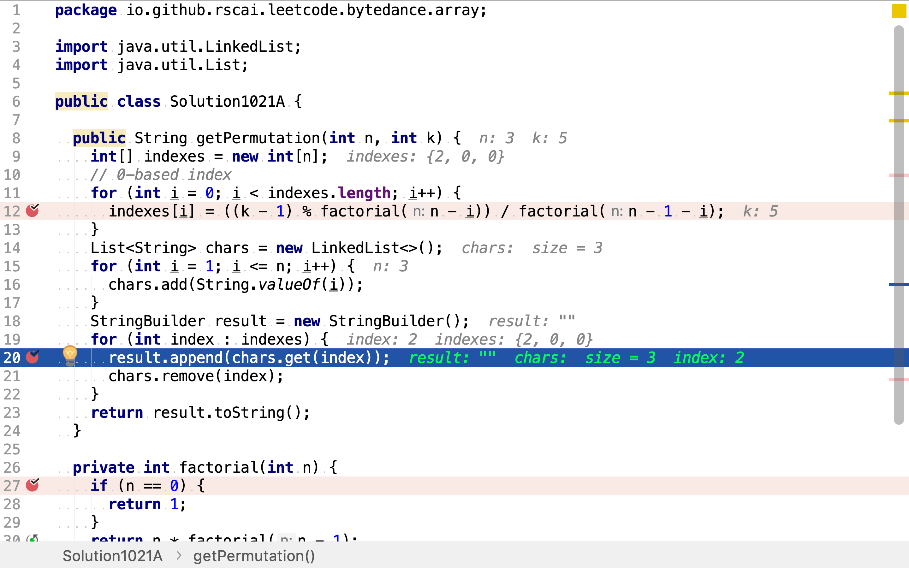
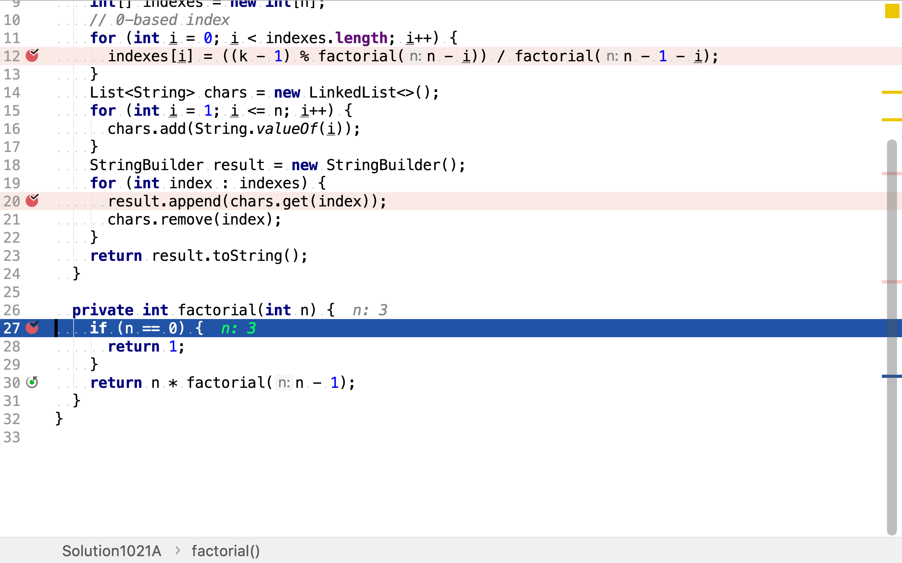
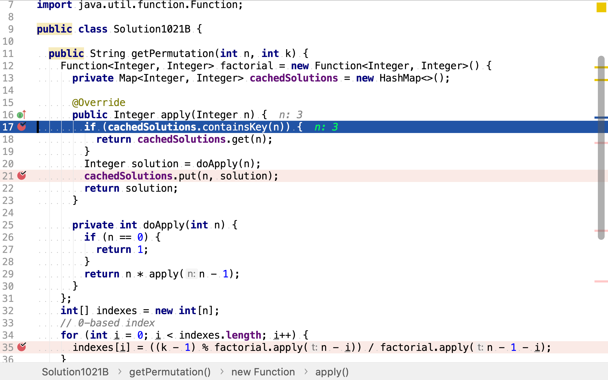

# 第k個排列

## 題目

>給出集合`[1,2,3,…,n]`，其所有元素共有`n!`種排列。
>
>按大小順序列出所有排列情況，並一一標記，當`n = 3`時, 所有排列如下：
>
>1. `"123"`
>2. `"132"`
>3. `"213"`
>4. `"231"`
>5. `"312"`
>6. `"321"`
>
>給定`n`和`k`，返回第`k`個排列。
>
>**說明：**
>
>給定`n`的範圍是`[1,9]`。
>
>給定`k`的範圍是`[1,n!]`。

## 非固定進制法

我們可以將按大小順序列出的所有排序視為非固定進制的整數。固定進制的整數，比如十進制整數，

* 每一位都在`0, 1, 2, 3, 4, 5, 6, 7, 8, 9`之中循環
* 假設位數為$$n$$，第$$k$$個十進制整數中，第一位（從左往右數）的值為$$\frac{k \mod 10^{n}}{10^{10-1}}$$，第$$x$$（$$0 \leq x < n$$，從0開始計）位止值為$$\frac{k \mod 10^{n-x}}{10^{n-1-x}}$$

排列的特點是，每一位的取值範圍是不同的。假設是$$n$$個元素排列，第一位的取值範圍是$$n$$個，第二位的取值範圍是$$n-1$$個，第三位的取值範圍是$$n-2$$，依此類推。

所以，將$$n$$個元素所有排序按大小順序列出，第$$k$$個排序中，第$$x$$位的值為$$\frac{k \mod (n-x)!}{(n-1-x)!}$$。

### 代碼實現

[include](../../../src/main/java/io/github/rscai/leetcode/bytedance/array/Solution1021A.java)

首先，按着公式$$f(x) = \frac{k \mod (n-x)!}{(n-1-x)!}$$計算每一位值的索引。


然後，穫取每一位上的值。因為每一位上的候選值列表都不相同，而且受前面位上取值影响。所以，每決定一位的值，都要將其從候選列表中移除。



階乘則以遞歸實現。



### 複雜度分析

#### 時間複雜度

本演算法針對每一位都計算了兩次階乘。然後，遍歷了每一位兩次。時間複雜度為：

$$
\begin{aligned}
C_{time} &= \sum_{i=0}^{n-1}(C_{time}(factorial(n-i)) + C_{time}(factorial(n-1-i))) + n + n \\
&= \frac{n(n+1)}{2} + \frac{n(n+1)}{2} + 2n \\
&= n^{2}+n + 2n \\
&= \mathcal{O}(n^{2})
\end{aligned}
$$

#### 空間複雜度

使用了三個長度為$$n$$的列表。空間複雜度為：

$$
\begin{aligned}
C_{space} &= n + n+ n \\
&=\mathcal{O}(n)
\end{aligned}
$$

## 動態規劃法

上述演算法時間複雜度發生在計算階乘。階乘是以遞歸實現的，將階乘的遞歸以樹的形式展現：

```plantuml
digraph d {
    root [label=""]
    a [label="factorial(n-1)"]
    b [label="factorial(n-2)"]
    c [label="factorial(n-3)"]
    root -> a
    root -> b
    root -> c

    aa [label="factorial(n-2)"]
    a -> aa
    aaa [label="factorial(n-3)"]
    aa -> aaa
    aaaa [label="..."]
    aaa -> aaaa

    ba [label="factorial(n-3)"]
    b -> ba
    bbb [label="..."]
    ba -> bbb

    ca [label="..."]
    c -> ca
}
```

可以發現有很多子樹是重復的，這意味着「有重復的子問題」，以以使用「動態規劃」優化。



### 代碼實現

[include](../../../src/main/java/io/github/rscai/leetcode/bytedance/array/Solution1021B.java)

首先，一樣地按着公式$$f(x) = \frac{k \mod (n-x)!}{(n-1-x)!}$$計算每一位值的索引。


然後，穫取每一位上的值。因為每一位上的候選值列表都不相同，而且受前面位上取值影响。所以，每決定一位的值，都要將其從候選列表中移除。


階乘使用函數式實現，該函數使用`HashMap`存儲函數值，從而實現「動態規劃」避免重復計算。



### 複雜度分析

#### 時間複雜度

因為存儲了階乘函數的值，所以其實際祇執行了$$n$$次乘。所以時間複雜度優化至$$\mathcal{O}(n)$$。

#### 空間複雜度

其最多存儲了$$n$$個函數值，所以空間複雜度依舊是$$\mathcal{O}(n)$$。

## 一次遍歷法

將上述演算法中所執行的階乘以樹的形式展現：

```plantuml
digraph d {
    root [label=""]
    a [label="factorial(n-1)"]
    b [label="factorial(n-2)"]
    c [label="factorial(n-3)"]
    root -> a
    root -> b
    root -> c

    aa [label="factorial(n-2)"]
    a -> aa
    aaa [label="factorial(n-3)"]
    aa -> aaa
    aaaa [label="..."]
    aaa -> aaaa

    ba [label="factorial(n-3)"]
    b -> ba
    bbb [label="..."]
    ba -> bbb

    ca [label="..."]
    c -> ca
}
```

以深度優先從右往左後序遍歷樹（相當於從右往左依次按公式$$f(x) = \frac{k \mod (n-x)!}{(n-1-x)!}$$計算每第$$k$$個排列上的每一位），得到`factorial`執行序列`..., factorial(n-3), ..., factorial(n-3), factorial(n-2), ..., factorial(n-3), factorial(n-2), factorial(n-1)`，去掉重復得到`..., factorial(n-3), factorial(n-2), factorial(n-1)`。再從階乘的定義可推$$factorial(a) = a \times factorial(a-1)$$。所以，當從右往左依次按公式$$f(x) = \frac{k \mod (n-x)!}{(n-1-x)!}$$計算每第$$k$$個排列上的每一位時，祇需要保存之前兩個`factorial`函數的值。

### 代碼實現

[include](../../../src/main/java/io/github/rscai/leetcode/bytedance/array/Solution1021C.java)

通過公式$$f(x) = \frac{k \mod (n-x)!}{(n-1-x)!}$$可知計算第$$k$$個排列中每一位的值都需要兩個`factorial`的值，所以就建立兩個變量去保存這兩個`factorial`值。


計算每一位時都需要兩個`factorial`值，需每一個`factorial`值計算都需要前一個`factorial`值。比如，計算第$$i$$位時，需計算`factorial(n-1-i)`和`factorial(n-i)`，計算`factorial(n-1-i)`和`factorial(n-i)`時又分別需要計算`factorial(n-1-i-1)`和`factorial(n-i-1)`。其中`factorial(n-1-i-1)`和`factorial(n-i-1)`的值在計算後一位（從右往左計算每一位的值）值時已得到並保存，所以此輪無需重復計算。


### 複雜度分析

#### 時間複雜度

時間複雜度與「動態規劃法」相同，$$\mathcal{O}(n)$$。

#### 空間複雜度

相較與「動態規劃法」，本演算法祇保存了兩個`factorial`的值，在計算階乘環節其空間複雜度為$$\mathcal{O}(1)$$。但其它部份的空間複雜度並沒有降低，所以總體空間複雜度依舊為$$\mathcal{O}(n)$$。

## 參考

* [動態規劃](https://zh.wikipedia.org/wiki/動態規劃)