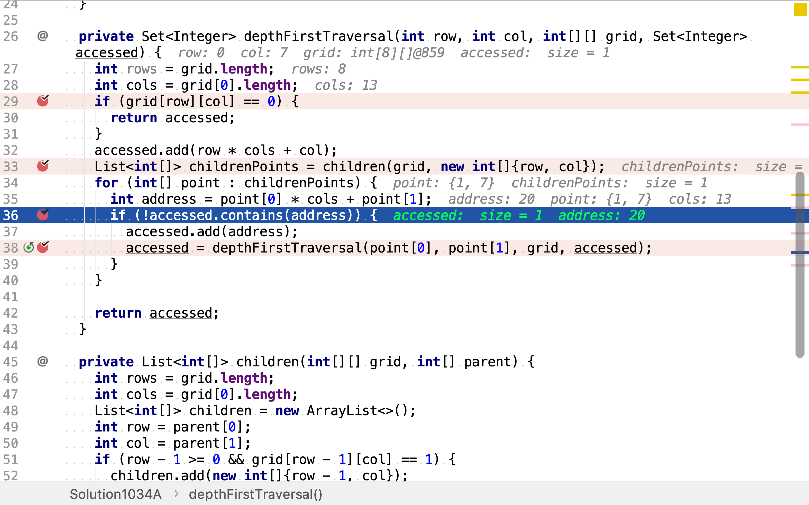
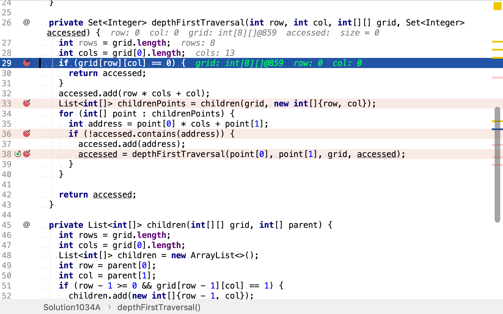

# 島嶼的最大面積

## 題目

>給定一個包含了一些 0 和 1的非空二維數組`grid`, 一個 島嶼 是由四個方向 (水平或垂直) 的 1 (代表土地) 構成的組合。你可以假設二維矩陣的四個邊緣都被水包圍著。
>
>找到給定的二維數組中最大的島嶼面積。 (如果沒有島嶼，則返回面積為0。)
>
>**示例1：**
>
>```
>[[0,0,1,0,0,0,0,1,0,0,0,0,0],
> [0,0,0,0,0,0,0,1,1,1,0,0,0],
> [0,1,1,0,1,0,0,0,0,0,0,0,0],
> [0,1,0,0,1,1,0,0,1,0,1,0,0],
> [0,1,0,0,1,1,0,0,1,1,1,0,0],
> [0,0,0,0,0,0,0,0,0,0,1,0,0],
> [0,0,0,0,0,0,0,1,1,1,0,0,0],
> [0,0,0,0,0,0,0,1,1,0,0,0,0]]
>```
>
>對於上面這個給定矩陣應返回`6`。注意答案不應該是11，因為島嶼只能包含水平或垂直的四個方向的‘1’。
>
>**示例2：**
>
>```
>[[0,0,0,0,0,0,0,0]]
>```
>
>對於上面這個給定的矩陣, 返回`0`。
>
>**注意:** 給定的矩陣`grid`的長度和寬度都不超過`50`。

## 深度優先搜尋法

地圖中的島嶼可以視為圖，求最大的島嶼即為求最大的連通分量。依次以圖中每個點為起點遍歷圖，即可穫取所有連通分量。

### 深度優先搜尋

>深度優先搜尋演算法（英語：Depth-First-Search，DFS）是一種用於遍歷或搜尋樹或圖的演算法。沿著樹的深度遍歷樹的節點，儘可能深的搜尋樹的分支。當節點v的所在邊都己被探尋過，搜尋將回溯到發現節點v的那條邊的起始節點。這一過程一直進行到已發現從源節點可達的所有節點為止。如果還存在未被發現的節點，則選擇其中一個作為源節點並重複以上過程，整個行程反覆進行直到所有節點都被存取為止。屬於盲目搜尋。

>#### 實現方法

>1. 首先將根節點放入佇列中。
>2. 從佇列中取出第一個節點，並檢驗它是否為目標。
>    * 如果找到目標，則結束搜尋並回傳結果。
>    * 否則將它某一個尚未檢驗過的直接子節點加入佇列中。
>3. 重複步驟2。
>4. 如果不存在未檢測過的直接子節點。
>    * 將上一級節點加入佇列中。
>    * 重複步驟2。
>5. 重複步驟4。
>6. 若佇列為空，表示整張圖都檢查過了——亦即圖中沒有欲搜尋的目標。結束搜尋並回傳「找不到目標」。

舉個例子，給定如下以二維整數數組表示的圖：

```
[[0,0,1,0,0,0,0,1,0,0,0,0,0],
 [0,0,0,0,0,0,0,1,1,1,0,0,0],
 [0,1,1,0,1,0,0,0,0,0,0,0,0],
 [0,1,0,0,1,1,0,0,1,0,1,0,0],
 [0,1,0,0,1,1,0,0,1,1,1,0,0],
 [0,0,0,0,0,0,0,0,0,0,1,0,0],
 [0,0,0,0,0,0,0,1,1,1,0,0,0],
 [0,0,0,0,0,0,0,1,1,0,0,0,0]]
```

依次以每個點為起點，深度優先搜尋。假設現在`(1, 7)`為起點進行深度優先搜尋。

```
[[0,0,1,0,0,0,0,1,0,0,0,0,0],
 [0,0,0,0,0,0,0,A,1,1,0,0,0],
 [0,1,1,0,1,0,0,0,0,0,0,0,0],
 [0,1,0,0,1,1,0,0,1,0,1,0,0],
 [0,1,0,0,1,1,0,0,1,1,1,0,0],
 [0,0,0,0,0,0,0,0,0,0,1,0,0],
 [0,0,0,0,0,0,0,1,1,1,0,0,0],
 [0,0,0,0,0,0,0,1,1,0,0,0,0]]
```

穫取`(1, 7)`相鄰的點`[(0,7),(1,8)]`：

```
[[0,0,1,0,0,0,0,B,0,0,0,0,0],
 [0,0,0,0,0,0,0,A,1,1,0,0,0],
 [0,1,1,0,1,0,0,0,0,0,0,0,0],
 [0,1,0,0,1,1,0,0,1,0,1,0,0],
 [0,1,0,0,1,1,0,0,1,1,1,0,0],
 [0,0,0,0,0,0,0,0,0,0,1,0,0],
 [0,0,0,0,0,0,0,1,1,1,0,0,0],
 [0,0,0,0,0,0,0,1,1,0,0,0,0]]
```

然後，依次以`(0,7)`為起點，穫取未訪問的相鄰點。`(0,7)`僅有一個相鄰點`(0,7)`但已被訪問。

再然後，以`(1,8)`為起點，穫取未訪問的相鄰點。`(1,8)`有兩個相鄰點，且其中`(1,9)`未被訪問。

```
[[0,0,1,0,0,0,0,B,0,0,0,0,0],
 [0,0,0,0,0,0,0,A,C,D,0,0,0],
 [0,1,1,0,1,0,0,0,0,0,0,0,0],
 [0,1,0,0,1,1,0,0,1,0,1,0,0],
 [0,1,0,0,1,1,0,0,1,1,1,0,0],
 [0,0,0,0,0,0,0,0,0,0,1,0,0],
 [0,0,0,0,0,0,0,1,1,1,0,0,0],
 [0,0,0,0,0,0,0,1,1,0,0,0,0]]
```

再然後，以`(1,9)`為起點，穫取未訪問的相鄰點。`(1,9)`僅有一個相鄰點但已被訪問。至此，完成圖中一個連通分量的深度優先搜尋。依次以圖中每個點為起點，重復上述深度優先搜尋就可以遍歷圖中所有連通分量。

最後，從所有連通分量中取節點數最多的即為最大島嶼。

### 代碼

[include](../../../src/main/java/io/github/rscai/leetcode/bytedance/array/Solution1034A.java)

依次以每個點為起點，深度優先搜尋。


深度優先搜尋是一個遞歸方法。其先穫取相鄰的點，


然後，排除掉已訪問過的點。



再然後，以相鄰點為起點，遞歸調用深度優先搜尋。


遞歸終止條件為無未訪問的相鄰點，或起點為空。



### 複雜度分析

#### 時間複雜度

本演算法依次以每個點為起點深度優先搜尋。設二維數組點總數為$$n$$，則其執行了$$n$$次深度優先搜尋。每次深度優先搜尋最多訪問了$$n$$個點。所以，時間複雜度為$$\mathcal{O}(n^2)$$。

#### 空間複雜度

深度優先搜尋時保存了所有已訪問過的點，其最多為$$n$$。空間複雜度為$$\mathcal{O}(n)$$。

## 一次遍歷

在上述中演算法中，同一個連通分量會被搜尋多次。如果，在某個點被首次搜尋後將其移除，則不會有任何連通分被重復搜尋。任意點也不會被重復搜尋。

舉個例子，給定如下以二維數組表示的圖：

```
[[0,0,1,0,0,0,0,1,0,0,0,0,0],
 [0,0,0,0,0,0,0,1,1,1,0,0,0],
 [0,1,1,0,1,0,0,0,0,0,0,0,0],
 [0,1,0,0,1,1,0,0,1,0,1,0,0],
 [0,1,0,0,1,1,0,0,1,1,1,0,0],
 [0,0,0,0,0,0,0,0,0,0,1,0,0],
 [0,0,0,0,0,0,0,1,1,1,0,0,0],
 [0,0,0,0,0,0,0,1,1,0,0,0,0]]
```

按照上述演算法，連通分量`[(0,7),(1,7),(1,8),(1,9)]`會被搜尋四次。若在首次訪問點時，即將其清除，則該分量僅會被搜尋一次。

以`(0,7)`為起點時，該連通分量第一次被搜尋到。

```
[[0,0,1,0,0,0,0,A,0,0,0,0,0],
 [0,0,0,0,0,0,0,1,1,1,0,0,0],
 [0,1,1,0,1,0,0,0,0,0,0,0,0],
 [0,1,0,0,1,1,0,0,1,0,1,0,0],
 [0,1,0,0,1,1,0,0,1,1,1,0,0],
 [0,0,0,0,0,0,0,0,0,0,1,0,0],
 [0,0,0,0,0,0,0,1,1,1,0,0,0],
 [0,0,0,0,0,0,0,1,1,0,0,0,0]]
```

穫取其相鄰點，同時將自身清除（置為-1）。

```
[[0,0,1,0,0,0,0,,0,0,0,0,0],
 [0,0,0,0,0,0,0,B,1,1,0,0,0],
 [0,1,1,0,1,0,0,0,0,0,0,0,0],
 [0,1,0,0,1,1,0,0,1,0,1,0,0],
 [0,1,0,0,1,1,0,0,1,1,1,0,0],
 [0,0,0,0,0,0,0,0,0,0,1,0,0],
 [0,0,0,0,0,0,0,1,1,1,0,0,0],
 [0,0,0,0,0,0,0,1,1,0,0,0,0]]
```

繼續以相鄰點為起點，繼續深度優先搜尋。

```
[[0,0,1,0,0,0,0,-1,0,0,0,0,0],
 [0,0,0,0,0,0,0,-1,-1,-1,0,0,0],
 [0,1,1,0,1,0,0,0,0,0,0,0,0],
 [0,1,0,0,1,1,0,0,1,0,1,0,0],
 [0,1,0,0,1,1,0,0,1,1,1,0,0],
 [0,0,0,0,0,0,0,0,0,0,1,0,0],
 [0,0,0,0,0,0,0,1,1,1,0,0,0],
 [0,0,0,0,0,0,0,1,1,0,0,0,0]]
```

### 代碼

[include](../../../src/main/java/io/github/rscai/leetcode/bytedance/array/Solution1034B.java)

依次以每個點為起點，深度優先搜尋。


首次訪問時點時，將其置為`-1`（已訪問），以區分空點`0`。


### 複雜度分析

#### 時間複雜度

每個點至多被訪問五次，第一次從`1`轉為`-1`，第二至第五次被以上下左右點的相鄰點被檢測。時間複雜度為$$\mathcal{O}(n)$$。

#### 空間複雜度

每個點的已訪問狀態是重用輸入值空間的，另外使用了常數量的變量。空間複雜度為$$\mathcal{O}(1)$$。

## 參考

* [深度優先搜尋](https://zh.wikipedia.org/wiki/深度優先搜尋)