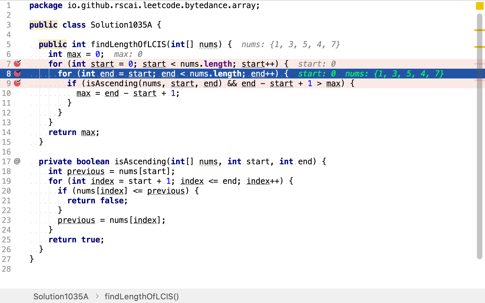
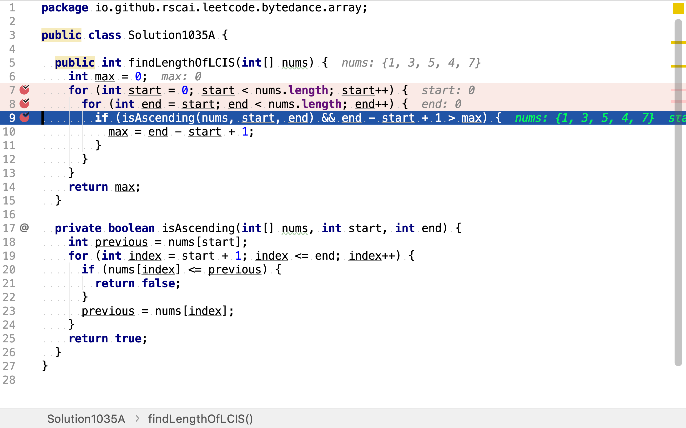
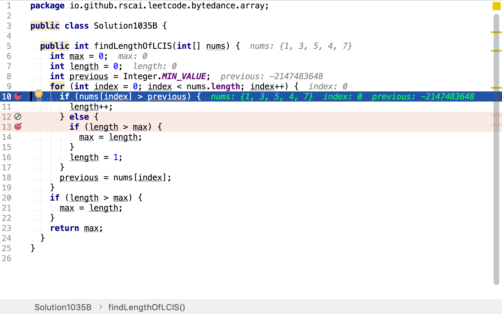

# 最長連續遞增序列

## 題目

>給定一個未經排序的整數數組，找到最長且連續的的遞增序列。
>
>**示例 1:**
>
>```
>輸入: [1,3,5,4,7]
>輸出: 3
>解釋: 最長連續遞增序列是 [1,3,5], 長度為3。
>儘管 [1,3,5,7] 也是升序的子序列, 但它不是連續的，因為5和7在原數組裡被4隔開。
>```
>
>**示例 2：**
>
>```
>輸入: [2,2,2,2,2]
>輸出: 1
>解釋: 最長連續遞增序列是 [2], 長度為1。
>```
>
>**注意：** 數組長度不會超過10000。

## 窮舉法

先羅列所有的連續序列組合，再過濾出升序序列，最後計算所有升序序列長度並求出最大值。

舉個例子，給定數組`[1,3,5,4,7]`。一組「頭」「尾」位置就能唯一確定一個連續序列。「頭」位置有五種選擇，「尾」位置受制於「頭」位置，祇能選擇「頭」位置及以後的位置。當「頭」位置為`1`時，「尾」位置有五種選擇；當「頭」位置是`3`時，「尾」位置有四種選擇。將所有連續序列以樹的形式展現為：

```plantuml
digraph d {
    root [label=""]
    a [label=1]
    b [label=3]
    c [label=5]
    d [label=4]
    e [label=7]
    root -> a
    root -> b
    root -> c
    root -> d
    root -> e

    aa [label=3]
    at [shape=triangle, label=nil, style=filled, fillcolor=grey]
    a -> aa
    a -> at

    aaa [label=5]
    aat [shape=triangle, label=nil, style=filled, fillcolor=grey]
    aa -> aaa
    aa -> aat

    aaaa [label=4]
    aaat [shape=triangle, label=nil, style=filled, fillcolor=grey]
    aaa -> aaaa
    aaa -> aaat

    aaaaa [label=7]
    aaaat [shape=triangle, label=nil, style=filled, fillcolor=grey]
    aaaa -> aaaaa
    aaaa -> aaaat
    aaaaat [shape=triangle, label=nil, style=filled, fillcolor=grey]
    aaaaa -> aaaaat

    ba [label=5]
    bt [shape=triangle, label=nil, style=filled, fillcolor=grey]
    b -> ba
    b -> bt

    baa [label=4]
    bat [shape=triangle, label=nil, style=filled, fillcolor=grey]
    ba -> baa
    ba -> bat

    baaa [label=7]
    baat [shape=triangle, label=nil, style=filled, fillcolor=grey]
    baa -> baaa
    baa -> baat
    baaat [shape=triangle, label=nil, style=filled, fillcolor=grey]
    baaa -> baaat

    ca [label=4]
    ct [shape=triangle, label=nil, style=filled, fillcolor=grey]
    c -> ca
    c -> ct

    caa [label=7]
    cat [shape=triangle, label=nil, style=filled, fillcolor=grey]
    ca -> caa
    ca -> cat
    caat [shape=triangle, label=nil, style=filled, fillcolor=grey]
    caa -> caat

    da [label=7]
    dt [shape=triangle, label=nil, style=filled, fillcolor=grey]
    d -> da
    d -> dt

    dat [shape=triangle, label=nill, style=filled, fillcolor=grey]
    da -> dat

    et [shape=triangle, label=nil, style=filled, fillcolor=grey]
    e -> et
}
```

從根節點到`nil`葉子節點之間的路徑即是一個連續序列。

### 代碼

[include](../../../src/main/java/io/github/rscai/leetcode/bytedance/array/Solution1035A.java)

首先，羅列所有的「頭」位置選擇。


然後，依據「頭」位置羅列所有「尾」位置的選擇。一組「頭」「尾」位置唯一確定一個連續序列。



最後，過濾連續遞增的序列並計算長度，其中最大長度即為所求解。



### 複雜度分析

#### 時間複雜度

設數組長度為$$n$$，則總共有$$\frac{n(n+1)}{2}$$個連續序列組合。時間複雜度為$$\mathcal{O}(n^2)$$。

#### 空間複雜度

使用了一個變量`max`，空間複雜度為$$\mathcal{O}(1)$$。

## 一次遍歷法

將所有連續序列組合以樹的形式展示出來，可以發現很多重復的子樹。也就意味著有很多重復的計算。

```plantuml
digraph d {
    root [label=""]
    a [label=1]
    b [label=3]
    c [label=5]
    d [label=4]
    e [label=7]
    root -> a
    root -> b
    root -> c
    root -> d
    root -> e

    aa [label=3]
    at [shape=triangle, label=nil, style=filled, fillcolor=grey]
    a -> aa
    a -> at

    aaa [label=5]
    aat [shape=triangle, label=nil, style=filled, fillcolor=grey]
    aa -> aaa
    aa -> aat

    aaaa [label=4]
    aaat [shape=triangle, label=nil, style=filled, fillcolor=grey]
    aaa -> aaaa
    aaa -> aaat

    aaaaa [label=7]
    aaaat [shape=triangle, label=nil, style=filled, fillcolor=grey]
    aaaa -> aaaaa
    aaaa -> aaaat
    aaaaat [shape=triangle, label=nil, style=filled, fillcolor=grey]
    aaaaa -> aaaaat

    ba [label=5]
    bt [shape=triangle, label=nil, style=filled, fillcolor=grey]
    b -> ba
    b -> bt

    baa [label=4]
    bat [shape=triangle, label=nil, style=filled, fillcolor=grey]
    ba -> baa
    ba -> bat

    baaa [label=7]
    baat [shape=triangle, label=nil, style=filled, fillcolor=grey]
    baa -> baaa
    baa -> baat
    baaat [shape=triangle, label=nil, style=filled, fillcolor=grey]
    baaa -> baaat

    ca [label=4]
    ct [shape=triangle, label=nil, style=filled, fillcolor=grey]
    c -> ca
    c -> ct

    caa [label=7]
    cat [shape=triangle, label=nil, style=filled, fillcolor=grey]
    ca -> caa
    ca -> cat
    caat [shape=triangle, label=nil, style=filled, fillcolor=grey]
    caa -> caat

    da [label=7]
    dt [shape=triangle, label=nil, style=filled, fillcolor=grey]
    d -> da
    d -> dt

    dat [shape=triangle, label=nill, style=filled, fillcolor=grey]
    da -> dat

    et [shape=triangle, label=nil, style=filled, fillcolor=grey]
    e -> et
}
```

「求一個數組中最大的連續遞增子序列」可以拆解為：

1. 求數組中第一個連續遞增子序列
2. 求數組剩餘部份中最大的連續遞增子序列
3. 求第1和第2步求得連續遞增子序列中較大的一個

第2步遞歸套用1至3步。

舉個例子，給定數組`[1,3,5,4,7]`。首先，找出第一個連續遞增子序列`[1,3,5]`。然後，在剩餘數組中求出最大連續遞增子序列`[4,7]`。最後，求其最大長度為`3`。

```plantuml
digraph d {
    root [label=""]
    a [label=1]
    d [label=4]
    root -> a
    root -> d

    aa [label=3]
    at [shape=triangle, label=nil, style=filled, fillcolor=grey]
    a -> aa
    a -> at

    aaa [label=5]
    aat [shape=triangle, label=nil, style=filled, fillcolor=grey]
    aa -> aaa
    aa -> aat
    aaat [shape=triangle, label=nil, style=filled, fillcolor=grey]
    aaa -> aaat

    da [label=7]
    dt [shape=triangle, label=nil, style=filled, fillcolor=grey]
    d -> da
    d -> dt

    dat [shape=triangle, label=nill, style=filled, fillcolor=grey]
    da -> dat
}
```

### 代碼

[include](../../../src/main/java/io/github/rscai/leetcode/bytedance/array/Solution1035B.java)

用一次遍歷實現上述遞歸操作。從數組頭部開始尋找第一個連續遞增子序列，其尾部檢測方法即「是否大於前方元素」。



找到第一個連續遞增子序列後，以「尾」部元素後一個元素為第二個連續遞增子序的「頭」，繼續尋找下一個連續子序列。同時，先檢測已找到的連續遞增子序列是否為當前最長。


### 複雜度分析

#### 時間複雜度

祇遍歷了一遍數組，時間複雜度為$$\mathcal{O}(n)$$。

#### 空間複雜度

使用了三個變量`max, length, previous`，空間複雜度為$$\mathcal{O}(1)$$。
