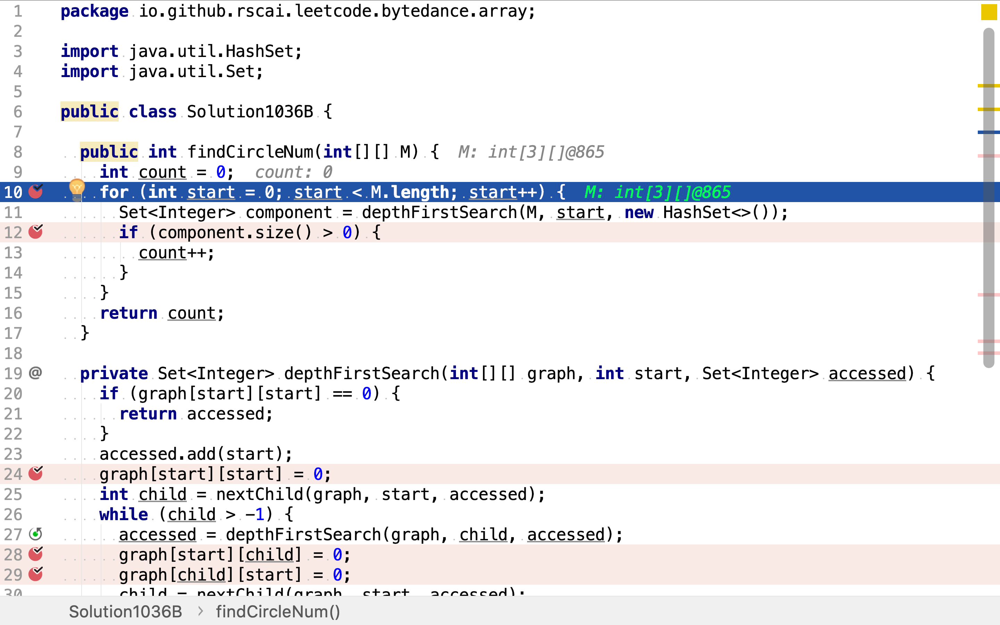
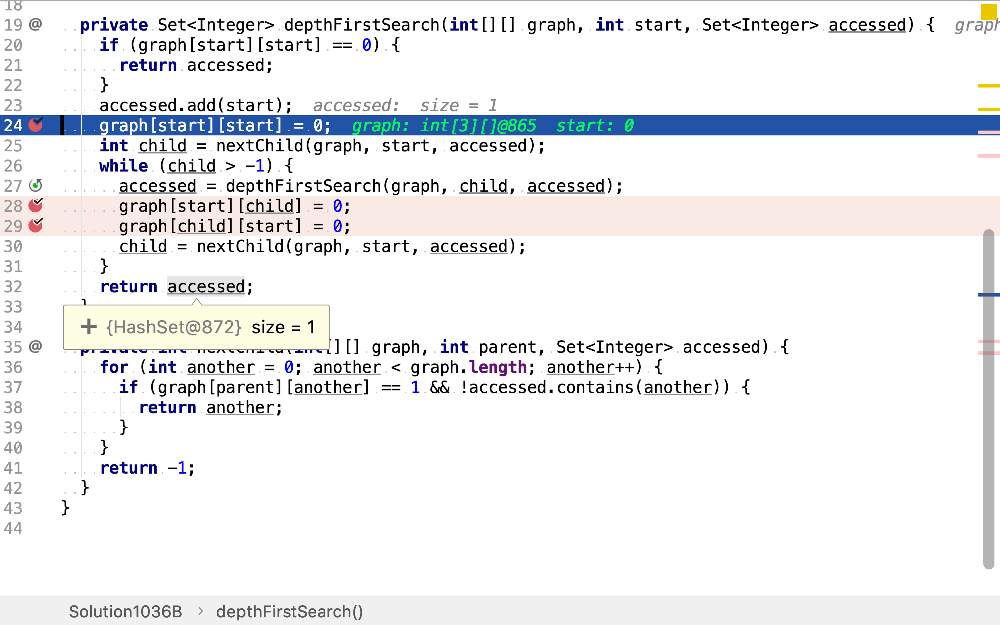
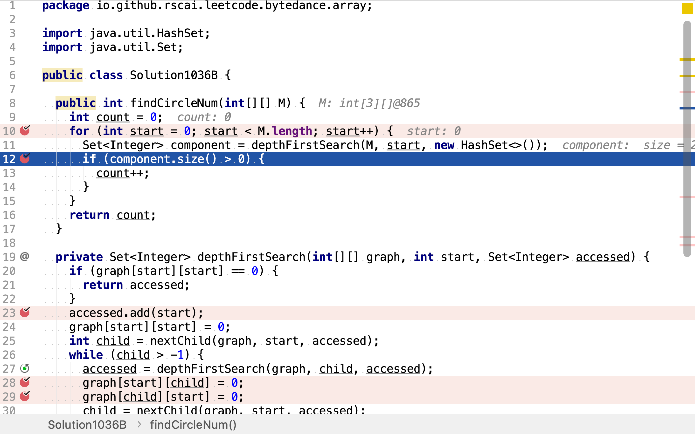

# 朋友圈

## 題目

>班上有**N**名學生。其中有些人是朋友，有些則不是。他們的友誼具有是傳遞性。如果已知**A**是**B**的朋友，**B**是**C**的朋友，那麼我們可以認為**A**也是**C**的朋友。所謂的朋友圈，是指所有朋友的集合。
>
>給定一個**N * N**的矩陣**M**，表示班級中學生之間的朋友關係。如果`M[i][j] = 1`，表示已知第**i**個和**j**個學生互為朋友關係，否則為不知道。你必須輸出所有學生中的已知的朋友圈總數。
>
>**示例 1：**
>
>```
>輸入:
>[[1,1,0],
> [1,1,0],
> [0,0,1]]
>輸出: 2
>說明：已知學生0和學生1互為朋友，他們在一個朋友圈。
>第2個學生自己在一個朋友圈。所以返回2。
>```
>
>**示例 2：**
>
>```
>輸入:
>[[1,1,0],
> [1,1,1],
> [0,1,1]]
>輸出: 1
>說明：已知學生0和學生1互為朋友，學生1和學生2互為朋友，所以學生0和學生2也是朋友，所以他們三個在一個朋友圈，返回1。
>```
>
>**注意：**
>
>1. N 在[1,200]的範圍內。
>2. 對於所有學生，有M[i][i] = 1。
>3. 如果有M[i][j] = 1，則有M[j][i] = 1。

## 深度優先搜尋圖連通分量法

此題可以抽象為求圖的連通分量。



此題中，每一個朋友圈即一個連通分量。求朋友圈數量即求連通分量數量。

最直接求圖連通分量的方法就使用「廣度優先搜尋」和「深度優先搜尋」。依次以圖中每一個點為起點，用「廣度優先搜尋」或「深度優先搜尋」搜尋以起點為根節點的樹，該樹即為一個圖的連通分量。將所有搜尋到的樹去重後得到的集合即為該圖的所有連通分量。

舉個例子，假設有如下圖：

```plantuml
graph g {
     a -- b -- c 
     b -- d -- c
     e -- f
}
```

 以`a`為起點，深度優先搜尋，找到連通分量`a, b, c, d`，並記錄已訪問的點。

```plantuml
graph g {
    a [style=filled, fillcolor=grey]
    b [style=filled, fillcolor=grey]
    c [style=filled, fillcolor=grey]
    d [style=filled, fillcolor=grey]
     a -- b -- c 
     b -- d -- c
     e -- f
}
```

再以`b, c, d`為起點，但它們都已經被訪問過了。

再以`e`為起點，深度優先搜尋，找到連通分量`e, f`，並記錄已訪問的點。

```plantuml
graph g {
    a [style=filled, fillcolor=grey]
    b [style=filled, fillcolor=grey]
    c [style=filled, fillcolor=grey]
    d [style=filled, fillcolor=grey]
    e [style=filled, fillcolor=grey]
    f [style=filled, fillcolor=grey]
     a -- b -- c 
     b -- d -- c
     e -- f
}
```

再以`f`為起點，發現其已經被訪問過了。至此，遍歷完所有點了。得到了圖的全部連通分量`a, b, c, d`和`e, f`。

### 代碼實現

[include](../../../src/main/java/io/github/rscai/leetcode/bytedance/array/Solution1036B.java)

首先，依舊是依次以每個點為起點，深度優先搜尋連通分量。



但深度優先搜尋時，將訪問過的點和邊都標記為已訪問。



最後，直接累計搜尋到的連通分量即可。因為所有的點和邊都祇被訪問一次，所以不價出現重復的連通分量（包含的點相同）。



### 複雜度分析

#### 時間複雜度

`depthFirstSearch`將訪問過的點和邊立即移除，所以雖然依舊依次以每個點為起點搜尋連通分量，但實際上每個點最多被訪問兩次，每條邊被訪問一次。時間複雜度為$$\mathcal{O}(n)$$。

#### 空間複雜度

`depthFristSearch`返回值最多包含$$n$$個元素。空間複雜度為$$\mathcal{O}(n)$$。

## 參考

* [元件 (圖論)](https://zh.wikipedia.org/wiki/%E5%85%83%E4%BB%B6_(%E5%9C%96%E8%AB%96))
* [Component(graph theory)](https://en.wikipedia.org/wiki/Component_(graph_theory))
