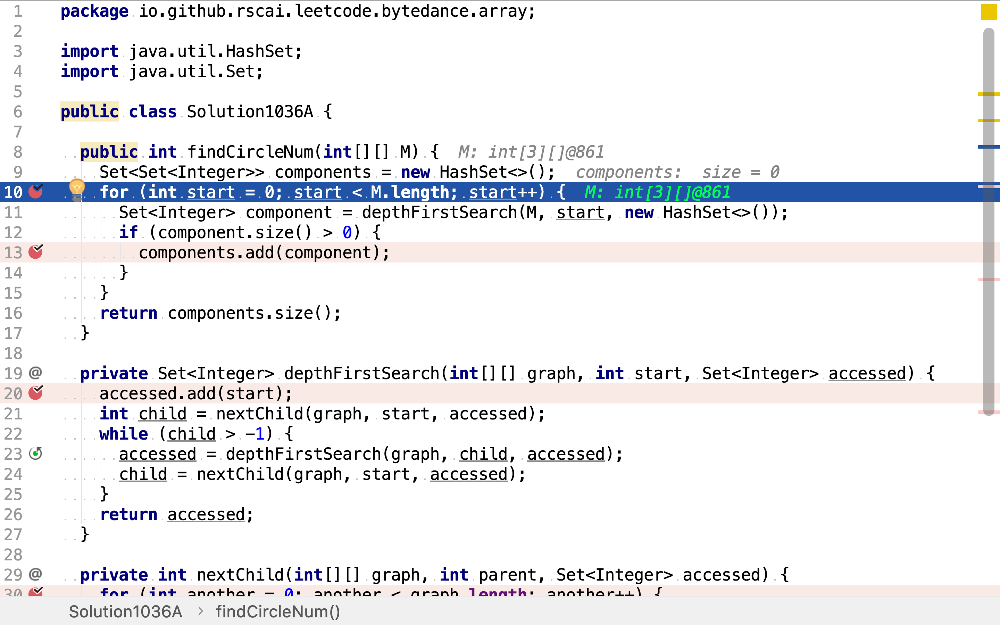
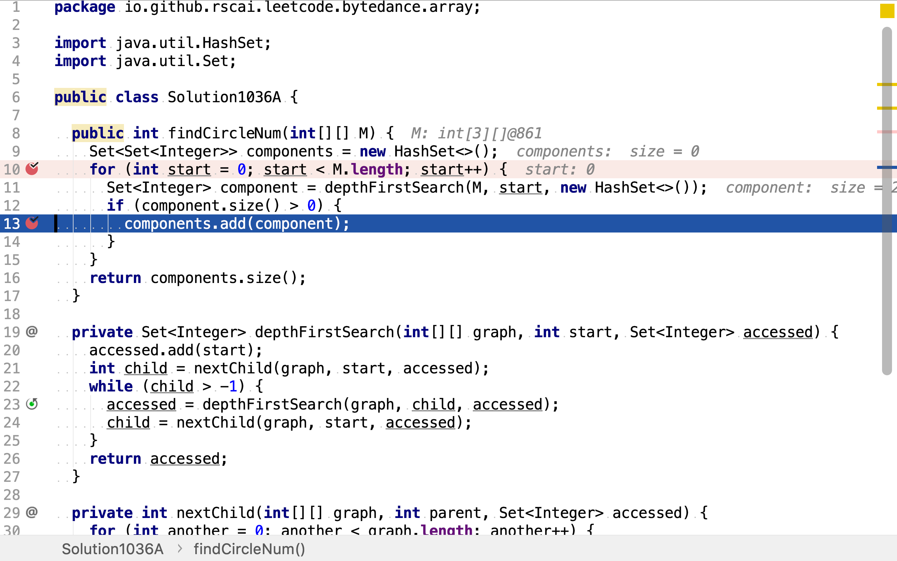
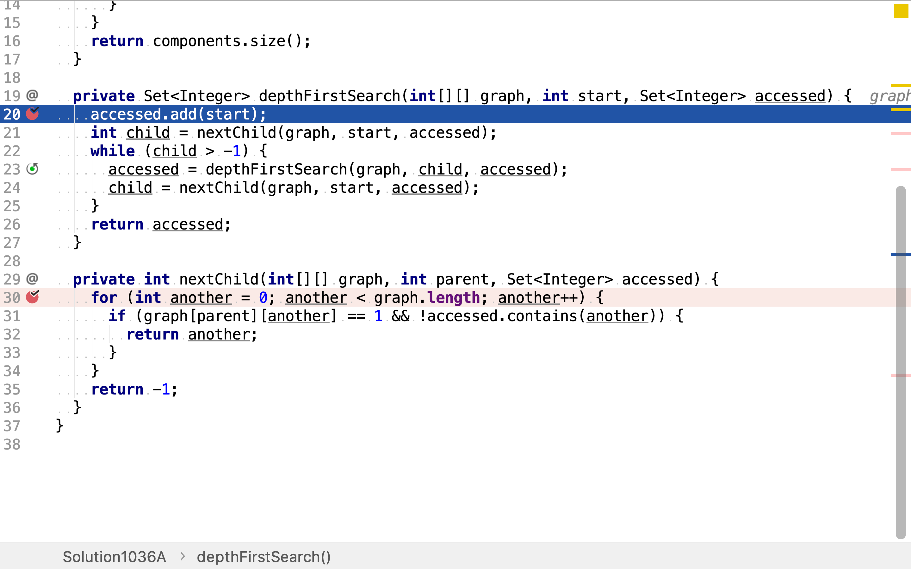
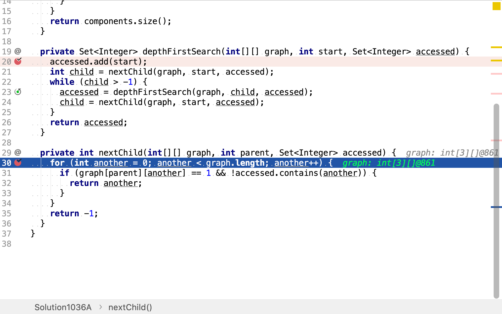

# 朋友圈

## 題目

>班上有**N**名學生。其中有些人是朋友，有些則不是。他們的友誼具有是傳遞性。如果已知**A**是**B**的朋友，**B**是**C**的朋友，那麼我們可以認為**A**也是**C**的朋友。所謂的朋友圈，是指所有朋友的集合。
>
>給定一個**N * N**的矩陣**M**，表示班級中學生之間的朋友關係。如果`M[i][j] = 1`，表示已知第**i**個和**j**個學生互為朋友關係，否則為不知道。你必須輸出所有學生中的已知的朋友圈總數。
>
>**示例 1：**
>
>```
>輸入:
>[[1,1,0],
> [1,1,0],
> [0,0,1]]
>輸出: 2
>說明：已知學生0和學生1互為朋友，他們在一個朋友圈。
>第2個學生自己在一個朋友圈。所以返回2。
>```
>
>**示例 2：**
>
>```
>輸入:
>[[1,1,0],
> [1,1,1],
> [0,1,1]]
>輸出: 1
>說明：已知學生0和學生1互為朋友，學生1和學生2互為朋友，所以學生0和學生2也是朋友，所以他們三個在一個朋友圈，返回1。
>```
>
>**注意：**
>
>1. N 在[1,200]的範圍內。
>2. 對於所有學生，有M[i][i] = 1。
>3. 如果有M[i][j] = 1，則有M[j][i] = 1。

## 深度優先搜尋圖連通分量法

此題可以抽象為求圖的連通分量。

>### 元件 (圖論)
>
>在圖論中，元件又稱為連通元件、分量、或分支，是一個無向子圖，在元件中的任何兩個頂點都可以經由該圖上的邊抵達另一個頂點，且沒有任何一邊可以連到其他子圖的頂點。沒有與任何其他頂點相連的單一頂點也可以算是一個元件。

此題中，每一個朋友圈即一個連通分量。求朋友圈數量即求連通分量數量。

最直接求圖連通分量的方法就使用「廣度優先搜尋」和「深度優先搜尋」。依次以圖中每一個點為起點，用「廣度優先搜尋」或「深度優先搜尋」搜尋以起點為根節點的樹，該樹即為一個圖的連通分量。將所有搜尋到的樹去重後得到的集合即為該圖的所有連通分量。

舉個例子，給定如下圖：

```plantuml
graph g {
     a -- b -- c 
     b -- d -- c
     e -- f
}
```

依次以`a, b, c, d, e, f`為起點，以「深度優先搜尋」搜尋樹。得到六棵樹：

* 以`a`為根節點

```plantuml
graph g {
    a -- b
    b -- c
    b -- d
}
```

* 以`b`為根節點

```plantuml
graph g {
    b -- a
    b -- c
    b -- d
}
```

* 以`c`為根節點

```plantuml
graph g {
    c -- b
    c -- d
    b -- a
}
```

* 以`d`為根節點

```plantuml
graph g {
    d -- b
    d -- c
    b -- a
}
```

* 以`e`為根節點

```plantuml
graph g {
    e -- f
}
```

* 以`f`為根節點

```plantuml
graph g {
    f -- e
}
```

按點集合去重剩下：

* `a, b, c, d`
* `e, f`

### 代碼實現

[include](../../../src/main/java/io/github/rscai/leetcode/bytedance/array/Solution1036A.java)

首先，依次以圖中每個點為根節點，深度優先遍歷樹。



得到的樹即為圖的一個連通分量。因為該題中圖是無向圖，所以有些樹即連通分量所包含的點集是相同的，需要去重。這𥚃用JDK提供的Set實現去重。



深度優先搜尋是一個遞歸算法，其先訪問根節點，再以根節點的子節點為根節點，遞歸執行深度優先搜索。詃遞歸算法的終止條件是「沒有未訪問的子節點」。



本題使用正方形數組表示圖，第i行第j列值為`1`時表示第i個點和第j個點相鄰。因為人與人之間的關系是雙向的，所以抽象成圖時是無向的。在無向圖中，若第i個點和第j個點相鄰，則第j個點和第i個點也相鄰。所以輸入的正方形數組是以左上⻆到右下⻆的連線為中心對稱的。當搜尋相鄰點時，祇需遍歷半個正方形數組。



### 複雜度分析

#### 時間複雜度

本演算法依次以每個點為根節點，深度優先搜尋樹。而每次搜尋樹，最壞情況下圖中所有點都是連通的，則需要訪問所有點。假設圖中點的數量為$$n$$，則時間複雜度為$$\mathcal{O}(n^2)$$。

#### 空間複雜度

點集合的集合`components`最多包含$$n$$個元素。`depthFirstSearch`返回的`accessed`最多包含$$n$$個元素。所以空間複雜度為$$\mathcal{O}(n)$$。

## 動態規劃法

>### 動態規劃
>
>動態規劃（英語：Dynamic programming，簡稱DP）是一種在數學、管理科學、電腦科學、經濟學和生物資訊學中使用的，通過把原問題分解為相對簡單的子問題的方式求解複雜問題的方法。
>
>動態規劃常常適用於有重疊子問題和最佳子結構性質的問題，動態規劃方法所耗時間往往遠少於樸素解法。
>
>動態規劃背後的基本思想非常簡單。大致上，若要解一個給定問題，我們需要解其不同部分（即子問題），再根據子問題的解以得出原問題的解。
>
>通常許多子問題非常相似，為此動態規劃法試圖僅僅解決每個子問題一次，從而減少計算量：一旦某個給定子問題的解已經算出，則將其記憶化儲存，以便下次需要同一個子問題解之時直接查表。這種做法在重複子問題的數目關於輸入的規模呈指數增長時特別有用。

假設在圖中存兩點a和b，若存在一條從a到b的路徑，則以a為起點深度優先搜尋所得的連通分所包含的點一定與以b為起點深度優先搜尋所得的連通分量所包含的點相同。舉個例子，假設有如下圖：

```plantuml
graph g {
     a -- b -- c 
     b -- d -- c
     e -- f
}
```

`a`和`d`之間有一條路徑`a - b - d`連通。以`a`為起點深度優先搜尋得到連通分量

```plantuml
graph g {
    a -- b
    b -- d
    b -- c
}
```

其包含的點為`a, b, c, d`。以`d`為起點深度優先搜尋得到連通分量

```plantuml
graph g {
    d -- b
    d -- c
    b -- a
}
```

其包含的點為`a, b, c, d`。兩個連通分量所包含的點相同，即相同的「朋友圈」。

所以，「以一個連通分量中不同點為起點，深度優先搜尋連通分量」是「重復子問題」，可以不重復計算。

### 代碼實現

[include](../../../src/main/java/io/github/rscai/leetcode/bytedance/array/Solution1036B.java)

首先，依舊是依次以每個點為起點，深度優先搜尋連通分量。


但深度優先搜尋時，將訪問過的點和邊都從圖中移除，避免「重復子問題」為重復計算。


最後，直接累計搜尋到的連通分量即可。因為所有的點和邊都祇被訪問一次，所以不價出現重復的連通分量（包含的點相同）。


### 複雜度分析

#### 時間複雜度

`depthFirstSearch`將訪問過的點和邊立即移除，所以雖然依舊依次以每個點為起點搜尋連通分量，但實際上每個點最多被訪問兩次，每條邊被訪問一次。時間複雜度為$$\mathcal{O}(n)$$。

#### 空間複雜度

`depthFristSearch`返回值最多包含$$n$$個元素。空間複雜度為$$\mathcal{O}(n)$$。

## 參考

* [元件 (圖論)](https://zh.wikipedia.org/wiki/%E5%85%83%E4%BB%B6_(%E5%9C%96%E8%AB%96))
* [Component(graph theory)](https://en.wikipedia.org/wiki/Component_(graph_theory))
* [動態規劃](https://zh.wikipedia.org/wiki/動態規劃)