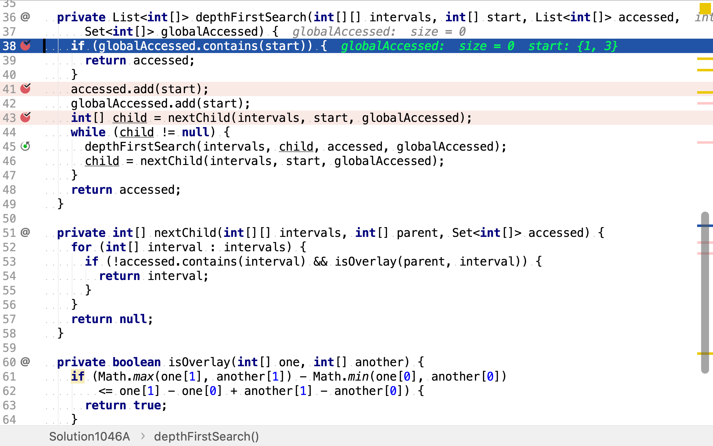
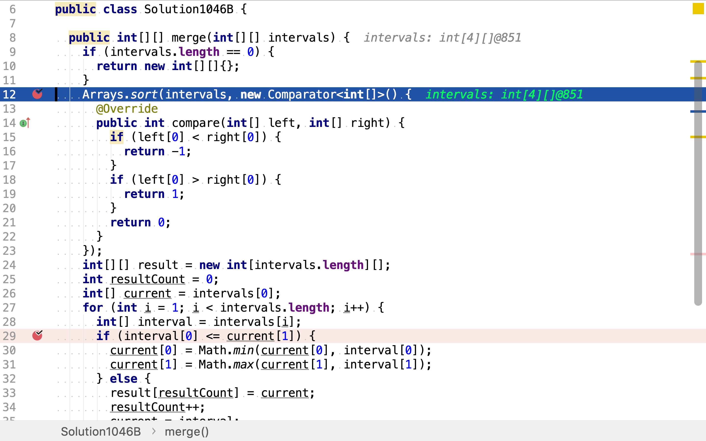

# 合併區間

# 題目

>給出一個區間的集合，請合併所有重疊的區間。
>
>**示例 1：**
>
>```
>輸入: [[1,3],[2,6],[8,10],[15,18]]
>輸出: [[1,6],[8,10],[15,18]]
>解釋: 區間 [1,3] 和 [2,6] 重疊, 將它們合併為 [1,6].
>```
>
>**示例 2：**
>
>```
>輸入: [[1,4],[4,5]]
>輸出: [[1,5]]
>解釋: 區間 [1,4] 和 [4,5] 可被視為重疊區間。
>```

## 圖連通分量法

如果將每個區間視為圖中的一個點，將兩個區間重疊視為圖中兩個相鄰，則所有重疊的區間集合即為圖中的連通分量。

舉個例子，給定區間集合`[[1,6],[4,7],[6,11],[13,16],[16,24]]`。該區間集合可建模為如下圖：

```plantuml
graph g {
    a [label="[1,6]"]
    b [label="[4,7]"]
    c [label="[6,11]"]
    d [label="[13,16]"]
    e [label="[16,24]"]

    a -- b
    a -- c
    b -- c
    d -- e
}
```

集合中五個區間映射為圖中的五個點。其中：

* 區間`[1,6], [4,7], [6,11]`相互重疊即相鄰
* 區間`[13,16]`和`[16,24]`相互重疊即相鄰

使用深度優先搜尋法查找所有連通分量：

* 以`[1,6]`為起點深度優先遍歷圖，得到連通分量`[[1,6], [4,7], [6,11]]`，同時記錄下已訪問的點。

```plantuml
graph g {
    a [label="[1,6]", style=filled, fillcolor=grey]
    b [label="[4,7]", style=filled, fillcolor=grey]
    c [label="[6,11]", style=filled, fillcolor=grey]
    d [label="[13,16]"]
    e [label="[16,24]"]

    a -- b
    a -- c
    b -- c
    d -- e
}
```

* 以`[13,16]`為起點深度優先遍歷圖，得到連通分量`[13,16], [16,24]]`，同時記錄已訪問過的點。

```plantuml
graph g {
    a [label="[1,6]", style=filled, fillcolor=grey]
    b [label="[4,7]", style=filled, fillcolor=grey]
    c [label="[6,11]", style=filled, fillcolor=grey]
    d [label="[13,16]", style=filled, fillcolor=grey]
    e [label="[16,24]", style=filled, fillcolor=grey]

    a -- b
    a -- c
    b -- c
    d -- e
}
```

### 代碼實現

[include](../../../src/main/java/io/github/rscai/leetcode/bytedance/array/Solution1046A.java)

以每一個區間為起點，使用深度優先搜尋法遍歷圖搜尋連通分量。


保留下非空的連通分量。


最後，各自合併連通分量𥚃的點即區間。


其中，深度優先搜尋法以遞歸方式實現。首先，訪問當點（即區間），將其加入「全局已訪問集合」；然後，穫取與起點相鄰但未被訪問的點，以該點為新的起點進行深度優先搜尋；再然後，穫取下一個與起點相鄰但未被訪問的點，以該點為新的起點進行深度優先搜尋；遞歸終止條件為「沒有相鄰但未被訪問的點」。

首先，判斷起點是否已被訪問過。



若否，則將其納入當前連通分量中，並記錄到「全局已訪問」點集中。


然後，穫取下一個相鄰但未訪問過的點，以該點為新的起點，遞歸套用`depthFirstSearch`。


遞歸終止條件為：沒有未訪問的相鄰點（重疊的區間）。

### 複雜度分析

#### 時間複雜度

首先，其針對每一個點都進行一次深度優先搜尋和集合比較。但`depthFirstSearch`會將訪問過的點都記錄下來，以避免重復訪問。所以，假設輸入區間數為$$n$$，這一段的時間複雜度為$$\mathcal{O}(n)$$。

```java
    for (int[] start : intervals) {
      List<int[]> component = depthFirstSearch(intervals, start, new ArrayList<int[]>(),
          globalAccessed);
      if (component.size() > 0) {
        components.add(component);
      }
    }
```

然後，各自合併連通分量時，兩重循環要遍歷每一個原輸入區間。時間複雜度為$$\mathcal{O}(n)$$。

```java
    for (Set<int[]> component : components) {
      int start = Integer.MAX_VALUE;
      int end = Integer.MIN_VALUE;
      for (int[] interval : component) {
        start = Math.min(start, interval[0]);
        end = Math.max(end, interval[1]);
      }
      result[index] = new int[]{start, end};
      index++;
    }
```

將所有的加起點，時間複雜度為

$$
\begin{aligned}
C_{time} &= \mathcal{O}(n) + \mathcal{O}(n) \\
&= \mathcal{O}(n)
\end{aligned}
$$。

#### 空間複雜度

使用了三個變量`components`, `globalAccessed`和`result`。空間複雜度為：

$$
\begin{aligned}
C_{space} &= \mathcal{O}(n + n + n) \\
&=\mathcal{O}(n)
\end{aligned}
$$

## 排序

如果給定的區間是按起始點從小到大排序的，則重疊的區間一定是連續的。所以，將區間按起始點從小到大排序；然後，一次遍歷區間，將重疊的連續區間合併。

舉個例子，給定區間`[[1,6],[4,7],[6,11],[13,16],[16,24]]`。按起始點升序排序後得到`[[1,6],[4,7],[6,11],[13,16],[16,24]]`

```plantuml
graph g {
    intervals [shape=record, label="[1,6]|[4,7]|[6,11]|[13,16]|[16,24]"]
}
```

* `[1,6]`和`[4,7]`重疊，合併為`[1,7]`

```plantuml
graph g {
    intervals [shape=record, label="[1,7]|[6,11]|[13,16]|[16,24]"]
}
```

* `[1,7]`和`[6,11]`重疊，合併為`[1,11]`

```plantuml
graph g {
    intervals [shape=record, label="[1,11]|[13,16]|[16,24]"]
}
```

* `[1,11]`和`[13,16]`不重疊
* `[13,16]`和`[16,24]`重疊，合併為`[13,24]`

```plantuml
graph g {
    intervals [shape=record, label="[1,11]|[13,24]"]
}
```

從以上例子可以看出，本演算法基於以下命題**不**成立：

>在有序的區間序列中，存在三個連序的區間a, b和c。若a和c重疊，則a和b不重疊且b和c不重疊。

### 證明

設：

* 區間$$a$$的起止點分別為$$a_s, a_s$$
* 區間$$b$$的起止點分別為$$b_s, b_e$$
* 區間$$c$$的起止點分別為$$c_s, c_e$$

已知：

* a, b, c 是按起始點從小到到排序，即$$a_s \leq b_s \leq e_s$$
* a和c重疊，即$$c_s \leq a_e$$

則：

$$
(b_s \leq c_s, c_s \leq a_e) \to bs \leq a_e
$$

$$
(b_s \leq a_e, a_s \leq b_s) \to a和b重疊
$$

所以，命題不成立。

### 代碼實現

[include](../../../src/main/java/io/github/rscai/leetcode/bytedance/array/Solution1046A.java)

首先，使用JDK提供的`Arrays.sort`對輸入區間序列排序。



然後，再合併相鄰且重疊的區間。


### 複雜度分析

#### 時間複雜度

`Arrays.sort`實現了「合併排序（Merge Sort）」，時間複雜度是$$n \log(n)$$。然後再遍歷了一次有序區間序列。所以，整體時間複雜度為：

$$
\begin{aligned}
C_{time} &= \mathcal{O}(n \log(n) + n) \\
&= \mathcal{O}(n \log(n))
\end{aligned}
$$

#### 空間複雜度

使用了變量`result`，空間複雜度為$$\mathcal{O}(n)$$。
