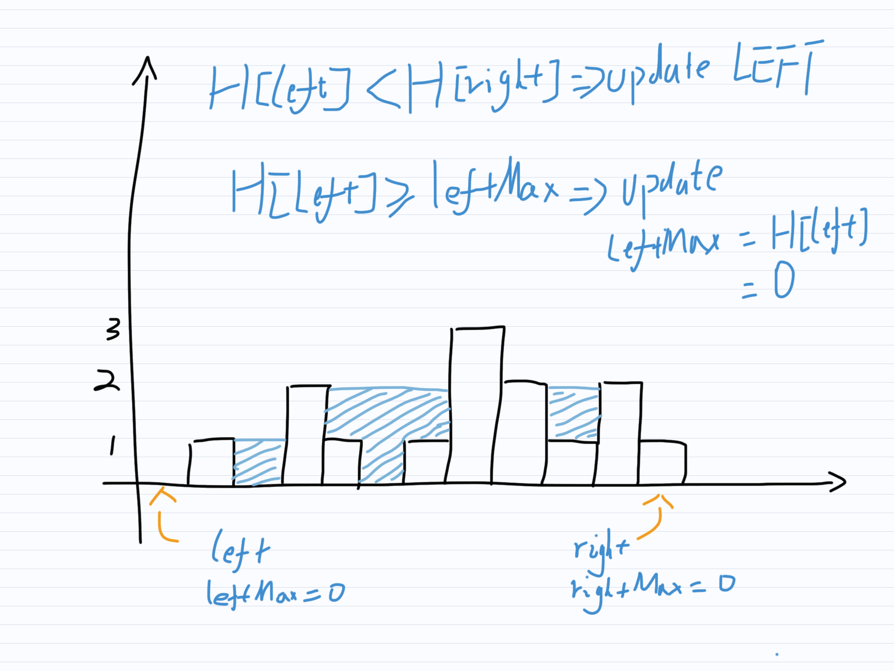

# 接雨水

## 題目

>給定n個非負整數表示每個寬度為1的柱子的高度圖，計算按此排列的柱子，下雨之後能接多少雨水。
>
>
>
>上面是由數組[0,1,0,2,1,0,1,3,2,1,2,1] 表示的高度圖，在這種情況下，可以接6 個單位的雨水（藍色部分表示雨水）。感謝 Marcos 貢獻此圖。
>
>**示例：**
>
>```
>輸入: [0,1,0,2,1,0,1,3,2,1,2,1]
>輸出: 6
>```

## 暴力法

對於每一根柱子，其上雨水可達的最大高度為其左右兩邊最高柱子中較低的一根柱子的高度，再減去柱子本身的高度即為兩水的深度。

舉個例子，給定如下柱圖:


第1根柱子左邊中最高的柱子高度為0，右邊最高柱子高度為3，則其積水最大可達高度0。

第二根柱子左邊最高柱子高度為1，右邊最高柱子高度為3，則其積水最大可達高度1。再減去柱子本身高度0，則積水深度最大可達1。

第三根柱子左邊最高柱子高度為1，右邊最高柱子高度為3，則其積水最大可達高度為1。但其自身高度為2，則積水深度最大為0。

第四根柱子左邊最高柱子高度為2，右邊最高柱子高度為3，則其積水最大可達高度為2。減去自身高度1，則積水深度最大為1。

第五根柱子左邊最高柱子高度為2，右邊最高柱子高度為3，則其積水最大高度為2。減去自身高度0，積水最大深度為2。

。。。

### 代碼實現

[include](../../../src/main/java/io/github/rscai/leetcode/bytedance/array/Solution1047A.java)

首先，遍歷每根柱子。


然後，針對每一根柱子，計算其左邊最高柱子和右邊最高柱子，取其中較低者再減去柱子本身的高度，得到本柱子上方積水的深度。


最後，累加積水深度。若積水深度為負數，則等同於0。


左邊和右邊的最高柱子由分別遍歷左右所有柱子得到。


### 複雜度分析

#### 時間複雜度

本演算法針對每根柱子都需要通過遍歷一遍所有柱子找到左右兩邊最高的柱子。所以時間複雜度為$$\mathcal{O}(n^2)$$。

#### 空間複雜度

使用了三個變量`area, index, regionalArea`，空間複雜度為$$mathcal{O}(1)$$。

## 動態規劃法



柱子跟柱子之間的「左邊柱子」和「右邊柱子」有部份重疊。這些重疊的部份就是「動態規劃」可以優化的地方。

舉個例子，給定如下柱圖:


第一根柱子上的積水深度由左邊最高的柱子和右邊最高的柱子決定。而左邊柱子為空。右邊柱子包括了第`2,3,4,5,6,7,8,9,10,11`根柱子，其最高的柱子為第`2`根與其餘柱子中最高者之間的較高者。


其餘柱子中最高者則可運用遞歸法求得。相似地，第二根柱子上的積水深度由左邊最高的柱子和右邊最高的柱子決定，而左右兩邊最高的柱子都可運用遞歸法求得。

將所有子問題及其子問題以樹的形式展現，可以直觀地發現很多相同的子樹，這些重復的子樹就是「重疊的子問題」。將重重疊子問題的解保存以供後續使用，避免重復計算相同的問題，這正是「動態規劃」的核心。

```plantuml
digraph d {
    root
    a [label="depth(1)"]
    b [label="depth(2)"]
    c [label="depth(3)"]
    d [label="depth(4)"]
    e [label="depth(5)"]
    f [label="..."]
    root -> a
    root -> b
    root -> c
    root -> d
    root -> e
    root -> f
    
    aa [label="maxHeight([])"]
    ab [label="maxHeight([2,3,4,5,6,7,8,9,10,11])"]
    a -> aa
    a -> ab
    aba [label="height(2)"]
    abb [label="maxHeight([3,4,5,6,7,8,9,10,11])", style=filled, fillcolor=green]
    ab -> aba
    ab -> abb
    abba [label="height(3)"]
    abbb [label="maxHeight([4,5,6,7,8,9,10,11])", style=filled, fillcolor=pink]
    abb -> abba
    abb -> abbb
    abbba [label="height(4)"]
    abbbb [label="maxHeight([5,6,7,8,9,10,11])", style=filled, fillcolor=lightyellow]
    abbb -> abbba
    abbb -> abbbb
    abbbba [label="..."]
    abbbb -> abbbba

    ba [label="maxHeight([1])"]
    bb [label="maxHeight([3,4,5,6,7,8,9,10,11])", style=filled, fillcolor=green]
    b -> ba
    b -> bb
    bba [label="height(3)"]
    bbb [label="maxHeight([4,5,6,7,8,9,10,11])", style=filled, fillcolor=pink]
    bb -> bba
    bb -> bbb
    bbba [label="height(4)"]
    bbbb [label="maxHeight([5,6,7,8,9,10,11])", style=filled, fillcolor=lightyellow]
    bbb -> bbba
    bbb -> bbbb
    bbbba [label="height(5)"]
    bbbbb [label="maxHeight([6,7,8,9,10,11])"]
    bbbb -> bbbba
    bbbb -> bbbbb
    bbbbba [label="..."]
    bbbbb -> bbbbba
}
```

### 代碼實現

[include](../../../src/main/java/io/github/rscai/leetcode/bytedance/array/Solution1047B.java)

大體上與暴力法相似，首先遍歷每根柱子。


然後，針對每一根柱子，計算其左邊最高柱子和右邊最高柱子，取其中較低者再減去柱子本身的高度，得到本柱子上方積水的深度。


最後，累加積水深度。若積水深度為負數，則等同於0。


求左右邊最高柱子的方法則使用帶值緩存的函數實現。


### 複雜度分析

#### 時間複雜度

本演算法緩存了所有`maxHeightOnLeftSide`和`maxHeightOnRightSide`的值，所以實際上只遍歷了一遍所有柱子。所以時間複雜度為$$\mathcal{O}(n)$$。

#### 空間複雜度

本演算法緩存了所有`maxHeightOnLeftSide`和`maxHeightOnRightSide`的值。所以空間複雜度是$$\mathcal{O}(n)$$。

## 雙指針法

要計算某一柱子上積水高度，並非一定要分別計算出左右邊最高的柱子，而只需要計算出左右邊最高柱子中的較低者。

使用左右兩個指針，分別從左端和右端向中間移動。再將左指針左側最大高度記為`leftMaxHeight`，右指針右側最大高度記為`rightMaxHeight`。
當左指針指向柱子低於右指針柱子時，移動左指針；當左指針柱子高於右指針柱子時，移動右指針。
當移動左指針時，若所指柱子高於`leftMaxHeight`則更新之。且此時`leftMaxHeight`和`rightMaxHeight`中較低者即為左側最高柱子和右側最高柱子之中的較低者。
當移動右指針時，進行類似的操作。

舉個例子，給定如下柱圖：


`left, right`指針初始分別指向頭和尾端柱子，`leftMax, rightMax`初始為`0`。

比較左右指針所指柱子，左指針柱子低於右指針柱子，則移動左指針。移動指針前，若左指針所指柱子高於`leftMax`則更新`leftMax`，同累加左指針所指柱子上的積水深度。



繼續比較左右指針所指柱子，此時左指針所指柱子並沒有低於右指針所指柱子，所以移動右指針。移動指針之前，若右指針所指柱子高於`rightMax`則更新`rightMax`。同時累計右指針所指柱子上的積水深度。


繼續比較左右指針所指柱子，此時左指針所指柱子低於右指針所指柱子，移動左指針。移動左指針之前，若左指針所指柱子高於`leftMax`則更新`leftMax`。同時累計左指針所指柱子上的積水深度。


### 代碼實現

[include](../../../src/main/java/io/github/rscai/leetcode/bytedance/array/Solution1047C.java)

首先，創建左右雙指針分別指向頭和尾。同時創建`leftMaxHeight`和`rightMaxHeight`。


然後，向中間移動雙指針。當左指針所指柱子低於右指針所指柱子時，移動左指針。若新的柱子高於`leftMaxHeight`則更新之；否則計算新柱子上積水深度並累計。


當左指針高於右指針時，移動右指針。若新的柱子高於`rightMaxHeight`則更新之；否則計算新柱子上積水深度並累計。


### 複雜度分析

#### 時間複雜度

整共就遍歷了一次所有柱子，所以時間複雜度是$$\mathcal{O}(n)$$。

#### 空間複雜度

使用了5個變量`leftIndex, rightIndex, area, leftMaxHeight, rightMaxHeight`，空間複雜度為$$\mathcal{O}(1)$$。
