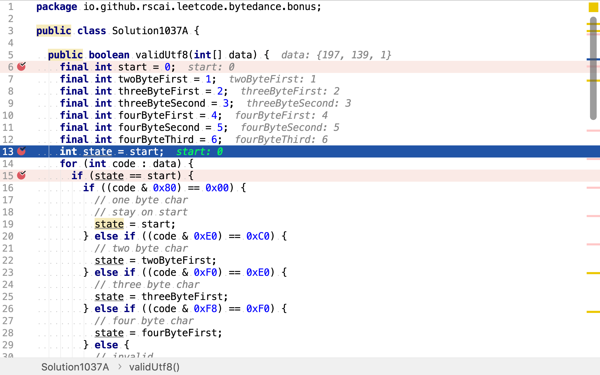
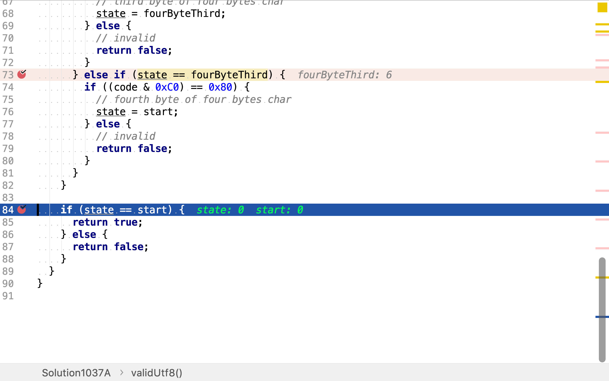

# UTF-8 編碼驗證

## 題目

>UTF-8 中的一個字符可能的長度為 1 到 4 字節，遵循以下的規則：
>
>1. 對於 1 字節的字符，字節的第一位設為0，後面7位為這個符號的unicode碼。
>2. 對於 n 字節的字符 (n > 1)，第一個字節的前 n 位都設為1，第 n+1 位設為0，後面字節的前兩位一律設為10。剩下的沒有提及的二進制位，全部為這個符號的unicode碼。
>
>這是 UTF-8 編碼的工作方式：
>
>```
>   Char. number range  |        UTF-8 octet sequence
>      (hexadecimal)    |              (binary)
>   --------------------+---------------------------------------------
>   0000 0000-0000 007F | 0xxxxxxx
>   0000 0080-0000 07FF | 110xxxxx 10xxxxxx
>   0000 0800-0000 FFFF | 1110xxxx 10xxxxxx 10xxxxxx
>   0001 0000-0010 FFFF | 11110xxx 10xxxxxx 10xxxxxx 10xxxxxx
>```
>
>給定一個表示數據的整數數組，返回它是否為有效的 utf-8 編碼。
>
>**注意:**
>
>輸入是整數數組。只有每個整數的最低 8 個有效位用來存儲數據。這意味著每個整數只表示 1 字節的數據。
>
>**示例 1:**
>
>```
>data = [197, 130, 1], 表示 8 位的序列: 11000101 10000010 00000001.
>
>返回 true 。
>這是有效的 utf-8 編碼，為一個2字節字符，跟著一個1字節字符。
>```
>
>**示例 2:**
>
>```
>data = [235, 140, 4], 表示 8 位的序列: 11101011 10001100 00000100.
>
>返回 false 。
>前 3 位都是 1 ，第 4 位為 0 表示它是一個3字節字符。
>下一個字節是開頭為 10 的延續字節，這是正確的。
>但第二個延續字節不以 10 開頭，所以是不符合規則的。
>```

## 確定有限狀態機法

確定有限狀態機是解決正則語言、編碼檢驗解柝的一個很有利的數學模型。



針對本題，定義：

* 一個非空有限的狀態集合`{start, twoByteFirst, threeByteFirst, threeByteSecond, fourByteFirst, fourByteSecond, fourByteThird}`
* 一個輪入字母表`{0xxxxxxx, 110xxxxx, 1110xxxx, 11110xxx, 10xxxxxx}`
* 一個轉移函數

|State|0xxxxxxx|110xxxxx|1110xxxx|11110xxx|10xxxxxx
|-----|--------|--------|--------|--------|---------
|start|start|twoByteFirst|threeByteFirst|fourByteFirst| 
|twoByteFirst| | | | |start
|threeByteFirst| | | | |threeByteSecond
|threeByteSecond| | | | |start
|fourByteFirst| | | | |fourByteSecond
|fourByteSecond| | | | |fourByteThird
|fourByteThird| | | | |start

* 一個開始狀態 `start`
* 一個接受狀態的集合 `{start}`

舉個例子，輪入整數序列`[197, 130, 1]`, 表示 8 位的序列: 11000101 10000010 00000001。

* state初始為start；
* 輸入第一個8位值`11000101`，其符合`110xxxxx`，所以轉移狀態至twoByteFirst
* 輸入第二個8位值`10000010`，其符合`10xxxxxx`，所以轉移狀態至start
* 輸入第三個8位值`00000001`，其符合`0xxxxxxx`，所以保持狀態為start

最終狀態停留在start，屬於接受狀態集合，所以該整數序列是有效的UTF-8編碼。

### 代碼實現

[include](../../../src/main/java/io/github/rscai/leetcode/bytedance/bonus/Solution1037A.java)

將所有狀態值都定義為常量，


狀態初始化為start，



使用for循環逐一輸入整數，驅動「確定有限狀態機」


最後，判斷狀態是否為可接受狀態。



### 複雜度分析

#### 時間複雜度

本演算法只遍歷了一遍整數序列，所以時間複雜度為$$\mathcal{O}(n)$$。

#### 空間複雜度

使用了一個變量`state`，所以空間複雜度為$$\mathcal{O}(1)$$。
