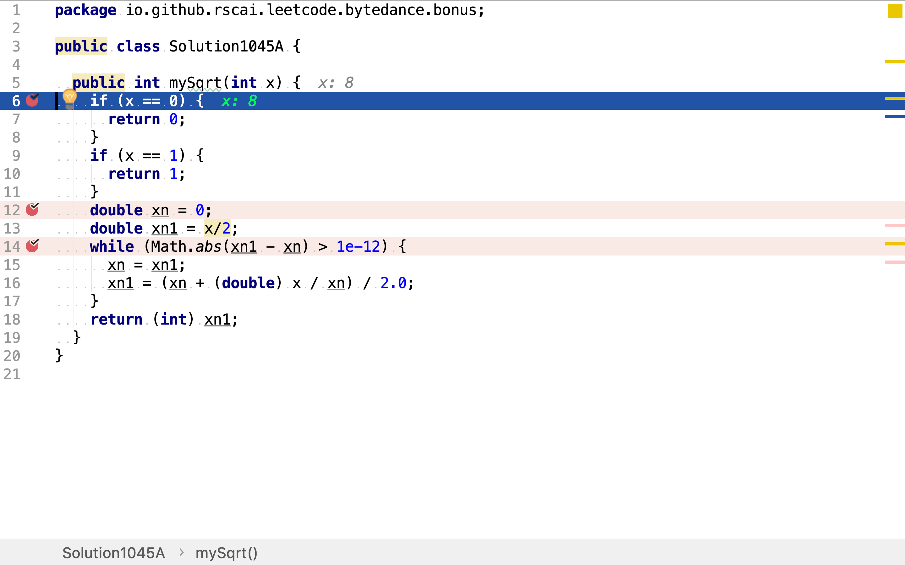
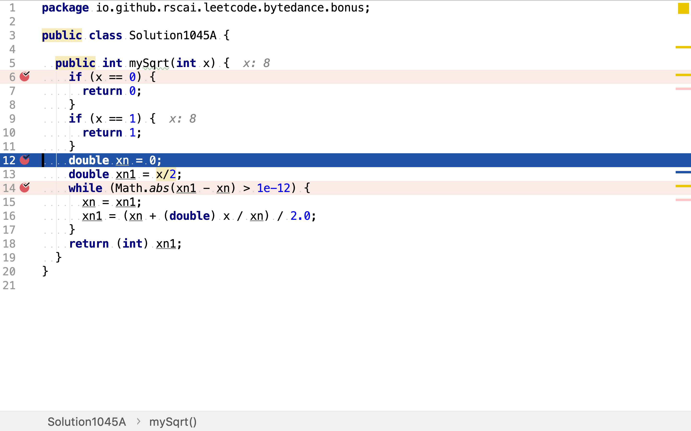
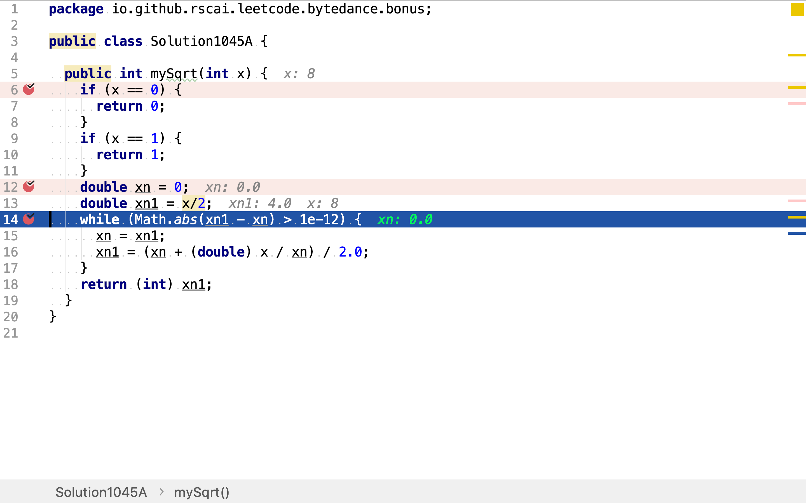
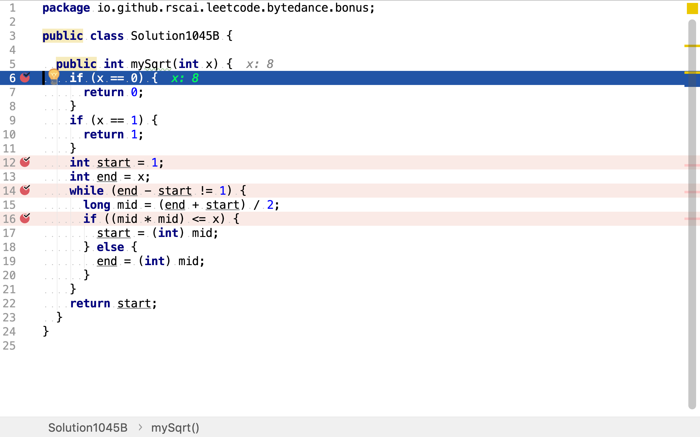
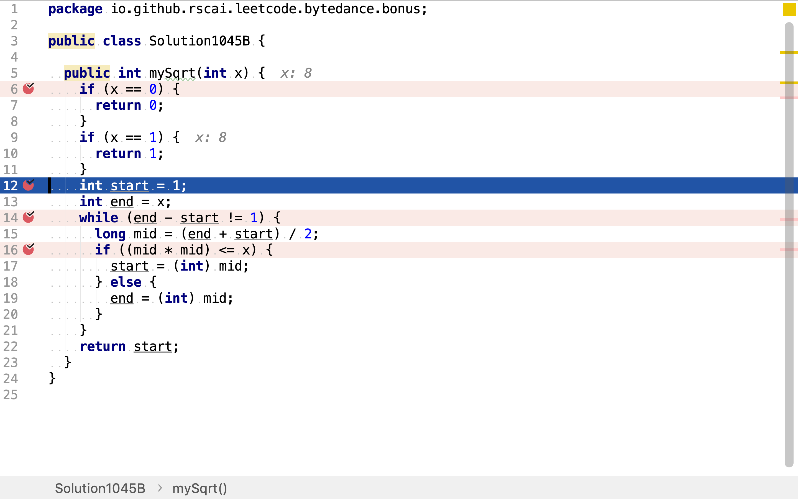
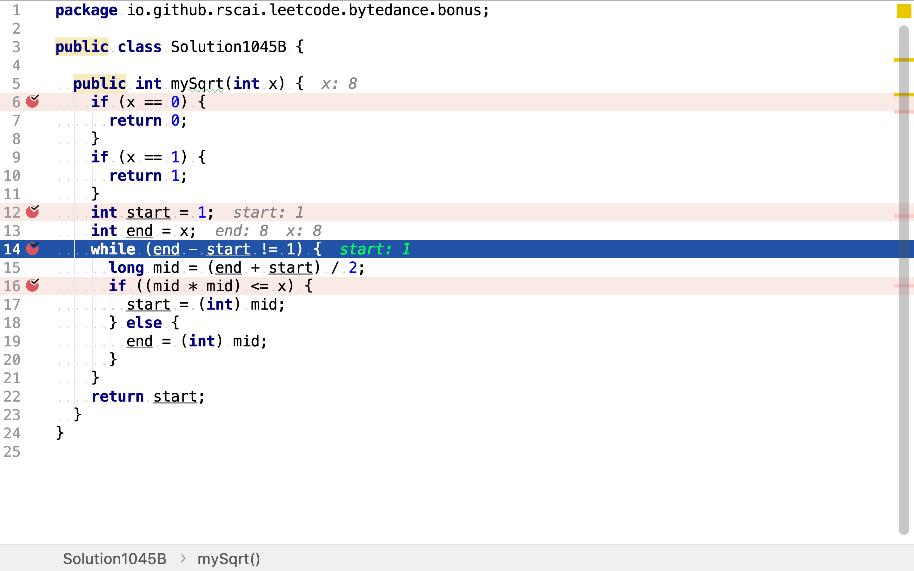
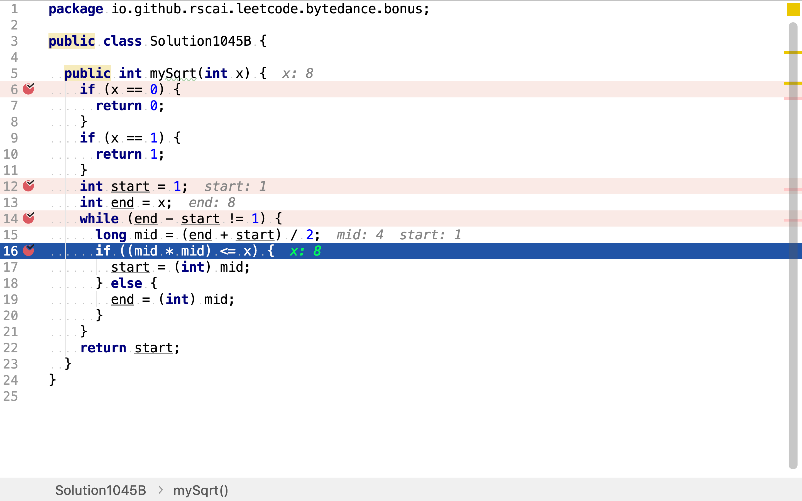

# x的平方根

## 題目

>實現 int sqrt(int x) 函數。
>
>計算並返回 x 的平方根，其中 x 是非負整數。
>
>由於返回類型是整數，結果只保留整數的部分，小數部分將被捨去。
>
>**示例 1**
>
>```
>輸入: 4
>輸出: 2
>```
>
>**示例 2**
>
>```
>輸入: 8
>輸出: 2
>說明: 8 的平方根是 2.82842...,
>     由於返回類型是整數，小數部分將被捨去。
>```


## 牛頓法

>在數學中，一個數 $$x$$的平方根$$y$$指的是滿足 $$y^2 = x$$的數，即平方結果等於$$x$$的數。例如，4和-4都是16的平方根，因為 $${\displaystyle 4^{2}=(-4)^{2}=16}$$。
>
>任意非負實數都有唯一的非負平方根，稱為主平方根或算術平方根（英語：principal square root），記為 $${\sqrt {x}}$$，其中的符號√稱作根號。例如，9的主平方根為3，記作$${\displaystyle {\sqrt {9}}=3}$$，因為 $${\displaystyle 3^{2}=3\times 3=9}$$並且3非負。被求平方根的數稱作被開方數（英語：radicand），是根號下的數字或者表達式，即例子中的數字9。
>
>正數$$x$$有兩個互為相反數的平方根：正數 $${\sqrt {x}}$$與負數$$-\sqrt x$$，可以將兩者一起記為 $$\pm {\sqrt {x}}$$。
>
>負數的平方根在複數系中有定義。而實際上，對任何定義了開平方運算的數學對象都可考慮其「平方根」（例如矩陣的平方根）。
>
>### 正數的平方根
>
>若正整數x是平方數，則其平方根是整數。若正整數x不是平方數，則其平方根是無理數。
>
>### 計算方法
>
>#### 長除式算法
>
>長除式算平方根的方式也稱為直式開方法，原理是 $$(a+b)^2=a^2+2ab+b^2=a^2+(2a+b)b$$。
>
>1. 首先將要開平方根的數從小數點分別向右及向左每兩個位一組分開，如98765.432內小數點前的65是一組，87是一組，9是一組，小數點後的43是一組，之後是單獨一個2，要補一個0而得20是一組。如1 04.85 73得四組，順序為1' 04. 85' 73'。
>2. 將最左的一組的數減去最接近又少於它的平方數，並將該平方數的開方（應該是個位數）記下。
>3. 將上一步所得之差乘100，和下一組數加起來。
>4. 將記下的數乘20，然後將它加上某個個位數，再乘以該個個位數，令這個積不大於但最接近上一步所得之差，並將該個個位數記下，且將上一步所得之差減去所得之積。
>5. 記下的數一次隔兩位記下。
>6. 重覆第3步，直到找到答案。
>7. 可以在數字的最右補上多組的00'以求得理想的精確度為止。
>
>#### 牛頓法
>
>如果要求$$S\,(S>1)$$的平方根，選取$$1\,<\,x_0\,<\,S$$
>
>$$x_{n+1} = \frac{1}{2}\left(x_n + \frac{S}{x_n}\right)$$
>例子：求 $$\sqrt{125348}$$至6位有效數字。

$$
\begin{aligned}
x_0 &= 3^6 = 729.000 \\
x_1 &= \frac{1}{2} \left(x_0 + \frac{S}{x_0}\right) = \frac{1}{2} \left(729.000 + \frac{125348}{729.000}\right) = 450.472 \\
x_2 &= \frac{1}{2} \left(x_1 + \frac{S}{x_1}\right) = \frac{1}{2} \left(450.472 + \frac{125348}{450.472}\right) = 364.365 \\
x_3 &= \frac{1}{2} \left(x_2 + \frac{S}{x_2}\right) = \frac{1}{2} \left(364.365 + \frac{125348}{364.365}\right) = 354.191 \\
x_4 &= \frac{1}{2} \left(x_3 + \frac{S}{x_3}\right) = \frac{1}{2} \left(354.191 + \frac{125348}{354.191}\right) = 354.045 \\
x_5 &= \frac{1}{2} \left(x_4 + \frac{S}{x_4}\right) = \frac{1}{2} \left(354.045 + \frac{125348}{354.045}\right) = 354.045
\end{aligned}
$$

### 代碼實現

[include](../../../src/main/java/io/github/rscai/leetcode/bytedance/bonus/Solution1045A.java)

當輪入整數是0或1時，可以直得出其平方根。



牛頓法是在連續函數上逐步逼近，所以將中間變量定義為較大取值範圍的double。



已知除了平方數，其它正整數的平方根都是無理數。所以，牛頓法只能通過不斷迭代不斷逼近平方根。實際實現中必須要有迭代中止條件，此處我們當前後兩次迭代結果相差小於`1e-12`即中止迭代。



### 複雜度分析

#### 時間複雜度

理論上講，牛頓法時間複雜度是$$\mathcal{O}(\log n)$$。但其實際表現取決於初始值的選擇和迭代中止條件（Tolerance）的選擇。

請參考：

* [Square Roots via Newton’s Method, S. G. Johnson, MIT Course 18.335, February 4, 2015](https://math.mit.edu/~stevenj/18.335/newton-sqrt.pdf)
* [收斂速度](https://zh.wikipedia.org/wiki/收斂速度)

#### 空間複雜度

使用了兩個變量`xn, xn1`，空間複雜度為$$\mathcal{O}(1)$$。

## 二分搜索法

根據平方根定義，大於1的正整數平方根x是一個大於1小於S的實數。而本題只求平方根的整數部份，實際上就是求1至平方根x之間最大的整數。1至平方根x之間的整數是有限及有序的，二分搜索法可有效地在有限有序序列中搜索目標值。

步驟：

1. 將1至S的整數序列切分為二
2. 若中間值的平方小於或等於S，則繼續在右半段序列中搜索：若中間值的平方大於S，則繼續在左半段序列中搜索
3. 當序列片斷僅為一個整數時，其就是所求目標值

舉個例子，求20的平方根的整數部份。20的平方根肯定是1至20之間，20平方根的整數部份一定是1至20之間19個整數中的一個。

1. 將序列`1,2,...,18,19`二分為`1,2,...,9`和`10,...,19`，中間值`10`的平方`100`大於`20`，繼續在左半段搜索
2. 將左半段序列`1,2,...,18,19`二分為`1,2,3,4`和`5,6,7,8,9`，中間值`5`的平方`25`大於`20`，繼續在左半段搜索
3.將左半段序列`1,2,3,4`二分為`1,2`和`3,4`，中間值`3`的平方`9`小於`20`，繼續在右半段中搜索 
4. 將右半段序列`3,4`二分為`3`和`4`，中間值`4`的平方`16`小於`20`，繼續在右半段中搜索
5. 右半段`4`僅有一個整數，所以`4`就是所求值

```plantuml
digraph d {
    root [shape=record, label="1|2|3|4|5|6|7|8|9|10|11|12|13|14|15|16|17|18|19"]
    a [shape=record, label="1|2|3|4|5|6|7|8|9", style=filled, fillcolor=lawngreen]
    b [shape=record, label="10|11|12|13|14|15|16|17|18|19"]
    root -> a
    root -> b

    aa [shape=record, label="1|2|3|4", style=filled, fillcolor=lawngreen]
    ab [shape=record, label="5|6|7|8|9"]
    a -> aa
    a -> ab

    aaa [shape=record, label="1|2"]
    aab [shape=record, label="3|4", style=filled, fillcolor=lawngreen]
    aa -> aaa
    aa -> aab

    aaaa [shape=record, label="3"]
    aaab [shape=record, label="4", style=filled, fillcolor=lawngreen]
    aaa -> aaaa
    aaa -> aaab
}
```

 ### 代碼實現

[include](../../../src/main/java/io/github/rscai/leetcode/bytedance/bonus/Solution1045B.java)

先處理一些簡單的情況，如輸入整數是0或1。



整數序列的起止初始為1和輪入整數，區間使用左閉右開模式。



二分搜索法是一種遞歸方法，這𥚃使用`while`循環實現遞歸。遞歸中止條件為整數序列僅包含一個整數。



將整數序列不斷地二分，通過中間值平方和輸入值之間的大小關系，判斷目標值是在左半段序列或是在右半段序列。



### 複雜度分析

#### 時間複雜度

假設初始整數序列，即輪入整數值，為$$n$$，二分法一共要進行$$\log n$$次二分和判斷中間值平方和輪入值關系。所以，時間複雜度為$$\mathcal{O}(\log n)$$。

#### 空間複雜度

使用了三個變量`start, end, mid`，空間複雜度為$$\mathcal{O}(1)$$。

## 參考

* [平方根](https://zh.wikipedia.org/wiki/平方根)