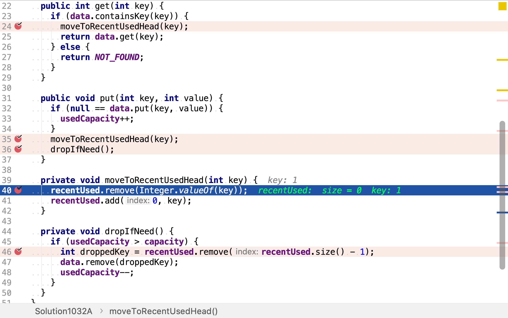

# LRU 緩存機制

## 題目

>運用你所掌握的數據結構，設計和實現一個 LRU (最近最少使用) 緩存機制。它應該支持以下操作： 獲取數據 `get` 和 寫入數據 `put` 。
>
>獲取數據 `get(key)` - 如果密鑰 (key) 存在於緩存中，則獲取密鑰的值（總是正數），否則返回 -1。
>寫入數據 `put(key, value)` - 如果密鑰不存在，則寫入其數據值。當緩存容量達到上限時，它應該在寫入新數據之前刪除最近最少使用的數據值，從而為新的數據值留出空間。
>
>**進階:**
>
>你是否可以在 O(1) 時間複雜度內完成這兩種操作？
>
>**示例:**
>
>```
>LRUCache cache = new LRUCache( 2 /* 緩存容量 */ );
>
>cache.put(1, 1);
>cache.put(2, 2);
>cache.get(1); // 返回 1
>cache.put(3, 3); // 該操作會使得密鑰 2 作廢
>cache.get(2); // 返回 -1 (未找到)
>cache.put(4, 4); // 該操作會使得密鑰 1 作廢
>cache.get(1); // 返回 -1 (未找到)
>cache.get(3); // 返回 3
>cache.get(4); // 返回 4
>```

## 散列表和雙向鏈表組合

一個LRU緩存需實現兩個特性，一是快速按鍵查找值，二是將值或鍵按最近使用情況排序以便快速获取最近最少使用的值或鍵。

常用的數據結構中，散列表可以非常高效地實現「按鍵查找值」；雙向鏈表可以高效地實現有序序列，同時高效地插入、移除元素。所以，我們可以組合散列表和雙向鏈表實現LRU緩存。

舉個列子，創建一個散列表和雙向鏈表。散列表初始時為空。雙向鏈表初始時也為空，同時維護分別指向鏈表頭尾的兩個引用。

```plantuml
digraph d {
    map [shape=record, label="<0>0|<1>1|<2>2|<3>3|<4>4|<5>5|<6>6|<7>7|<8>8|<9>9"]
    head [shape=none, label=head]
    tail [shape=none, label=tail]
}
```

將鍵值對`(1,1)`存入緩存時，先將其存入散列表對應的桶中，再將鍵`1`加到鏈表的頭端。

```plantuml
digraph d {
    map [shape=record, label="<0>0|<1>1|<2>2|<3>3|<4>4|<5>5|<6>6|<7>7|<8>8|<9>9"]
    ea [label="1:1", style=filled, fillcolor=lawngreen]
    map:1 -> ea
    head [shape=none, label=head]
    tail [shape=none, label=tail]
    na [label=1, style=filled, fillcolor=lawngreen]
    head -> na [style=dotted]
    tail -> na [style=dotted]
}
```

將鍵值對`(2,2)`存入緩存時，先將其存入散列表對應的桶中，再將鍵`2`加到鏈表的頭端。

```plantuml
digraph d {
    map [shape=record, label="<0>0|<1>1|<2>2|<3>3|<4>4|<5>5|<6>6|<7>7|<8>8|<9>9"]
    ea [label="1:1"]
    eb [label="2:2", style=filled, fillcolor=lawngreen]
    map:1 -> ea
    map:2 -> eb
    head [shape=none, label=head]
    tail [shape=none, label=tail]
    na [label=1]
    nb [label=2, style=filled, fillcolor=lawngreen]
    head -> nb [style=dotted]
    nb -> na
    na -> nb
    tail -> na [style=dotted]
    {rank=same; na,nb}
}
```

將鍵值對`(3,3)`存入緩存時，先將其存入散列表對應的桶中，再將鍵`3`加到鏈表的頭端。若緩存的容量為`2`，則此時緩存中的數據已超過了容量限制。鏈表尾端元素即最近最少使用的元素，將其從鏈表中移除，同時從散列表中移除相應的元素。

```plantuml
digraph d {
    map [shape=record, label="<0>0|<1>1|<2>2|<3>3|<4>4|<5>5|<6>6|<7>7|<8>8|<9>9"]
    ea [label="1:1", style=filled, fillcolor=pink]
    eb [label="2:2"]
    ec [label="3:3", style=filled, fillcolor=lawngreen]
    map:1 -> ea
    map:2 -> eb
    map:3 -> ec
    head [shape=none, label=head]
    tail [shape=none, label=tail]
    na [label=1, style=filled, fillcolor=pink]
    nb [label=2]
    nc [label=3, style=filled, fillcolor=lawngreen]
    head -> nc [style=dotted]
    nc -> nb
    nb -> nc
    nb -> na
    na -> nb
    tail -> na [style=dotted]
    {rank=same; na,nb,nc}
}
```

```plantuml
digraph d {
    map [shape=record, label="<0>0|<1>1|<2>2|<3>3|<4>4|<5>5|<6>6|<7>7|<8>8|<9>9"]
    eb [label="2:2"]
    ec [label="3:3", style=filled, fillcolor=lawngreen]
    map:2 -> eb
    map:3 -> ec
    head [shape=none, label=head]
    tail [shape=none, label=tail]
    nb [label=2]
    nc [label=3, style=filled, fillcolor=lawngreen]
    head -> nc [style=dotted]
    nc -> nb
    nb -> nc
    tail -> nb [style=dotted]
    {rank=same; nb,nc}
}
```

### 代碼實現

[include](../../../src/main/java/io/github/rscai/leetcode/bytedance/datastructure/Solution1032A.java)

使用JDK提供的`HashMap`實現散列表，再使用JDK提供的`LinkedList`實現雙向鏈表。


`get`直接以`HashMap`的`get`實現，同時將訪問的鍵移到鏈表的頭端。


`put`直接調用`HashMap`的`put`，同時將出現的鍵移到鏈表的頭端，若存儲的元素超過了容量則將鏈表尾端的元素及所對應的值移除。


將某個值移至鏈表頭端分為兩步，先將其從原位置移除，再將其插入至頭端。這兩步分別使用`LinkedList`的`remove(Object obj)`和`add(int index, E element)`實現。



若所存元素超過了容量限制，則需移除元素。鏈表尾端元素即最近最少使用元素，將其移除，同時從散列表中移除其所對應的值。


### 複雜度分析

#### 時間複雜度

`get`操作分別調用了一次`HashMap.containsKey, HashMap.get`和`moveToRecentUsedHead`。`HashMap.containsKey`和`HashMap.get`都是常數複雜度操作。`moveToRecentUsedHead`需要遍歷雙向鏈表以找到目標元素再將其插至頭端，其時間複雜度為$$\mathcal{O}(n)$$。`get`整體時間複雜度為$$\mathcal{O}(n)$$。

`put`操作分別調用了一次`HashMap.put, moveToRecentUsedHead`和`dropIfNeed`。`HashMap.put`是常數複雜度操作。`moveToRecentUsedHead`經上述分析其時間複雜度為$$\mathcal{O}(n)$$。`dropIfNeed`分別調用了一次`LinkedList.remove(int index)`和`HashMap.remove(K key)`，它們都是常數複雜度操作。所以`put`操作時間複雜度為$$\mathcal{O}(n)$$。

#### 空間複雜度

本實現使用了一個`HashMap`和一個`LinkedList`。假設數據量（即緩存容量）為$$n$$，則空間複雜度為$$\mathcal{O}(n)$$。

## 多重引用

上面的數據結構由兩個獨立的散列表和雙向鏈要組成，更新鏈表時需要遍歷整個鏈表找到目標元素再將其移至頭部。若只保存一份元素素，前列表和雙向鏈表都僅保存指向同一份元素的引用﹕則從散列表中讀取元素時，即同時获得了其在雙向鏈表中的位置。

舉個例子，按順序寫入三個鍵值對`1:1, 2:2, 3:3`。三個鍵值分別存於散列表對應位置，同時每個鍵值對節點持有前向、後向引用，分別指向雙向鏈表中的前向和後向節點。

```plantuml
digraph d {
    map [shape=record, label="<0>0|<1>1|<2>2|<3>3|<4>4|<5>5|<6>6|<7>7|<8>8|<9>9"]
    
    ea [label="1:1"]
    eb [label="2:2"]
    ec [label="3:3"]
    {rank=same; ea,eb,ec}
    map:1 -> ea
    map:2 -> eb
    map:3 -> ec

    ea -> eb -> ec
    ec -> eb -> ea
    ec -> head [dir=back, style=dotted]
    ea -> tail [dir=back, style=dotted]

    head [shape=none, label=head]
    tail [shape=none, label=tail]
}
```

此時若`get(2)`，則先從散列表中直接訪問鍵值對`2:2`，然後將其移到雙向鏈表的頭部。因為散列表和雙向鏈表引用的是同一個節點，所以無需遍歷鏈表就可以获得其在雙向鏈表中的節點。而將雙向鏈表中已知節點移到頭部僅而已變自身其前後節點的前向、後向引用。

```plantuml
digraph d {
    map [shape=record, label="<0>0|<1>1|<2>2|<3>3|<4>4|<5>5|<6>6|<7>7|<8>8|<9>9"]
    
    ea [label="1:1"]
    eb [label="2:2", style=filled, fillcolor=yellow]
    ec [label="3:3"]
    {rank=same; ea,eb,ec}
    map:1 -> ea
    map:2 -> eb
    map:3 -> ec

    ea -> ec -> eb
    eb -> ec -> ea
    eb -> head [dir=back, style=dotted]
    ea -> tail [dir=back, style=dotted]

    head [shape=none, label=head]
    tail [shape=none, label=tail]
}
```

### 代碼實現

[include](../../../src/main/java/io/github/rscai/leetcode/bytedance/datastructure/Solution1032B.java)

定義雙向鏈表節點，該節點除了保存值外，而保存了前後、後向引用。散列表`data`是以整數為鍵，雙向鏈表節點為值的散列表，這𥚃使用JDK提供的HashMap實現。同時，創建雙向鏈表的頭、尾引用。


`get`先從散列表中按值获取節點及從節點中讀取值，再將該節點移到最近最少使用雙向鏈表的頭部。


`put`與`get`類似，若散列表已持有該鍵，則`put`為更新。先從散列表中按鍵讀取節點，再將新值更新進節點，再將該節點移到最近最少使用雙向鏈表頭部。

若前列表未持有詤鍵，則`put`為插入。先以鍵值對構造一個新的節點，再將新節點插入散列表，再一女月木戈新節點插入至最近最少使用雙向鏈表頭部。


將一個節點移至雙向鏈表頭部分兩步，先將其從原位置移除，再將其插入頭部。


將一個節點從雙向鏈表中移除：

* 將前向節點的後向引用指向自身的後向節點
* 將後向節點的前向引用指向自身的前向節點
* 若自身是頭部節點，則將頭部節點指向自身後向節點
* 若自身是尾部節點，則將尾部節點指向自身前向節點


當LRU存儲的數據超過容量時，要移除最近最少使用的元素。最近最少使用雙向鏈表的尾部節點即是最近最少使用元素。先將前從散列表中移除，再從最近最少使用雙向鏈表中移除。


### 複雜度分析

#### 時間複雜度

`get`調用了`HashMap.containsKey, HashMap.get(K k)`和`moveToRecentUsedHead`。`HashMap.containsKey`和`HashMap.get(K k)`都是常數複雜度操作，`moveToRecentUsedHead`最多更改7個節點引用。所以，整體時間複雜度為$$\mathcal{O}(1)$$。

`put`調用了`HashMap.containsKey, HashMap.put, moveToRecentUsedHead`和`dropIfNeed`。`HashMap.containsKey`和`HashMap.put`都是常數複雜度操作。`moveToRecentUsedHead`也是常數複雜度操作。`dropIfNeed`調用了`HashMap.remove`和`removeFromLink`，`HashMap.remove`是常數複雜度操作，而`removeFromLink`最多更改四個節點引用值。所以，整體時間複雜度為$$\mathcal{O}(1)$$。

#### 空間複雜度

假設鍵值對數據量為$$n$$，則`data`持有$$n$$個節點，每個節點持有一個元素和兩個節點引用。空間複複雜度為：

$$
\begin{aligned}
C_{space} &= C_{space}(capacity) + C_{space}(usedCapacity) + C_{space}(data) + C_{space}(head) + C_{space}(tail) \\
&=\mathcal{O}(1) + \mathcal{O}(1) + \mathcal{O}(n) + \mathcal{O}(1) + \mathcal{O}(1) \\
&= \mathcal{O}(n)
\end{aligned}
$$
