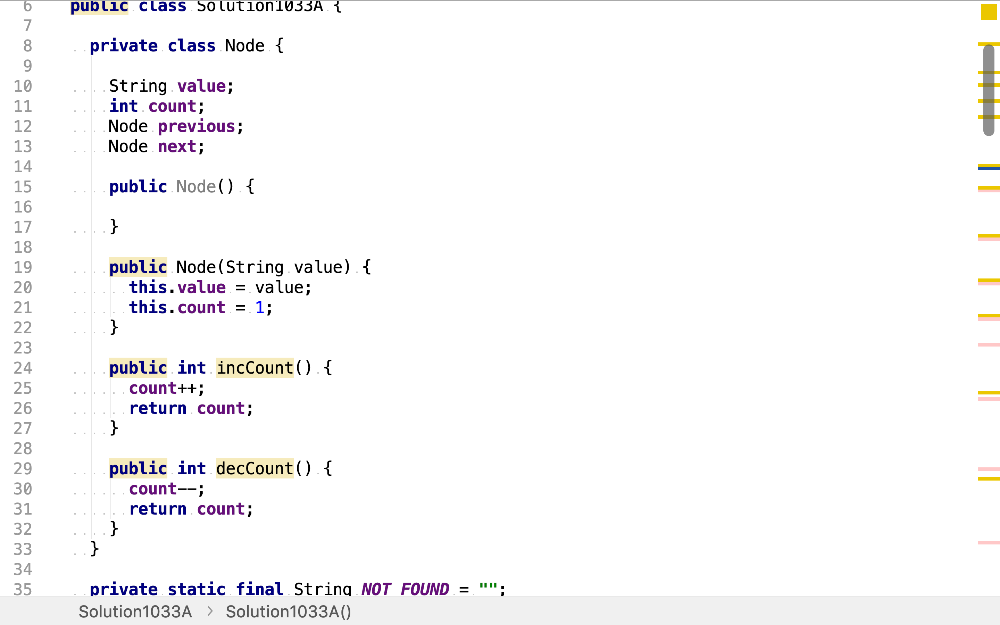
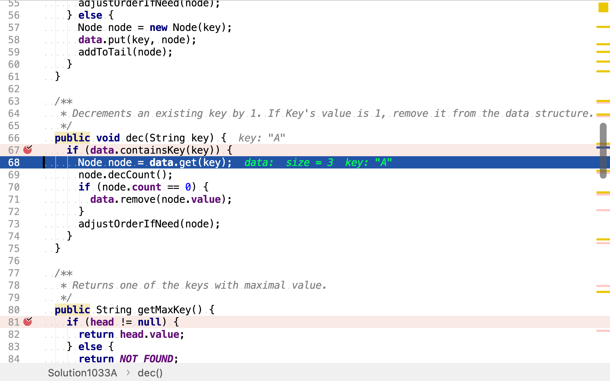
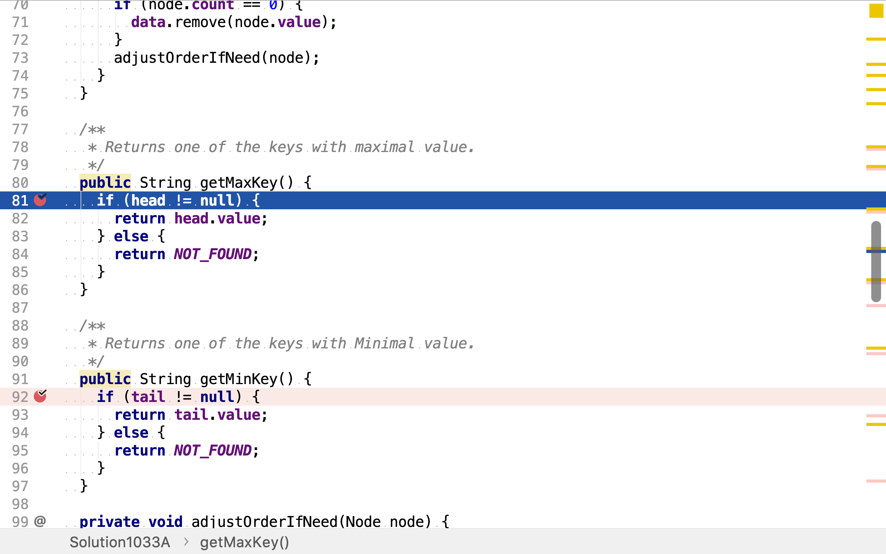
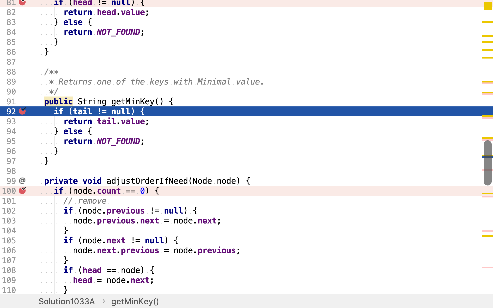
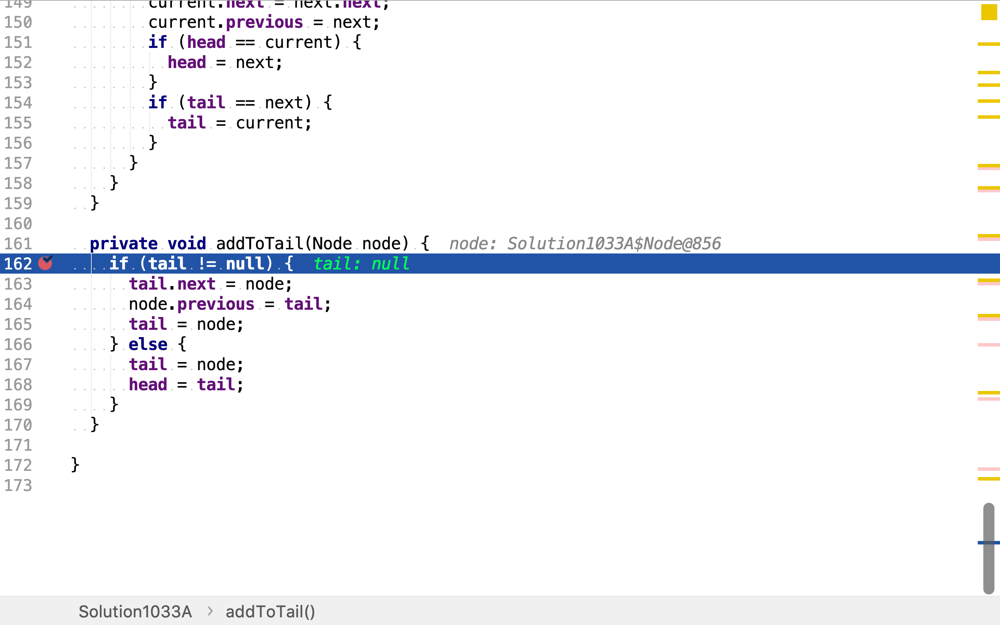
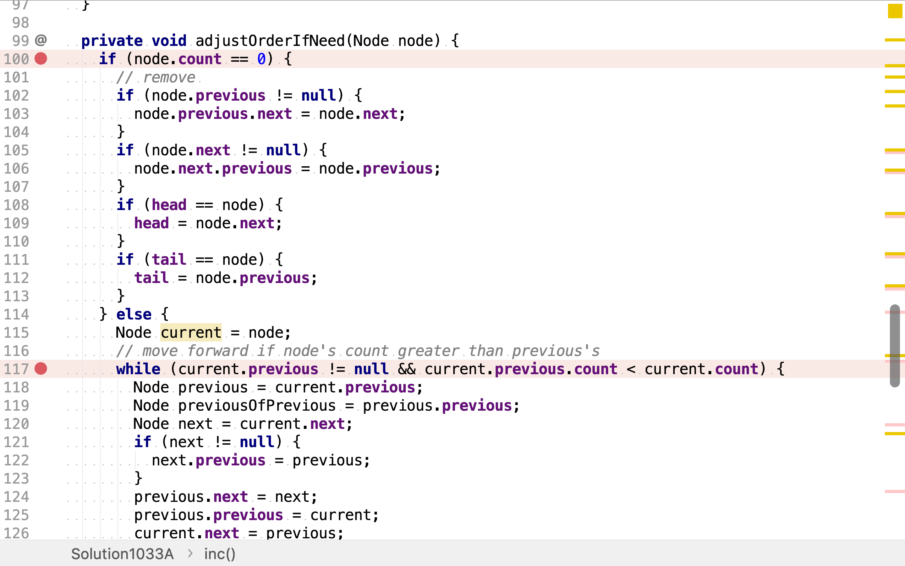
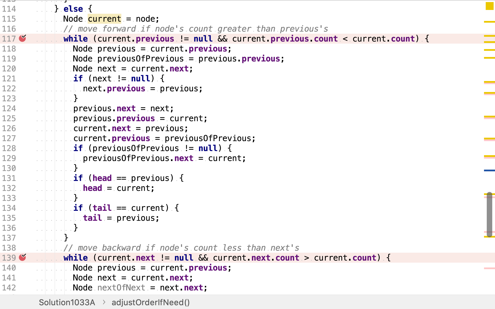
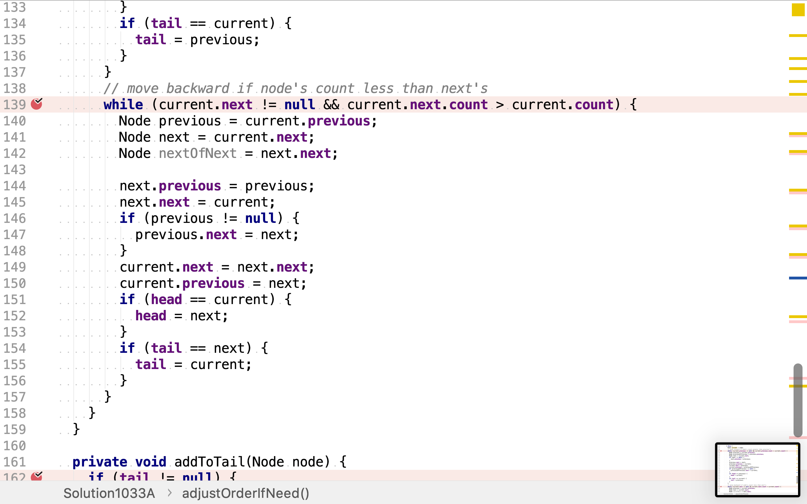

# 全O(1)的數據結構

## 題目

>實現一個數據結構支持以下操作：
>
>1. Inc(key) - 插入一個新的值為 1 的 key。或者使一個存在的 key 增加一，保證 key 不為空字符串。
>2. Dec(key) - 如果這個 key 的值是 1，那麼把他從數據結構中移除掉。否者使一個存在的 key 值減一。如果這個 key 不存在，這個函數不做任何事情。 key 保證不為空字符串。
>3. GetMaxKey() - 返回 key 中值最大的任意一個。如果沒有元素存在，返回一個空字符串""。
>4. GetMinKey() - 返回 key 中值最小的任意一個。如果沒有元素存在，返回一個空字符串""。
>

>挑戰：以 O(1) 的時間複雜度實現所有操作。

## 多重引用

`Inc(key)`和`Dec(key)`要以常數時間複雜度按鍵找到值「計數」並遞增或遞減。常用數據結構中，散列表「Hash Table」可以實現常數複雜度的按鍵查找值。如果維持一個有序序列，則`GetMaxKey()`和`GetMinKey()`也可以常數複雜度實現。雙向鏈表就可以實現一個有序序列，同時支持常數時間複雜度的元素移除插入。

我們創建一個組合散列表和雙向鏈表的數據結構。其中，散列表指向的是雙向鏈表節點，每個節點除了存儲鍵和計數外，還持有前向和後向引用，分別指向雙向鏈表中的前向和後向節點。

當`Inc(key)`時，先通過散列表按鍵找到目標節點，遞增計數。再將節點在雙向鏈表中向前移動，直至遇到計數不小於其的節點。

當`Dec(key)`時，先通過散列表㧒鍵找到目標節點，遞減計數。再將節點在雙向鏈表中向後移動，直至遇到計數不大於其的節點。

`GetMakKey()`則直接讀取雙向鏈表的頭節點。

`GetMinKey()`則直接讀取雙向鏈表的尾節點。

舉個例子，

```plantuml
digraph d {
    data [shape=record, label="<0>0|<1>1|<2>2|<3>3|<4>4|<5>5|<6>6|<7>7|<8>8|<9>9"]
    head [shape=none, label=head]
    tail [shape=none, label=tail]
}
```

`inc('A')`時，構造一個新的節點，計數為1，存入散列表，同時添加至雙向鏈表尾端。

```plantuml
digraph d {
    data [shape=record, label="<0>0|<1>1|<2>2|<3>3|<4>4|<5>5|<6>6|<7>7|<8>8|<9>9"]

    ea [label="A, 1"]

    tail [shape=none, label=tail]
    head [shape=none, label=head]

    data:0 -> ea

    ea -> tail [dir=back, style=dotted]
    ea -> head [dir=back, style=dotted]
}
```

`inc('B')`時，構造一個新的節點，計數為1，存入散列表，同時添加至雙向鏈表尾端。

```plantuml
digraph d {
    data [shape=record, label="<0>0|<1>1|<2>2|<3>3|<4>4|<5>5|<6>6|<7>7|<8>8|<9>9"]

    ea [label="A, 1"]
    eb [label="B, 1"]

    tail [shape=none, label=tail]
    head [shape=none, label=head]

    data:0 -> ea
    data:1 -> eb

    ea -> eb
    eb -> ea

    {rank=same; ea,eb}

    eb -> tail [dir=back, style=dotted]
    ea -> head [dir=back, style=dotted]
}
```

`inc('C')`時，構造一個新的節點，計數為1，存入散列表，同時添加至雙向鏈表尾端。

```plantuml
digraph d {
    data [shape=record, label="<0>0|<1>1|<2>2|<3>3|<4>4|<5>5|<6>6|<7>7|<8>8|<9>9"]

    ea [label="A, 1"]
    eb [label="B, 1"]
    ec [label="C, 1"]
    {rank=same; ea,eb,ec}

    tail [shape=none, label=tail]
    head [shape=none, label=head]

    data:0 -> ea
    data:1 -> eb
    data:2 -> ec

    ea -> eb -> ec
    ec -> eb -> ea 


    ec -> tail [dir=back, style=dotted]
    ea -> head [dir=back, style=dotted]
}
```

`inc('B')`時，從散列表中讀取節點，計數加一，並將其在雙向鏈表中向前移動，直至頭部。

```plantuml
digraph d {
    data [shape=record, label="<0>0|<1>1|<2>2|<3>3|<4>4|<5>5|<6>6|<7>7|<8>8|<9>9"]

    eb [label="B, 2"]
    ea [label="A, 1"]
    ec [label="C, 1"]
    {rank=same; eb,ea,ec}

    eb -> ea -> ec
    ec -> ea -> eb [constraint=false]

    tail [shape=none, label=tail]
    head [shape=none, label=head]

    data:0 -> ea
    data:1 -> eb
    data:2 -> ec

    ec -> tail [dir=back, style=dotted]
    eb -> head [dir=back, style=dotted]
}
```

`dec('A')`時，從散列表中讀取節點，計數減一。此時計數為0，所以將其從散列表和雙向鏈表中移除。

```plantuml
digraph d {
    data [shape=record, label="<0>0|<1>1|<2>2|<3>3|<4>4|<5>5|<6>6|<7>7|<8>8|<9>9"]

    eb [label="B, 2"]
    ec [label="C, 1"]
    {rank=same; eb,ec}

    eb -> ec
    ec -> eb [constraint=false]

    tail [shape=none, label=tail]
    head [shape=none, label=head]

    data:1 -> eb
    data:2 -> ec

    ec -> tail [dir=back, style=dotted]
    eb -> head [dir=back, style=dotted]
}
```

`GetMaxKey()`時，直接讀取雙向鏈表的頭部節點。

```plantuml
digraph d {
    data [shape=record, label="<0>0|<1>1|<2>2|<3>3|<4>4|<5>5|<6>6|<7>7|<8>8|<9>9"]

    eb [label="B, 2", style=filled, fillcolor=lawngreen]
    ec [label="C, 1"]
    {rank=same; eb,ec}

    eb -> ec
    ec -> eb [constraint=false]

    tail [shape=none, label=tail]
    head [shape=none, label=head]

    data:1 -> eb
    data:2 -> ec

    ec -> tail [dir=back, style=dotted]
    eb -> head [dir=back, style=dotted]
}
```

`GetMinKey()`時，直接讀取雙向鏈表的尾部節點。

```plantuml
digraph d {
    data [shape=record, label="<0>0|<1>1|<2>2|<3>3|<4>4|<5>5|<6>6|<7>7|<8>8|<9>9"]

    eb [label="B, 2"]
    ec [label="C, 1", style=filled, fillcolor=lawngreen]
    {rank=same; eb,ec}

    eb -> ec
    ec -> eb [constraint=false]

    tail [shape=none, label=tail]
    head [shape=none, label=head]

    data:1 -> eb
    data:2 -> ec

    ec -> tail [dir=back, style=dotted]
    eb -> head [dir=back, style=dotted]
}
```

### 代碼實現

[include](../../../src/main/java/io/github/rscai/leetcode/bytedance/datastructure/Solution1033A.java)

定義雙向鏈表的節點，該節點除了持有值和計數外，還持有前向和後向節點的引用。散列表的值類型就為該節點。



`inc(key)`分兩種情況：

* 散列表已含有相同鍵的。從散列表中取出鍵對應的節點，將計數加一，並調整其在雙向鏈表中的位置。
* 散列表中未含有相同鍵。構造一個新的節點，計數設為一，加入散列表，同時添加至雙向鏈表末尾。


`dec(key)`直接從散列表中取出節點（若其存在於散列表），將計數減一。若此時計數跃至0，則將其從散列移除。但無論如何，都要重新調整其在雙向鏈表中的位置。



雙向鏈表一直將所有節點按計數有序排列。`GetMaxKey()`直接從頭部获取最大值。



`GetMinKey()`直接從尾部获取最小值。



將節點添至雙向鏈表末尾的操作比較簡單。



調整節點在雙向鏈表中的位置時分兩種情況：

* 計數為0，直接從鏈表中移除
* 計數不為0，則向前移動直至遇到計數不小於其的節點或到達頭部：向後移動直至遇到計數不大於其的節點或到達尾部。







### 複雜度分析

#### 時間複雜度

`inc(key)`調用了`HashMap.containsKey, HashMap.get, HashMap.put, adjustOrderIfNeed, addTotail`。其中：

* `HashMap.containsKey`是常數時間複雜度操作
* `HashMap.get`是常數時間複雜度操作
* `HashMap.put`是常數時間複雜度操作
* `adjustOrderIfNeed`時間複雜度與雙向鏈表中節點計數重復度相關。假設所有鍵的計數都不相同或極少相同，則`adjustOrderIfNedd`的時間複雜度為常數
* `addToTail`最多更改三個引用的值

所以，`inc(key)`的時間複雜度為$$\mathcal{O}(1)$$。

`dec(key)`調用了`HashMap.containsKey, HashMap.get, HashMap.remove, adjustOrderIfneed`。

* `HashMap.containsKey`是常數時間複雜度操作
* `HashMap.get`是常數時間複雜度操作
* `HashMap.remove`是常數時間複雜度操作
* `adjustOrderIfNeed`是在所有鍵的計數都不相同或極少相同的情況下是常數複雜度

所以，`dec(key)`的時間複雜度為$$\mathcal{O}(1)$$。

`GetMaxKey()`直接讀取雙向鏈表的頭元素，時間複雜度為$$\mathcal{O}(1)$$。

`GetMinKey()`直接讀取雙向鏈表的尾元素，時間複雜度為$$\mathcal{O}(1)$$。

#### 空間複雜度

散列表和雙向鏈表都只是存儲引用，節點僅有一份。假設鍵數量為$$n$$，則總共有$$n$$個節點。每個節點除了持有鍵和計數外，遇持有兩個引用。所以空間複雜度為$$\mathcal{O}(n)$$。
