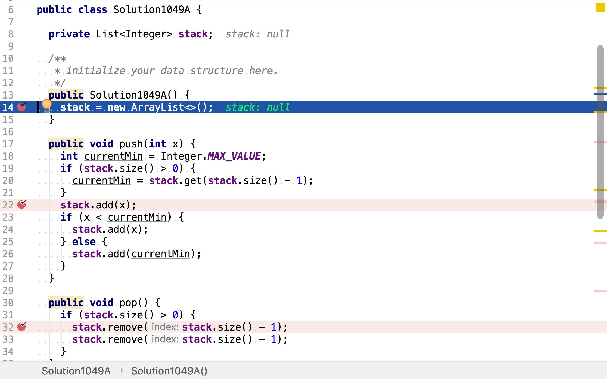
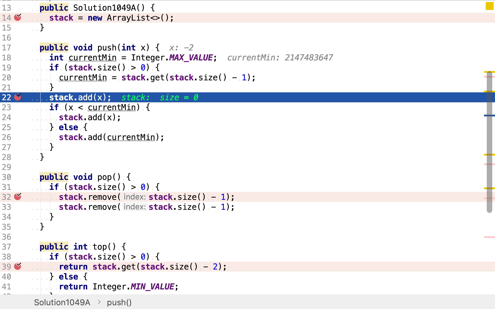
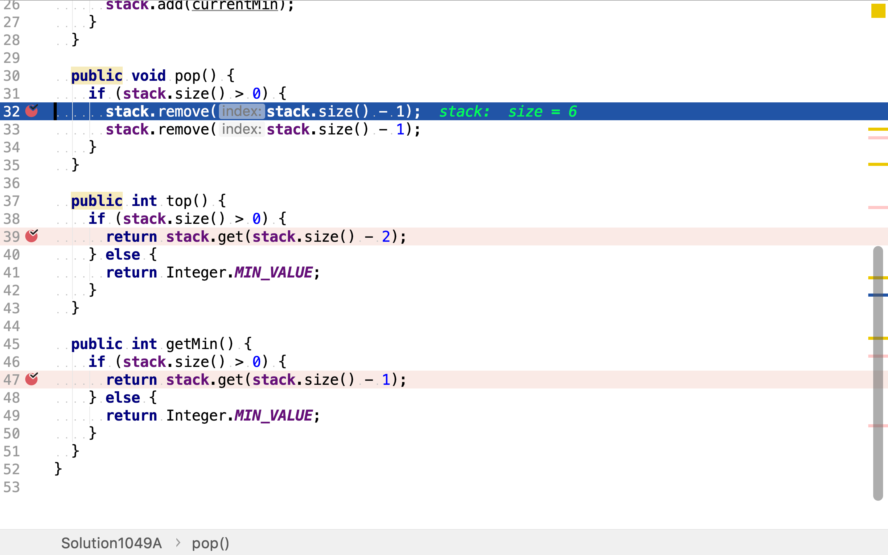
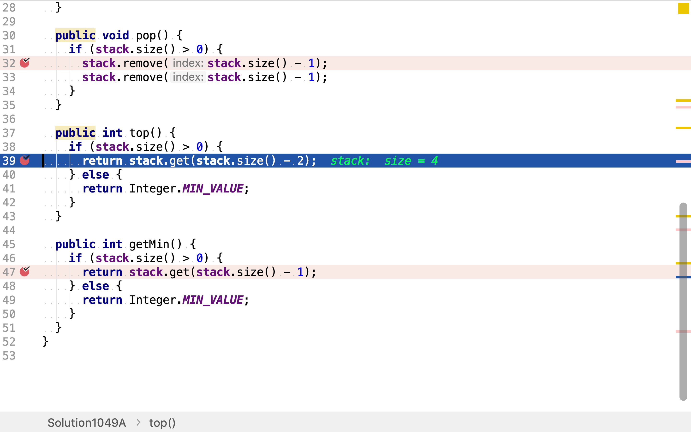
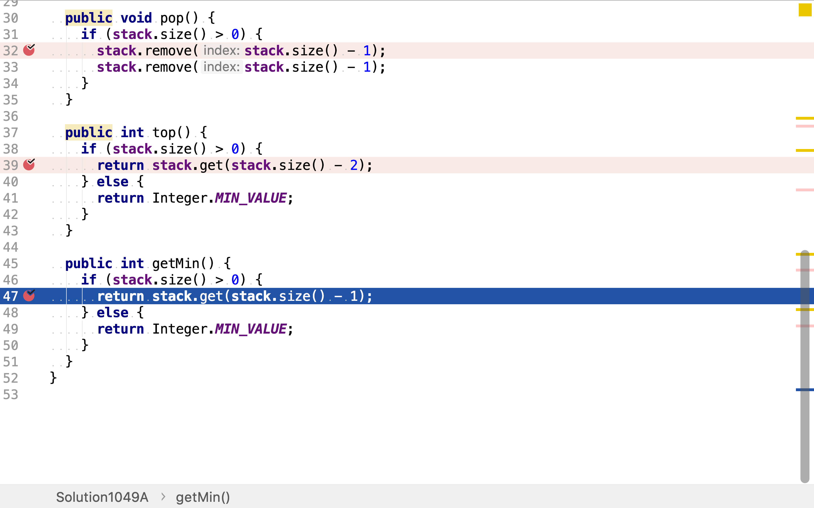
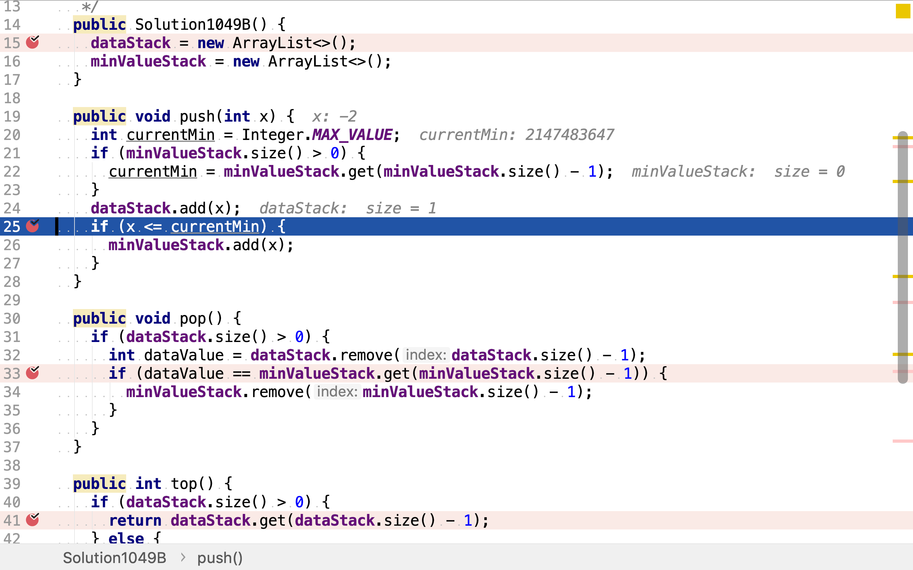
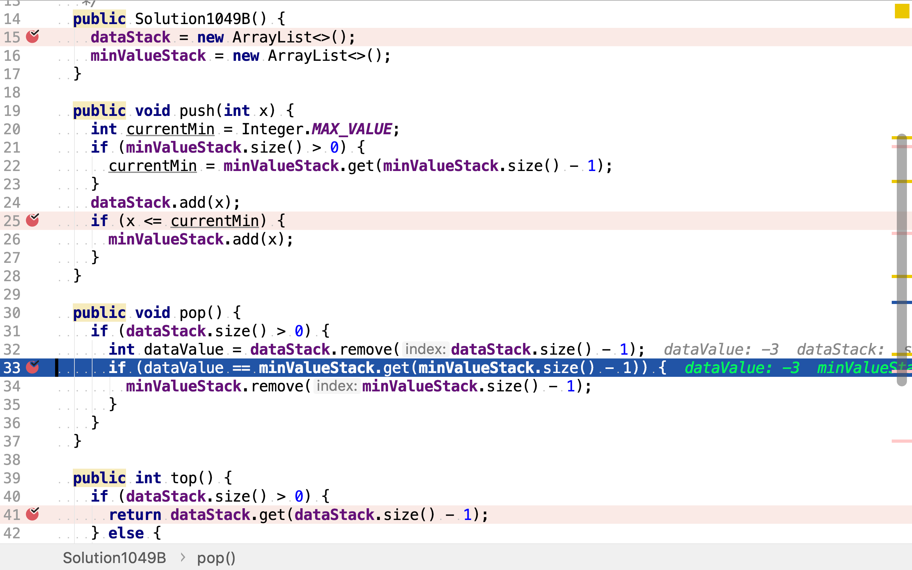
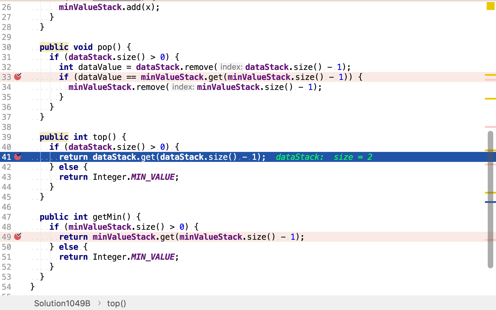
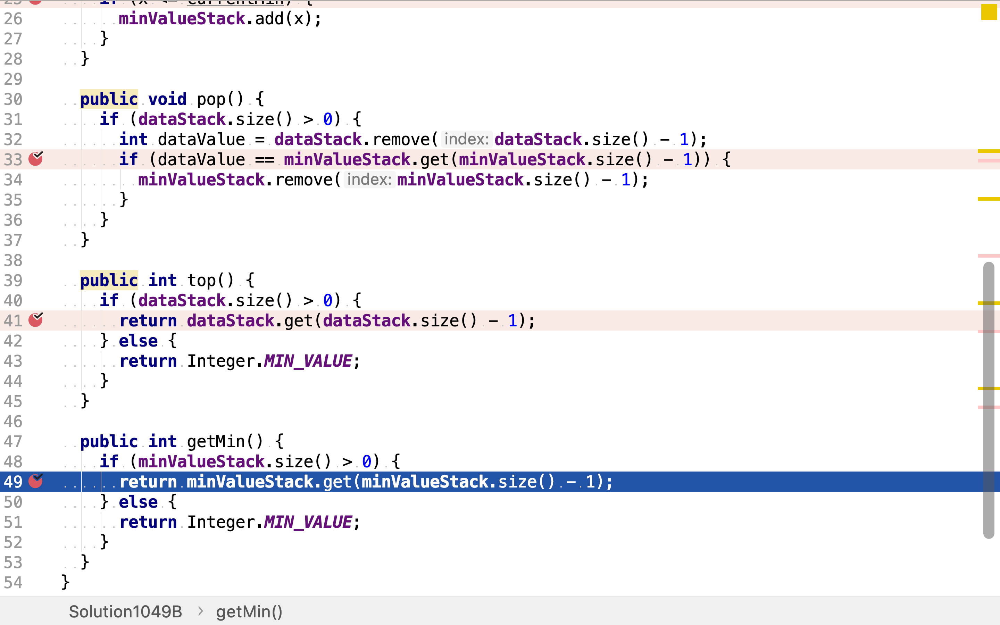

# 最小棧

## 題目

>設計一個支持 push，pop，top 操作，並能在常數時間內檢索到最小元素的棧。
>
>* push(x) -- 將元素 x 推入棧中。
>* pop() -- 刪除棧頂的元素。
>* top() -- 獲取棧頂元素。
>* getMin() -- 檢索棧中的最小元素。
>
>**示例:**
>
>```
>MinStack minStack = new MinStack();
>minStack.push(-2);
>minStack.push(0);
>minStack.push(-3);
>minStack.getMin();   --> 返回 -3.
>minStack.pop();
>minStack.top();      --> 返回 0.
>minStack.getMin();   --> 返回 -2.
>```

## 元素和最小值結對法

將「入棧元素」和「其入棧後棧內最小值」組成一對，入棧、出棧操作都是操作對。

舉個例子，創建一個棧，初始為空，不存在最小值。

```plantuml
graph g {
    stack [shape=record, label="{}"]
    min [shape=none, label="min = NA"]
}
```

當壓入值`-2`時，最小值變為`-2`。所以同時壓入值`-2`和最小值`-2`。

```plantuml
graph g {
    stack [shape=record, label="{-2|-2}"]
    min [shape=none, label="min = -2"]
}
```

當壓入值`0`，最小值依舊為`-2`。所以同時壓入值`0`和最小值`-2`。

```plantuml
graph g {
    stack [shape=record, label="{-2|0|-2|-2}"]
    min [shape=none, label="min = -2"]
}
```

當壓入值`-3`時，最小值變為`-3`。所以同時壓入值`-3`和最小值`-3`。

```plantuml
graph g {
    stack [shape=record, label="{-3|-3|-2|0|-2|-2}"]
    min [shape=none, label="min = -3"]
}
```

將值和最小值結對壓入棧，保證棧頂元素就是最小值。

當彈出元素時，將值和最小值一同彈出。之前最小值從`-2`變為`-3`是因為值`-3`的加入，現在`-3`被移出棧了，最小值也就回復到之前的`-2`。

```plantuml
graph g {
    stack [shape=record, label="{-2|0|-2|-2}"]
    min [shape=none, label="min = -2"]
}
```

### 代碼實現

[include](../../../src/main/java/io/github/rscai/leetcode/bytedance/datastructure/Solution1049A.java)

使用JDK提供的`ArrayList`來實現有序列表，棧就只能在一端增加刪除元素的有序列表。



入棧的時候將值和最小值成對入棧。最小值通過取之前最小值和當前壓入值之中最小的值得到。



出棧的時候也成對出棧。



值和最小值是成對壓入、彈出的，棧頂元素是最值，從頂往下第二個元素就是羅輯上的「棧頂」元素。



值和最小值是成對壓入、彈出的，棧頂元素就是最小值。



### 複雜度分析

#### 時間複雜度

`push`只在棧頂操作，且每次都是固定壓入兩個元素（值和最小值），跟棧中的數據量無關。所以時間複雜度為$$\mathcal{O}(1)$$。

`pop`也只在棧頂操作，且每次都是固定彈出兩個元素（值和最小值），跟棧中數據量無關。所以時間複雜度為$$\mathcal{O}(1)$$。

`top`固定讀取從頂往下第二個元素，跟棧中數據量無關。所以時間複雜度為$$\mathcal{O}(1)$$。

`getMin`固定讀取棧頂元素，跟棧中數據量無關。所以時間複雜度為$$\mtahcal{O}(1)$$。

#### 空間複雜度

本結構將每個值都擴展為兩個值組成的對，假設值的數據量為$$n$$，則棧中將有$$2n$$個元素。空間複雜度為$$\mathcal{O}(2n)$$，消掉常量為$$\mathcal{O}(n)$$。

## 雙棧法

創建兩個棧，一個用於存儲值，另一個用於存儲最小值。

舉個例子，創建兩個棧`dataStack`和`minValueStack`。

```plantuml
graph g {
    dataStackLabel [shape=none, label=dataStack]
    minValueStackLabel [shape=none, label=minValueStack]

    dataStack [shape=record, label="{}"]
    minValueStack [shape=record, label="{}"]

    dataStackLabel -- dataStack [style=invis]
    minValueStackLabel -- minValueStack [style=invis]
}
```

把值`-2`壓入dataStack時，最小值變為`-2`，將最小值`-2`同時壓入minValueStack。

```plantuml
graph g {
    dataStackLabel [shape=none, label=dataStack]
    minValueStackLabel [shape=none, label=minValueStack]

    dataStack [shape=record, label="{-2}"]
    minValueStack [shape=record, label="{-2}"]

    dataStackLabel -- dataStack [style=invis]
    minValueStackLabel -- minValueStack [style=invis]
}
```

把值`0`壓入dataStack時，最小值沒有發生變化，所以就不壓入minValueStack。

```plantuml
graph g {
    dataStackLabel [shape=none, label=dataStack]
    minValueStackLabel [shape=none, label=minValueStack]

    dataStack [shape=record, label="{0|-2}"]
    minValueStack [shape=record, label="{-2}"]

    dataStackLabel -- dataStack [style=invis]
    minValueStackLabel -- minValueStack [style=invis]
}
```

把值`-3`壓入dataStack時，最小值變為`-3`，所以把`-3`同時壓入minValueStack。

```plantuml
graph g {
    dataStackLabel [shape=none, label=dataStack]
    minValueStackLabel [shape=none, label=minValueStack]

    dataStack [shape=record, label="{-3|0|-2}"]
    minValueStack [shape=record, label="{-3|-2}"]

    dataStackLabel -- dataStack [style=invis]
    minValueStackLabel -- minValueStack [style=invis]
}
```

minValueStack棧頂元素就是最小值。

從dataStack彈出值時，要檢查minValueStack棧頂元素是否等於dataStack棧頂元素，若是則表明「當前最小值」被移出了dataStack，minValueStack要相應地將其彈出。

```plantuml
graph g {
    dataStackLabel [shape=none, label=dataStack]
    minValueStackLabel [shape=none, label=minValueStack]

    dataStack [shape=record, label="{0|-2}"]
    minValueStack [shape=record, label="{-2}"]

    dataStackLabel -- dataStack [style=invis]
    minValueStackLabel -- minValueStack [style=invis]
}
```

### 代碼實現

[include](../../../src/main/java/io/github/rscai/leetcode/bytedance/datastructure/Solution1049B.java)

使用JDK提供的`ArrayList`實現兩個棧，dataStack存儲值，minValueStack存儲最小值。


壓入值時，先將值壓入dataStack，再比較新壓入值跟當前最小值。若新壓入值小於或等於當前最小值，則最小值被改變，將新值同時壓入minValueStack。



彈出值時，除了將dataStack棧頂元素彈出，同時若minValueStack棧頂元素等於dataStack彈出元素，則意味着minValueStack棧頂的最小值被移除了，所以要同步彈出minValueStack棧頂元素。



dataStack專門存儲值，所以dataStack棧頂元素即即最後壓入元素。



minValueStack專門存儲最小值，minValueStack棧頂元素即最小值。



### 複複雜分析

#### 時間複雜度

`push`操作最多在兩個棧中分別壓入一個元素，時間複雜度為$$\mathcal{O}(1)$$。

`pop`操作最多從兩個棧中分別彈出棧頂元素，時間複雜度為$$\mathcal{O}(1)$$。

`top`操作直接從棧dataStack讀取棧頂元素，時間複雜度為$$\mathcal{O}(1)$$。

`getMin`操作直接從棧minValueStack讀取棧頂元素，時間複雜度為$$\mathcal{O}(1)$$。

#### 空間複雜度

本結構使用兩個棧，假設值的數據量為$$n$$，則dataStack佔用$$n$$個存儲空間，minValueStack最壞情況下（所有值都相等或值以降序順序壓入）佔用$$n$$個存儲空間。總體空間複雜度為$$\mathcal{O}(n)$$。
