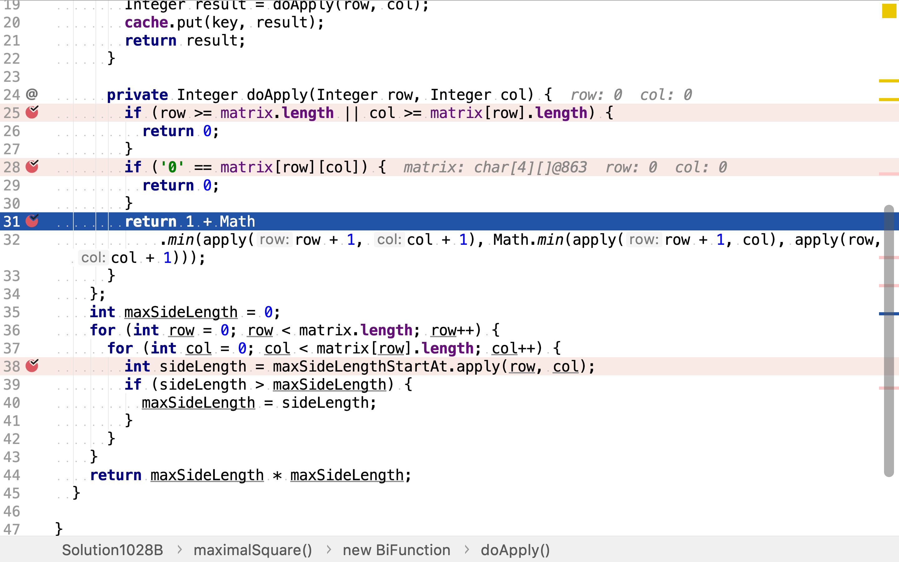

# 最大正方形

## 題目

>在一个由 0 和 1 组成的二维矩阵内，找到只包含 1 的最大正方形，并返回其面积。
>
>**示例：**
>
>```
>输入: 
>
>1 0 1 0 0
>1 0 1 1 1
>1 1 1 1 1
>1 0 0 1 0
>
>输出: 4
>```

## 窮舉法

一個正方形由四條邊確定，對應到二維數組，就是起、止行和起止列確定。

* 起始行從第零行（數組下標從零開始）到最後一行皆可
* 終止行可以是起始行及後續行中的任意一行
* 起始列從第零列到最後一列皆可
* 終止列可以是起紿列及後續列中的任意一行。但其與起始列之間的距離一定等於起始行與終止行之間的距離相等。（正方形定義決定四條邊長度相等。）

### 代碼

[include](../../../src/main/java/io/github/rscai/leetcode/bytedance/dynamic/Solution1028A.java)

首先，從0開始羅列所有起始行。


然後，從起始行開始羅列所有終止行。代碼中使用左閉右開格式，即行區間是包含起始行下標，但不包終止行下標。比如`(0,3)`，表示包含的行是`0, 1, 2`。


再然後，從0開始羅列所有起始列。


因為正方形的定義，行列區間長度是相等的。所以，當起止行和起始列確定時，終止列也確定了。


最後，檢測每個正方形包含的值是不是都是`1`。如果是則其是一個所求的正方形。再與之間已找到的最大正方形邊長進行比較。


逐一檢測正方形所包含的值就可以判斷其是否是所求正方形。


### 複雜度分析

#### 時間複雜度

時間複雜度是：$$\mathcal{O}(n^2)$$

#### 空間複雜度

使用了六個變量，空間複雜度是：$$\mathcal{O}(1)$$

## 動態規劃法

「動態規劃法」一般形式就是：

1. 將一個問題拆分為若干個更小的問題
2. 解決若干個更小的問題
3. 將若干個更小的問題歸併為一個大問題的解
4. 若干個更小的問題可以繼續拆分，直至問題足够小

正方形有且僅有一個左上⻆，以每一個點為左上⻆的最大正方形所組成的集合一定包含了全局最大正方形。所以，先逐一求出每個點為左上⻆的最大正方形，再一次遍歷求出其中最大的正方形。

以左上⻆第一個點`(0, 0)`為左上⻆的最大正方形有三種情形：

1. 邊長為0，因為左上⻆第一個點值為0

```txt
0 0 0 0
0 0 0 0
0 0 0 0
0 0 0 0
```

2. 邊長為1，左上⻆第一個點為1但右方`(0, 1)`，下方`(1, 0)`和右下方`(1, 1)`三個點都是0

```txt
1 0 0 0
0 0 0 0
0 0 0 0
0 0 0 0
```

3. 邊長為以右方點`(0, 1)`，下方點`(1,0)`和右下方點`(1,1)`為左上⻆點的最大正方形中最小邊長加1

```txt
1 1 1 0
1 1 1 1
1 1 1 1
0 1 1 1
```

第二種情形可以合併到第三種情形，正方形左上⻆第一個點是0等同於邊長為為0的正方形。

依此類推，以點`(0, 1)`為左上⻆的最大正方形：

1. 邊長為0，如果點`(0, 1)`的值為0
2. 邊長為以右方點(0, 2)`、下方點`(1, 1)`和右下方點`(1, 2)`為左上⻆的最大正方形中最小邊長加1

用函數符號表示。$$r$$為橫坐標，取值範圍$$0, 1, ..., rows - 1$$。$$c$$為從坐木田一火，取值範圍$$0, 1, ..., cols - 1$$。$$v(r,c)$$為點`(r, c)`的值，取值範圍$$0, 1$$。$$max(r, c)$$為以點`(r, c)`為左上⻆的最大正方形邊長。則：

$$
max(r, c) = \begin{cases}
   0 &\text{if } v(r, c) = 0 \\
   0 &\text{if } r >= rows \\
   0 &\text{if } c >= cols \\
   1 + min(max(r, c + 1), max(r + 1, c), max(r + 1, c + 1)) &\text{if } v(r, c) = 1
\end{cases}
$$

將函數的調用以樹狀形式展示出來，可以發現有很多函數值為重用使用。這𥚃可以緩存重用函數值，以大幅減少計算量。

```plantuml
digraph d {
    root 
    a [label="max(0, 0)"]
    b [label="max(0, 1)", style=filled, fillcolor=green]
    c [label="..."]
    d [label="max(1, 0)"]
    e [label="max(1, 1)", style=filled, fillcolor=blue]
    f [label="..."]
    root -> a
    root -> b
    root -> c
    root -> d
    root -> e
    root -> f

    aa [label="max(0, 1)", style=filled, fillcolor=green]
    ab [label="max(1, 0)"]
    ac [label="max(1, 1)", style=filled, fillcolor=blue]
    a -> aa
    a -> ab
    a -> ac

    aaa [label="max(0, 2)"]
    aab [label="max(1, 1)", style=filled, fillcolor=blue]
    aac [label="max(1, 2)"]

    aa -> aaa
    aa -> aab
    aa -> aac

    aaaa [label="..."]
    aaa -> aaaa
    aaba [label="..."]
    aab -> aaba
    aaca [label="..."]
    aac -> aaca
    
    aba [label="..."]
    ab -> aba
    aca [label="..."]
    ac -> aca

    ba [label="max(0, 2)"]
    bb [label="max(1, 1)", style=filled, fillcolor=blue]
    bc [label="max(1, 2)"]
    b -> ba
    b -> bb
    b -> bc

    baa [label="..."]
    ba -> baa
    bba [label="..."]
    bb -> bba
    bc [label="..."]
    bc -> bca
}
```

### 代碼

[include](../../../src/main/java/io/github/rscai/leetcode/bytedance/dynamic/Solution1028B.java)

首先，逐一求出以每個點為左上⻆的最大正方形邊長。


然後，再求出最大邊長。


其緩存了以某個點為左上⻆最大正方形邊長的值，在計算以某個點為左上⻆最大正方形邊長時，先檢索是否已緩存了值。


若無緩存，則計算之。這𥚃有三種情況：

1. 輪入點超出了矩陣，其值一定是0。


2. 輪入點的值為0，則以其為左上⻆的最大正方形邊長為0。


3. 輪入點的值為1，則以其為左上⻆的最大正方形邊長為以右方點、下方點和右下方點為左上⻆的最大正方形邊長中最小的值加1。



### 複雜度分析

#### 時間複雜度

所有拆分出來的子問題都求以矩陣中某一點為輪入的函數值，且函數值都被緩存重用。所以實際上其只做了跟矩陣大小相當的計算。時間複雜度為：

$$
C_{time} = \mathcal{O}(n)
$$

#### 空間複雜度

其緩存了所有的輪入的函數值。空間複雜度為：

$$
C_{space} = \mathcal{O}(n)
$$

## 一次遍歷實現動態規劃

上面的遞歸實現可以使用一次循環實現。

[include](../../../src/main/java/io/github/rscai/leetcode/bytedance/dynamic/Solution1028C.java)

