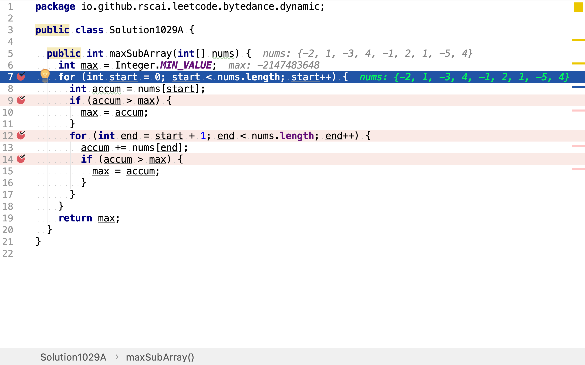

# 最大子序和

## 題目

>給定一個整數數組 nums ，找到一個具有最大和的連續子數組（子數組最少包含一個元素），返回其最大和。
>
>**示例：**
>
>```
>輸入: [-2,1,-3,4,-1,2,1,-5,4],
>輸出: 6
>解釋: 連續子數組 [4,-1,2,1] 的和最大，為 6。
>```
>
>**進階：**
>
>如果你已經實現複雜度為 O(n) 的解法，嘗試使用更為精妙的分治法求解。

## 窮舉法

連續子數組由起止點確定。起始點從第一個到最後都可，終止點從起始點（只包含一個元素）到最後一個皆可。

將所有子數組組合以樹的形式展現。從根到葉子節點的路徑所包含的節點就是一個子數組。比如，`root -> -2 -> NIL`表示子數組`[-2]`; `root -> -2 -> 1 -> NIL`表示子數組`[-2, 1]`。

```plantuml
digraph d {
    root
    a [label=-2]
    b [label=1]
    c [label=-3]
    d [label=4]
    e [label=-1]
    f [label=2]
    g [label=1]
    h [label=-5]
    i [label=4]
    root -> a
    root -> b
    root -> c
    root -> d
    root -> e
    root -> f
    root -> g
    root -> h
    root -> i

    aa [label=1]
    az [shape=triangle,label=NIL, style=filled, fillcolor=grey]
    a -> aa
    a -> az

    aaa [label=-3]
    aaz [shape=triangle, label=NIL, style=filled, fillcolor=grey]
    aa -> aaa
    aa -> aaz

    aaaa [label=4]
    aaaz [shape=triangle, label=NIL, style=filled, fillcolor=grey]
    aaa -> aaaa
    aaa -> aaaz

    aaaaa [label=-1]
    aaaaz [shape=triangle, label=NIL, style=filled, fillcolor=grey]
    aaaa -> aaaaa
    aaaa -> aaaaz

    aaaaaa [label="..."]
    aaaaa -> aaaaaa

    ba [label=-3]
    bz [shape=triangle, label=NIL, style=filled, fillcolor=grey]
    b -> ba
    b -> bz

    baa [label=4]
    baz [shape=triangle, label=NIL, style=filled, fillcolor=grey]
    ba -> baa
    ba -> baz

    baaa [label=-1]
    baaz [shape=triangle, lable=NIL, style=filled, fillcolor=grey]
    baa -> baaa
    baa -> baaz

    baaaa [label="..."]
    baaa -> baaaa

    ca [label=4]
    cz [shape=triangle, label=NIL, style=filled, fillcolor=grey]
    c -> ca
    c -> cz

    caa [label=-1]
    caz [shape=triangle, label=NIL, style=filled, fillcolor=grey]
    ca -> caa
    ca -> caz

    caaa [label="..."]
    caa -> caaa

    da [label=-1]
    dz [shape=triangle, label=NIL, style=filled, fillcolor=grey]
    d -> da
    d -> dz

    daa [label="..."]
    da -> daa
}
```

### 代碼

[include](../../../src/main/java/io/github/rscai/leetcode/bytedance/dynamic/Solution1029A.java)

首先，選擇起始點。任一位置都可以是起始點。



然後，比較單一元素值與當前最大值，以覆蓋僅包含一個元素的子數組。


再然後，選擇終止點。起始點往後任一位置都可以是終止點。


最後，累加起止點之間的元素值，並與當前最大值比較。


### 複雜度分析

#### 時間複雜度

其共有兩層循環，內層循環次數與外層取值有關。假設外層取值為$$i$$，則內層循環次數為$$n - i$$。時間複雜度為：

$$
\begin{aligned}
C_{time} &= \mathcal{O}(\sum_{i=1}^{n}(n-i)) \\
&= \mathcal{O}(\frac{1}{2} \times n \times (n + 1)) \\
&= \mathcal{O}(n^2)

\end{aligned}
$$

#### 空間複雜度

使用兩個變量`max`和`accum`。空間複雜度為：

$$
C_{space} = \mathcal{O}(1)
$$

## 動態規劃法

將子數組組合以樹的形式展現，可以發現有很多子樹是重復的。第一層（根節點為第0層）節點的左子樹完全等於以右側兄弟節點為根的子樹。

```plantuml
digraph d {
    root
    a [label=-2]
    b [label=1, style=filled, fillcolor=green]
    c [label=-3]
    d [label=4]
    e [label=-1]
    f [label=2]
    g [label=1]
    h [label=-5]
    i [label=4]
    root -> a
    root -> b
    root -> c
    root -> d
    root -> e
    root -> f
    root -> g
    root -> h
    root -> i

    aa [label=1, style=filled, fillcolor=green]
    az [shape=triangle,label=NIL, style=filled, fillcolor=grey]
    a -> aa
    a -> az

    aaa [label=-3, style=filled, fillcolor=green]
    aaz [shape=triangle, label=NIL, style=filled, fillcolor=grey]
    aa -> aaa
    aa -> aaz

    aaaa [label=4, style=filled, fillcolor=green]
    aaaz [shape=triangle, label=NIL, style=filled, fillcolor=grey]
    aaa -> aaaa
    aaa -> aaaz

    aaaaa [label=-1, style=filled, fillcolor=green]
    aaaaz [shape=triangle, label=NIL, style=filled, fillcolor=grey]
    aaaa -> aaaaa
    aaaa -> aaaaz

    aaaaaa [label="..."]
    aaaaa -> aaaaaa

    ba [label=-3, style=filled, fillcolor=green]
    bz [shape=triangle, label=NIL, style=filled, fillcolor=grey]
    b -> ba
    b -> bz

    baa [label=4, style=filled, fillcolor=green]
    baz [shape=triangle, label=NIL, style=filled, fillcolor=grey]
    ba -> baa
    ba -> baz

    baaa [label=-1, style=filled, fillcolor=green]
    baaz [shape=triangle, lable=NIL, style=filled, fillcolor=grey]
    baa -> baaa
    baa -> baaz

    baaaa [label="..."]
    baaa -> baaaa

    ca [label=4]
    cz [shape=triangle, label=NIL, style=filled, fillcolor=grey]
    c -> ca
    c -> cz

    caa [label=-1]
    caz [shape=triangle, label=NIL, style=filled, fillcolor=grey]
    ca -> caa
    ca -> caz

    caaa [label="..."]
    caa -> caaa

    da [label=-1]
    dz [shape=triangle, label=NIL, style=filled, fillcolor=grey]
    d -> da
    d -> dz

    daa [label="..."]
    da -> daa
}
```

而且，連續子數組的和有一個特性。假設一個連續子數組有a和b兩個子數組組成。如果a的和小於零，則a和b組成的子數組和肯定小於b的和。再結合子樹重復性，可以得出以下論斷：

* 如果某個節點到根節點路徑上所有節點值的和小於或等於0，則無需探索其子樹。因為，從根節點到其任意葉子節點路徑上值的和絕不會大於從其子節點到葉子節點路徑上值的和。且其右側兄弟子樹覆蓋了其子樹。

### 代碼

[include](../../../src/main/java/io/github/rscai/leetcode/bytedance/dynamic/Solution1029B.java)

一次遍歷整個數組。


比較從根節點至今的累加值和當前最大值。如果大於當前最大值，則表明找到了一個和更大的連續子數組。


如果從根節點到今的累加值小於0，則表明無需再探索其子樹了。直接清零累加值，等同於從下一個位置（在樹結構中，則是右側兄弟節點）再開始累加。


### 複雜度分析

#### 時間複雜度

只遍歷了數組一次，所以時間複雜為：

$$
C_{time} = \mathcal{O}(n)
$$

#### 空間複雜度

使用了兩個變量`max`和`accum`。空間複雜度為：

$$
C_{space} = \mathcal{O}(1)
$$

