# 三⻆形最小路徑和

## 題目

>給定一個三角形，找出自頂向下的最小路徑和。每一步只能移動到下一行中相鄰的結點上。
>
>例如，給定三角形：
>
>```
>[
>     [2],
>    [3,4],
>   [6,5,7],
>  [4,1,8,3]
>]
>```
>
>自頂向下的最小路徑和為 11（即，2 + 3 + 5 + 1 = 11）。
>
>**說明：**
>
>如果你可以只使用 O(n) 的額外空間（n 為三角形的總行數）來解決這個問題，那麼你的算法會很加分。

## 窮舉法

羅列所有路徑並求其和，再選取最小值。第一步只有一個選擇，從第二步開始每一步都有兩個選擇。

舉個例子，給定三角形：

```
[
     [2],
    [3,4],
   [6,5,7],
  [4,1,8,3]
]
```

將所有路徑以樹的形式展現。

第一步只有一個選擇，`2`。
第二步有兩種選擇，左下方`3`和右方下`4`。
第三步受限於第二步的選擇，如果第二步選了`3`則第三步可選擇`6`或`5，如果第二步選了`4`則第三步可選擇`5`或`7`。
依此類推。。。

也就是說，每一步都會分裂出兩種選擇。若三⻆形的高度為d，則路徑總數為$$2^{d-1}$$。

```plantuml
digraph d {
    root [label="(0,0) 2"]
    a [label="(1,0) 3"]
    b [label="(1,1) 4"]
    root -> a
    root -> b

    aa [label="(2,0) 6"]
    ab [label="(2,1) 5"]
    a -> aa
    a -> ab

    ba [label="(2,1) 5"]
    bb [label="(2,2) 7"]
    b -> ba
    b -> bb

    aaa [label="(3,0) 4"]
    aab [label="(3,1) 1"]
    aa -> aaa
    aa -> aab

    aba [label="(3,1) 1"]
    abb [label="(3,2) 8"]
    ab -> aba
    ab -> abb

    baa [label="(3,1) 1"]
    bab [label="(3,2) 8"]
    ba -> baa
    ba -> bab

    bba [label="(3,2) 8"]
    bbb [label="(3,3) 3"]
    bb -> bba
    bb -> bbb
}
```

用形式化語言描述：

* 若第i行選擇了第k個元素，則第i+1行可選擇第k和第k+1個元素
* 第一行只能選擇第0個元素

## 代碼

[include](../../../src/main/java/io/github/rscai/leetcode/bytedance/dynamic/Solution1030A.java)

整個問題可以認為是以某個點為三⻆形的頂點，羅列出所有可能的路徑的和。這𥚃使用遞歸實現。

首先，定義一個函數`pathLengths`。給定頂點位置`startIndex`和下方其餘行`rows`，該函數返迴所有可行的路徑的和。
`pathLengths`將問題拆分為兩部份：從其餘行中的第一行中取相鄰的點；以第一行中所取的點為三⻆形的頂點，求在剩餘行中所有路徑的和。

先把行分為第一行`firstRow`

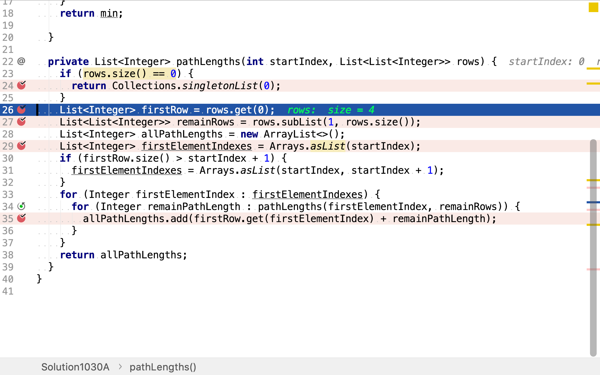

和其餘行`remainRows`

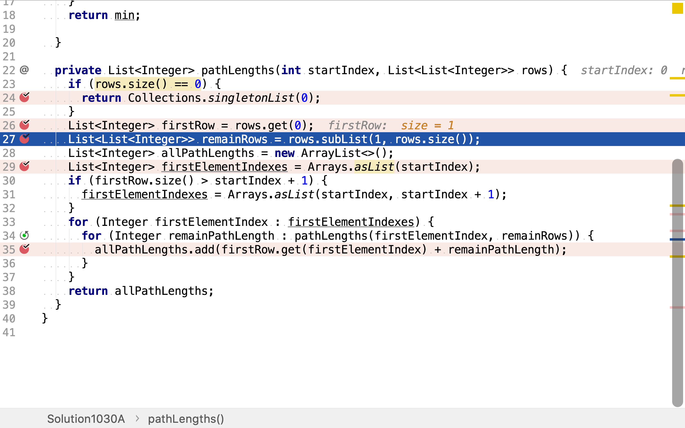

然後，解決「足够簡單的問題」：在第一行𥚃取相鄰點。下標相同和下標多1的點與上一行的點是相鄰的。

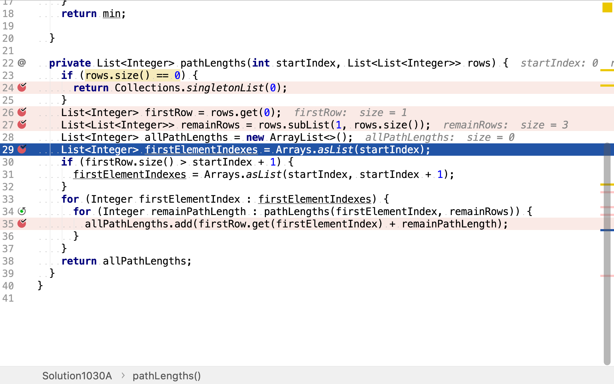

再然後，用遞歸調用的方式解決「其餘的問題」：以第一行中的點為三⻆形頂點，求在其餘行中所有路徑的和。

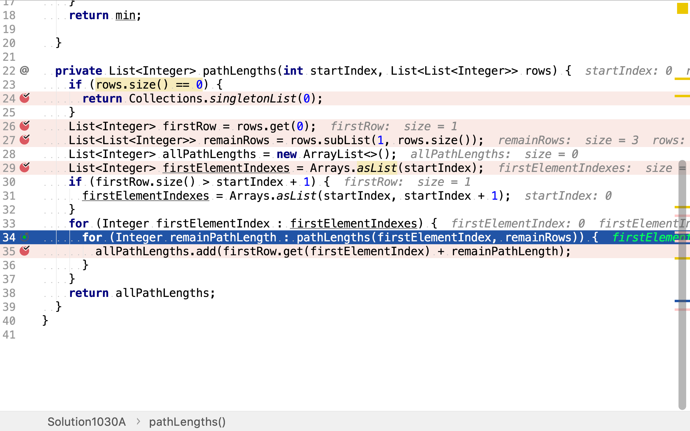

再然後，將「簡單問題」的解和「其餘問題」的解歸併。第一行中與上方相鄰的點有一至兩個，其餘行中的路徑也有多個。所以將兩個解集歸併產生了更多的解。

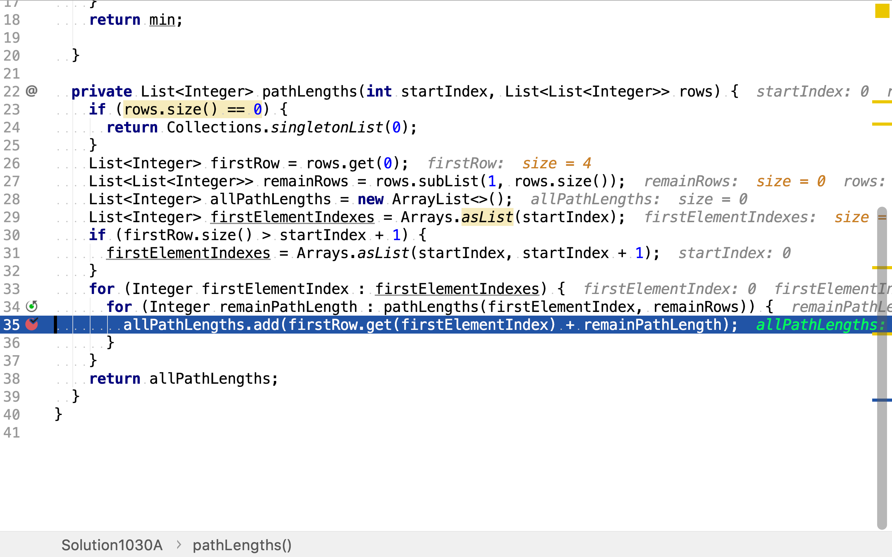

遞歸的終止條件是沒有「其餘行」。


最後，一次遍歷所有路徑和，求出最小值。

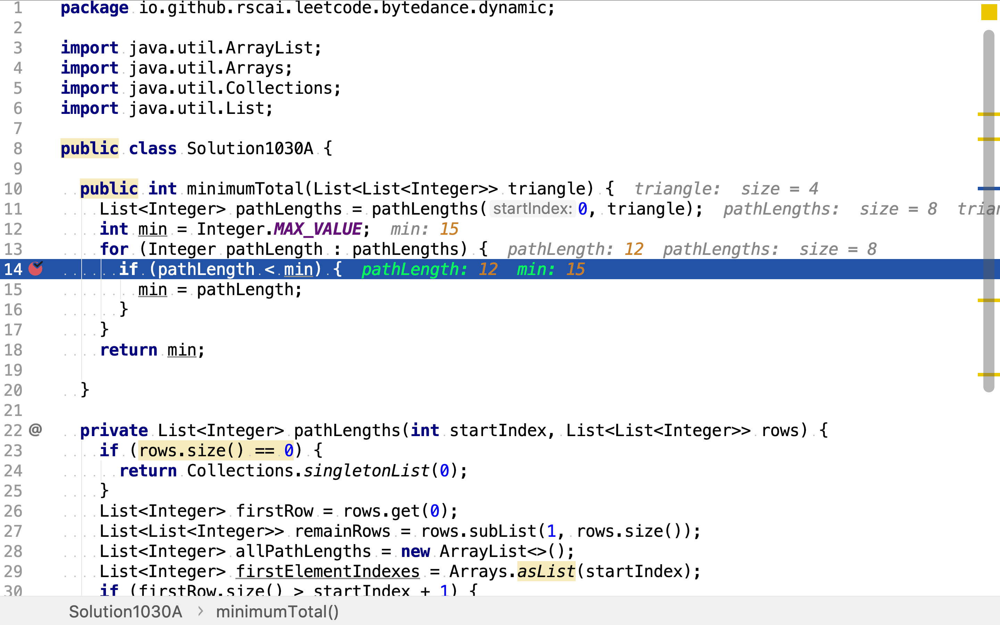

### 複雜度分析

#### 時間複雜度

`pathLengths`的調用深度與第一行`firstRow`在總體中所處的高度相關。第一層`pathLengths`調用中，`firstRow`是第一行，第二層`pathLengths`調用中，`firstRow`是第二行。依山一心類推。且每一次`pathLengths`會調用兩次自身（任一點在下一行中有兩個相鄰點）。所以，`pathLengths`的調用次數為$$\sum_{i=1}^{d}2^i$$，$$d$$為三⻆形的高度。

$$
\sum_{i=1}^{d}2^i = 2^{d+1} - 2^1
$$

以$$n$$為三⻆形中點的總數，則：

$$
d^2 + d = 2n
$$

所以，時間複雜度為：

$$
C_{time} = \mathcal{O}(2^{\sqrt{n}})
$$

#### 空間複雜度

`pathLengths`的最大調用深度是$$d$$。所以，空間複雜度是：

$$
C_{space} = \mathcal{O}(\sqrt{n})
$$

## 動態規劃法

將窮舉的過程用樹表示。可以發現很多重復的子樹。

```plantuml
digraph d {
    root [label="(0,0) 2"]
    a [label="(1,0) 3"]
    b [label="(1,1) 4"]
    root -> a
    root -> b

    aa [label="(2,0) 6"]
    ab [label="(2,1) 5", style=filled, fillcolor=green]
    a -> aa
    a -> ab

    ba [label="(2,1) 5", style=filled fillcolor=green]
    bb [label="(2,2) 7"]
    b -> ba
    b -> bb

    aaa [label="(3,0) 4"]
    aab [label="(3,1) 1"]
    aa -> aaa
    aa -> aab

    aba [label="(3,1) 1", style=filled, fillcolor=green]
    abb [label="(3,2) 8", style=filled, fillcolor=green]
    ab -> aba
    ab -> abb

    baa [label="(3,1) 1", style=filled, fillcolor=green]
    bab [label="(3,2) 8", style=filled, fillcolor=green]
    ba -> baa
    ba -> bab

    bba [label="(3,2) 8"]
    bbb [label="(3,3) 3"]
    bb -> bba
    bb -> bbb
}
```

動態規劃法就是暫存這此子樹的解，供後續使用，從而減少計算量。

遞推公式為：

$$
f(r, c) = \begin{cases}
   v(r, c) &\text{if } r = rows \\
   v(r, c) + min(f(r+1, c), f(r + 1, c+1)) &\text{if } r < rows
\end{cases}
$$

其中，$$f(r, c)$$為以第r行第c列元素為起點的最短路徑和，$$v(r, c)$$為第r行第c列元素的值，$$rows$$為總行數。

### 代碼

[include](../../../src/main/java/io/github/rscai/leetcode/bytedance/dynamic/Solution1030B.java)

定義一個遞歸函數`minPathLength`，其返回以某一點為三⻆形的頂點到底部的最短路徑。

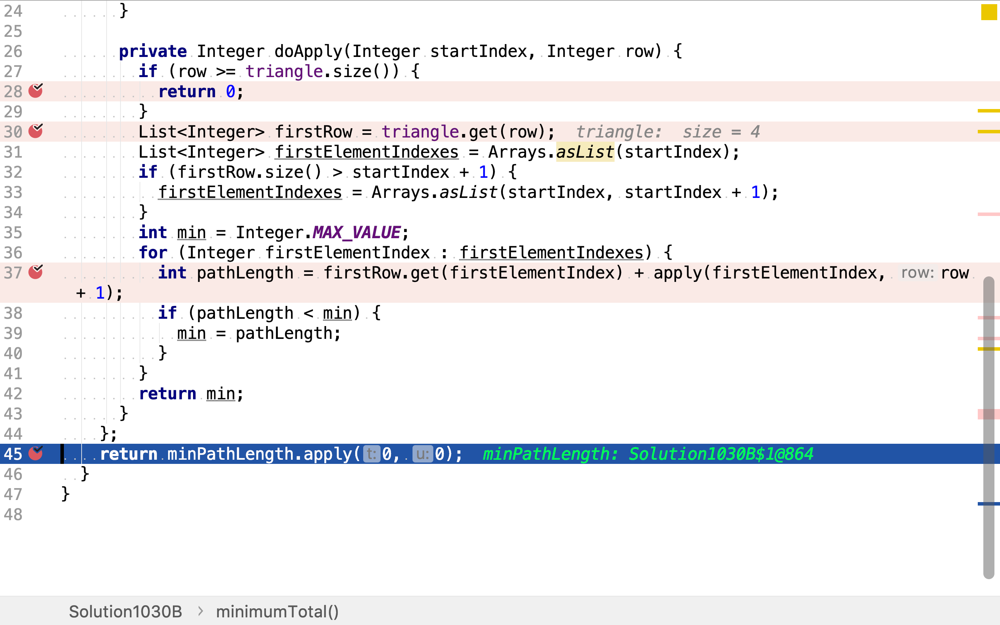

`minPathLength`用遞歸的方式求解問題。其先將三⻆形拆分為第一行和其餘行。先求解第一行的解（第一行的解有兩個，三⻆形中每一個點都與下方的兩個點相鄰）。

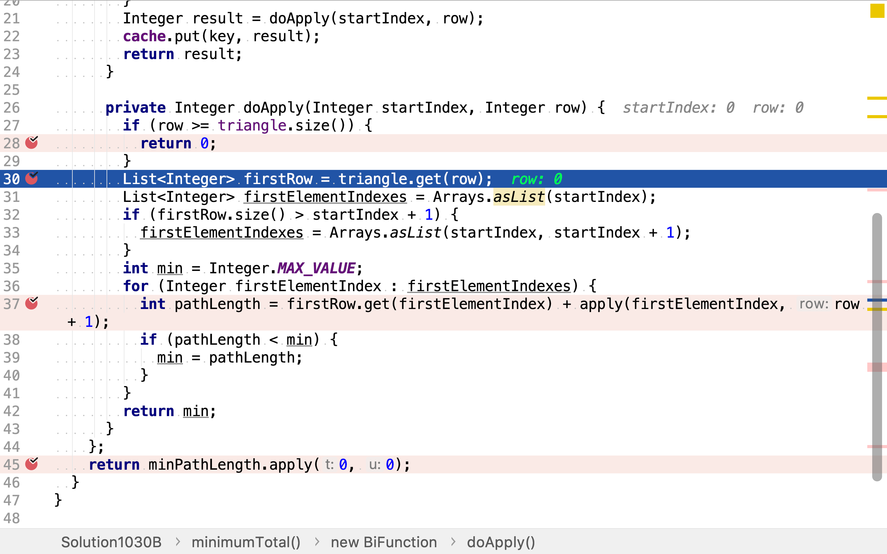

再求解其餘行中的最短路徑和。其餘行中路徑的起點由第一行的解決定。而第一行的解有兩個，所以其餘行中的解也分別有兩個。

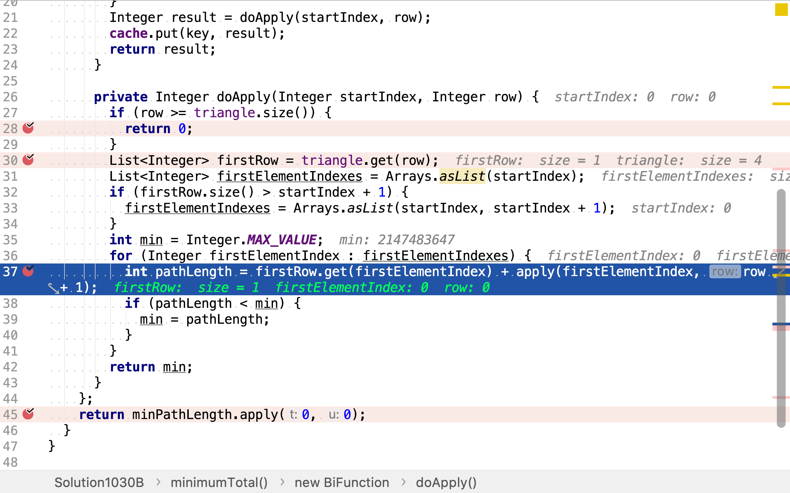

遞歸的終止條件為到達三⻆形的底部（訪問過了最下面的一行）。

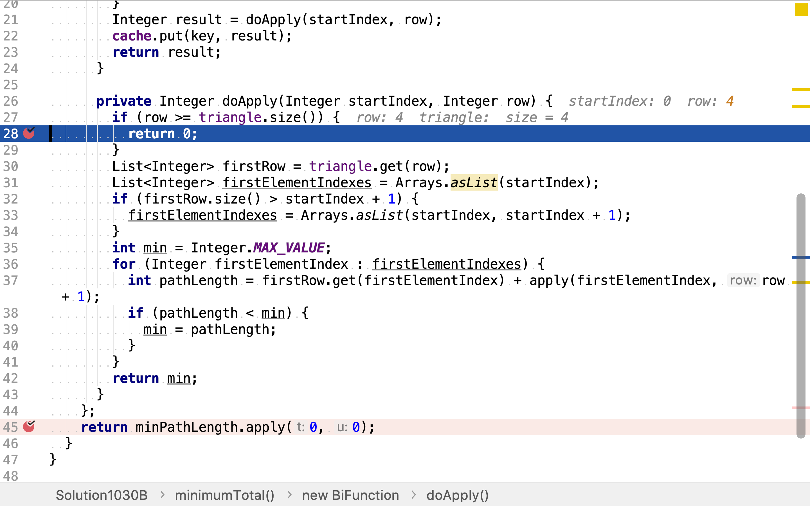

其暂存所有輸入值對應的解，避免了重復計算。

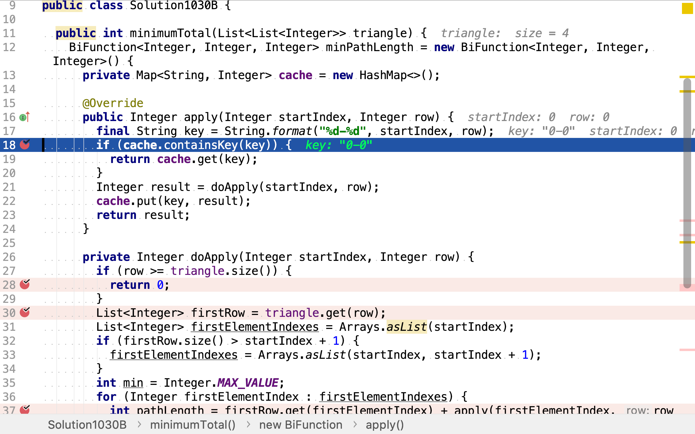

### 複雜度分析

#### 時間複雜度

`minPathLength`暂存了值，所以其實際的計算次數為n（n為三⻆形中點的數量。

時間複雜度為：

$$
\begin{aligned}
C_{time} &= \mathcal{O}(n)
\end{aligned}
$$

#### 空間複雜度

`minPathLength`為三⻆形中每個點都暂存了結果，所以空間複雜度為：

$$
\begin{aligned}
C_{space} &= \mathcal{O}(n)
\end{aligned}
$$

## 一次遍歷實現動態規劃

上述動態規劃演算法可以用面向過程的方式實現。

### 代碼

[include](../../../src/main/java/io/github/rscai/leetcode/bytedance/dynamic/Solution1030C.java)

首先，構造一個跟輪入三⻆形相同尺寸的二維列表，用來存儲以相應點為起點的最短路徑和。

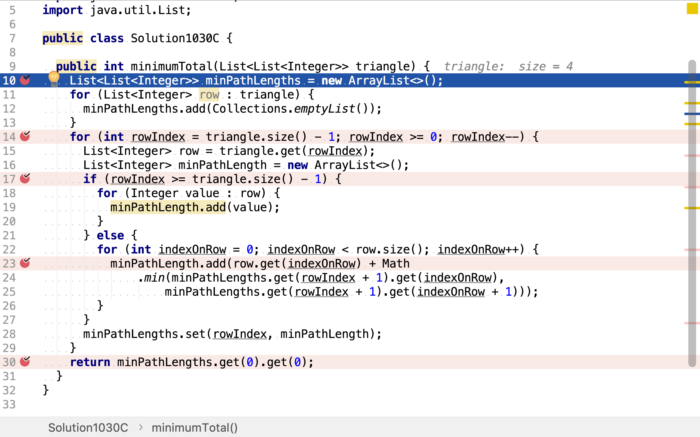

然後，從下往上計算。計算以每個點為起點，其最短路徑和。

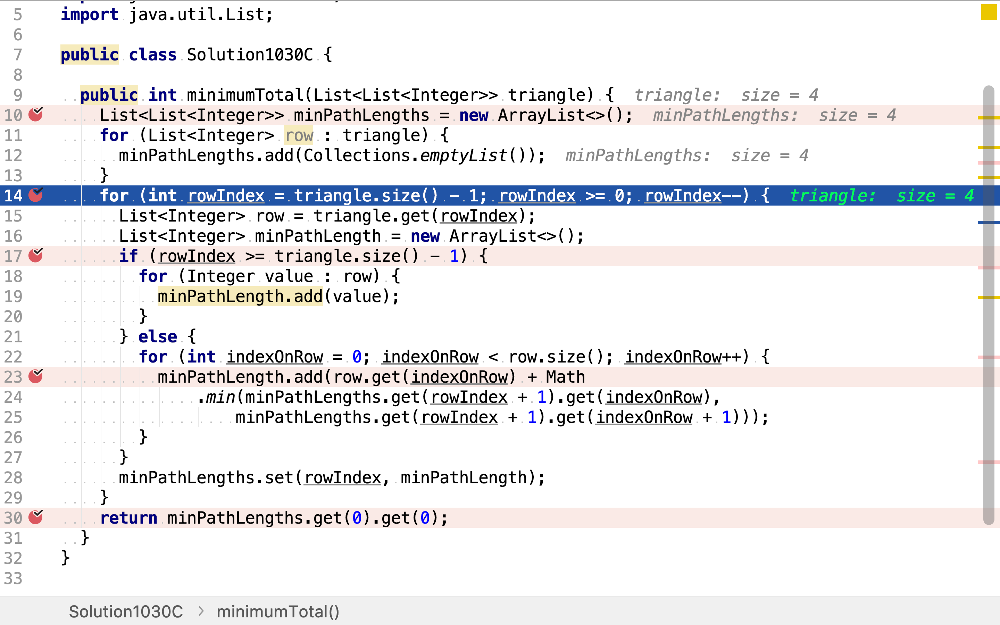

計算最短路徑和時，有兩種情形。第一種情形，當前行為最後一行，則以某個點為起點的唯一路徑就是僅包含自身的列表，也就是最短路徑。

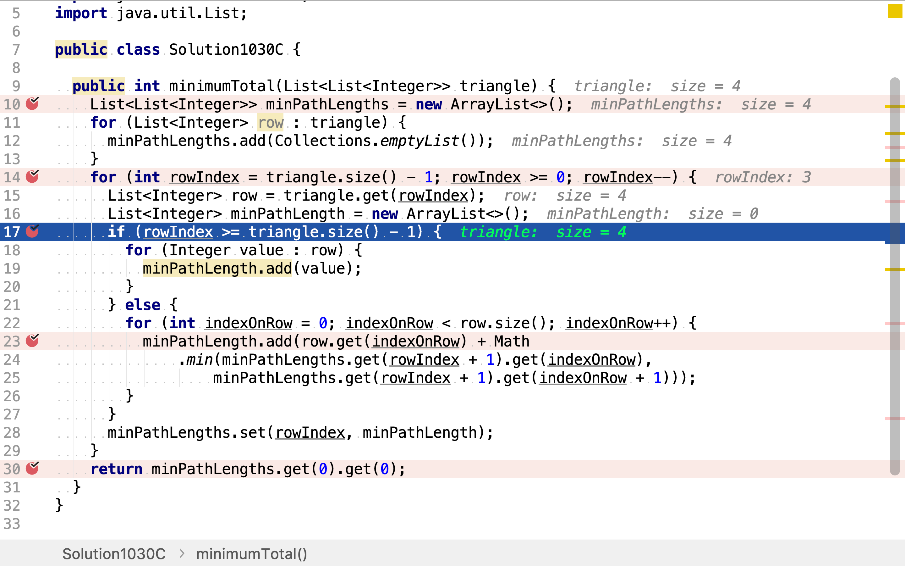

另一種情形，當前行不是最後一行。則以其上某一點為起點的最短路徑和為：以相鄰點為起點的最短路徑加中最短的加上自身值。


最後，再取出以全局三⻆形頂點為起點的最短路徑和。

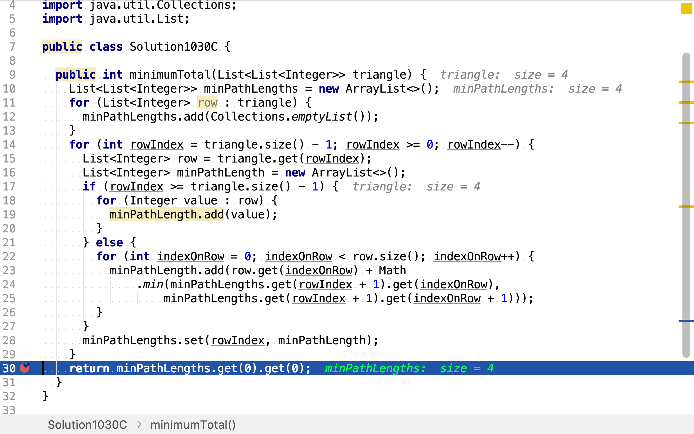

### 複雜度分析

#### 時間複雜度

與用函數式實現的演算法相同。

$$
\begin{aligned}
C_{time} &= \mathcal{O}(n)
\end{aligned}
$$

#### 空間複雜度

其為三⻆形中每個點都暂存了結果，所以空間複雜度為：

$$
\begin{aligned}
C_{space} &= \mathcal{O}(n)
\end{aligned}
$$