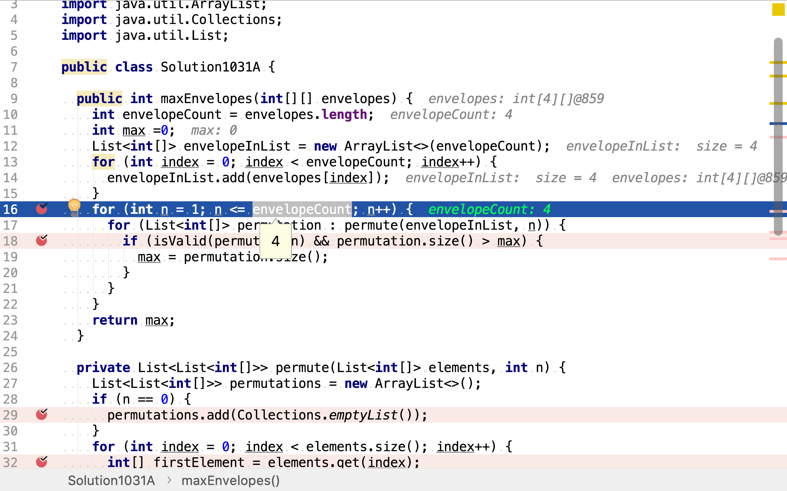
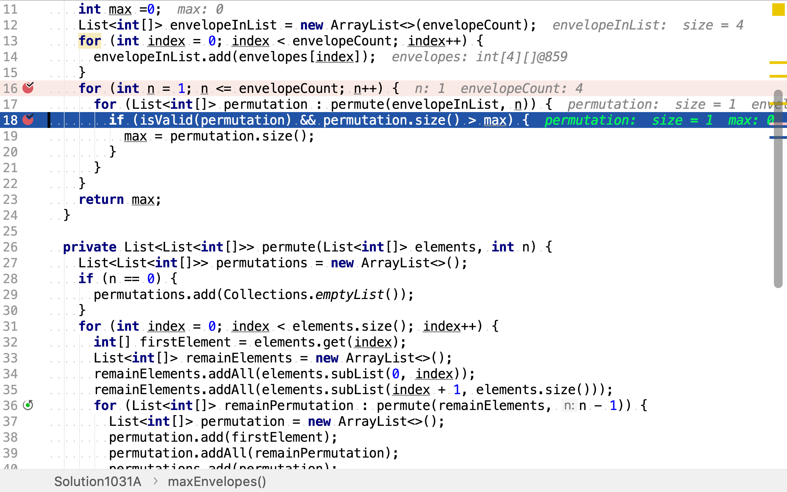
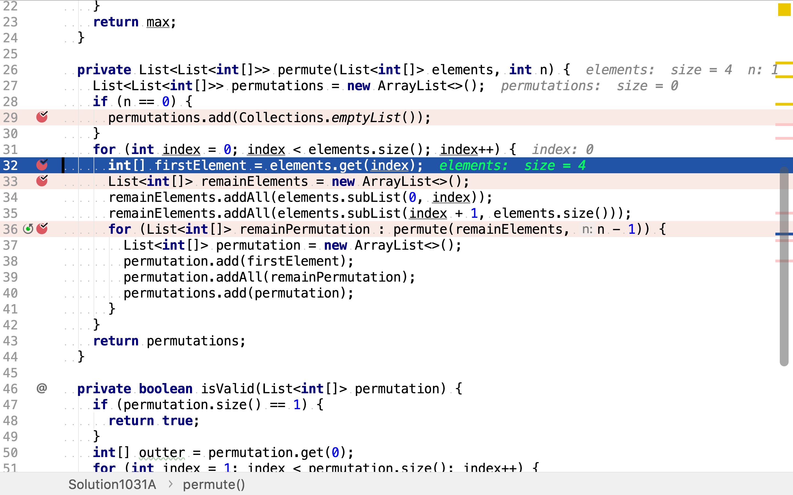
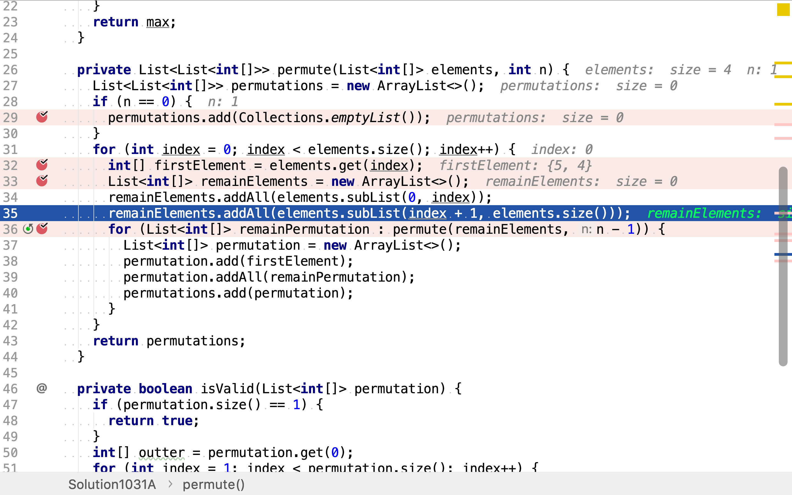
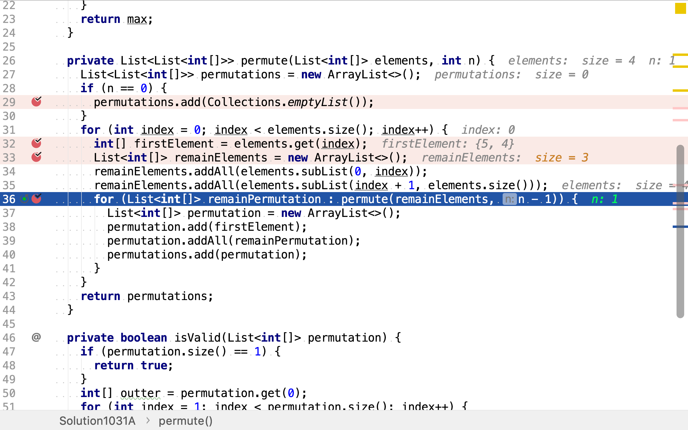
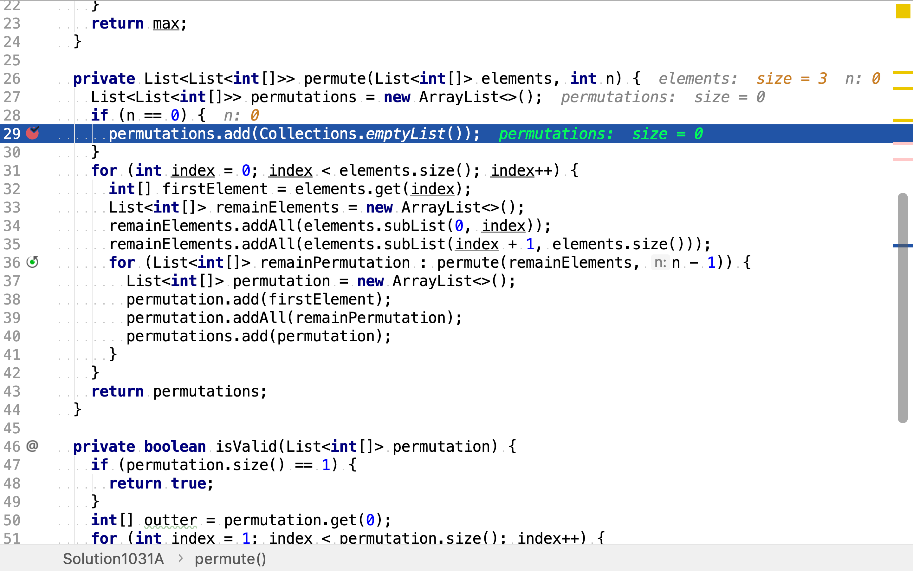
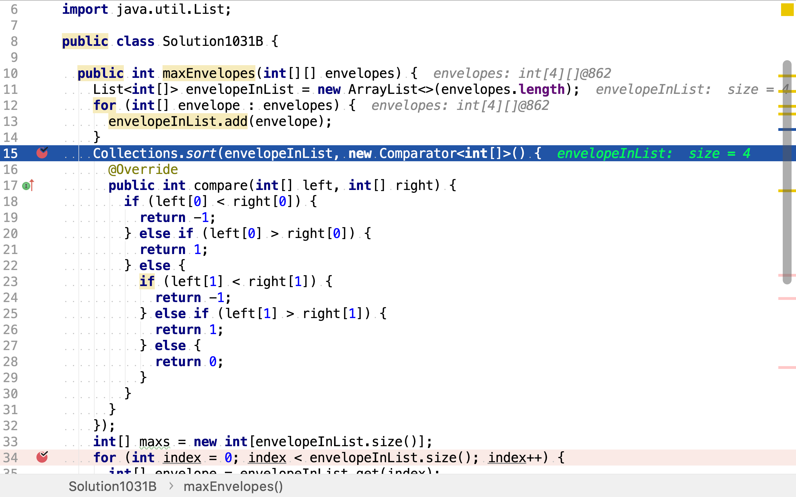
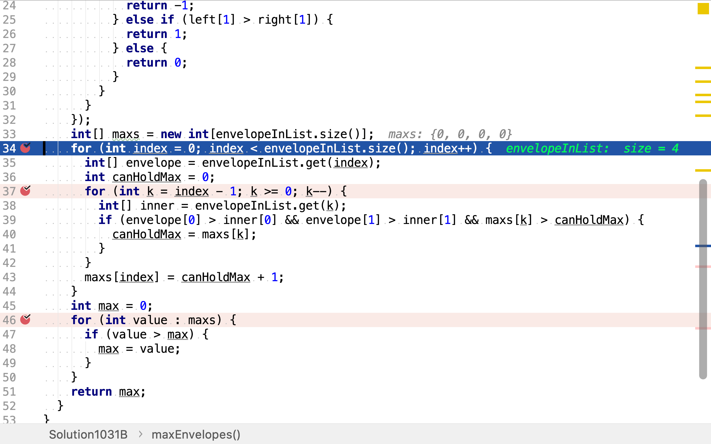
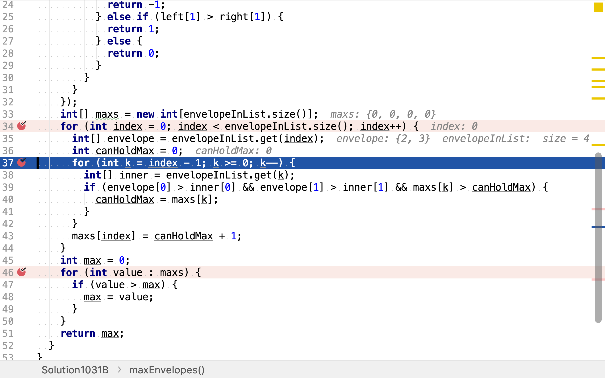
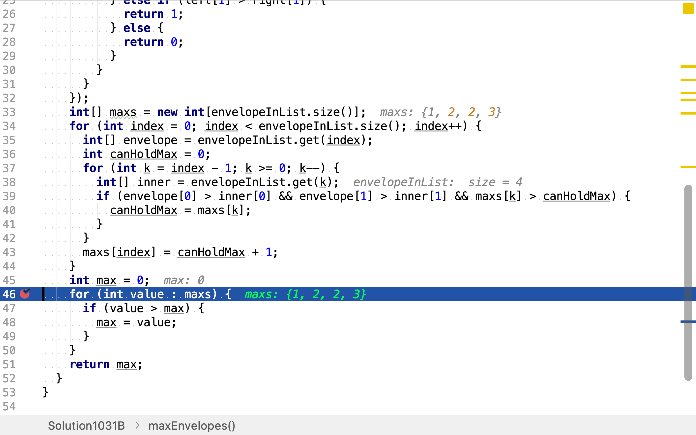

# 俄羅斯套娃信封問題

## 題目

>給定一些標記了寬度和高度的信封，寬度和高度以整數對形式 (w, h) 出現。當另一個信封的寬度和高度都比這個信封大的時候，這個信封就可以放進另一個信封裡，如同俄羅斯套娃一樣。
>
>請計算最多能有多少個信封能組成一組“俄羅斯套娃”信封（即可以把一個信封放到另一個信封裡面）。
>
>**說明:**
>不允許旋轉信封。
>
>**示例:**
>
>```
>輸入: envelopes = [[5,4],[6,4],[6,7],[2,3]]
>輸出: 3
>解釋: 最多信封的個數為 3, 組合為: [2,3] => [5,4] => [6,7]。
>```

## 窮舉法

給定$$n$$個信封，分別取$$1, 2, ..., n$$個信封排列。再過濾可以嵌套的信封排列。最後取其中嵌套信封最多的排列。

在$$n$$個元素中取$$k$$個元素組合排列的數量為$$\frac{n!}{(n-k)!}$$。

舉個例子，給定四個信封`[[5,4],[6,4],[6,7],[2,3]]`。套娃信封可以是由一個信封、兩個信封、三個信封或四個信封組成。逐一羅列從四個信封中取出一個、兩個、三個和四個信封的排列。

從四個信封中取出一個信封有四種排列：

```plantuml
digraph d {
    root 
    a [label="[5,4]"]
    b [label="[6,4]"]
    c [label="[6,7]"]
    d [label="[2,3]"]
    root -> a
    root -> b
    root -> c
    root -> d
}
```

從四個信封中取出兩個信封有十二種排列：

```plantuml
digraph d {
    root 
    a [label="[5,4]"]
    b [label="[6,4]"]
    c [label="[6,7]"]
    d [label="[2,3]"]
    root -> a
    root -> b
    root -> c
    root -> d

    aa [label="[6,4]"]
    ab [label="[6,7]"]
    ac [label="[2,3]"]
    a -> aa
    a -> ab
    a -> ac

    ba [label="[5,4]"]
    bb [label="[6,7]"]
    bc [label="[2,3]"]
    b -> ba
    b -> bb
    b -> bc

    ca [label="[5,4]"]
    cb [label="[6,4]"]
    cc [label="[2,3]"]
    c -> ca
    c -> cb
    c -> cc

    da [label="[5,4]"]
    db [label="[6,4]"]
    dc [label="[6,7]"]
    d -> da
    d -> db
    d -> dc
}
```

### 代碼

[include](../../../src/main/java/io/github/rscai/leetcode/bytedance/dynamic/Solution1031A.java)

首先，依次羅列所有的排列。



然後，過濾出可以嵌套在一起的排列，並求出其中信封數最大值。



排列用遞歸的方式實現。先將問題拆分為一個「簡單的子問題」- 從可選集合𥚃取一個元素。當可選集合大於1時，「一個元素」有多種取值。



除去一個「簡單的子問題」後，剩餘一個更小的可選元素集合和更小的排列數。



再遞歸調用自身解決「其餘問題」。



遞歸終止條件為$$n$$為空。



### 複雜度分析

#### 時間複雜度

在$$n$$個元素中取$$k$$個元素組合排列的數量為$$\frac{n!}{(n-k)!}$$。本演算法羅列了$$n$$從1到m的所有排列。所以，時間複雜度為：

$$
\begin{aligned}
C_{time} &= \mathcal{O}(\sum_{k=1}^{n}(\frac{n!}{(n-k)!})) \\
&=\mathcal{O}(n^n)
\end{aligned}
$$

#### 空間複雜度

其羅列了所有的排列，空間複雜度為：

$$
\begin{aligned}
C_{space} &= \mathcal{O}(\sum_{k=1}^{n}(\frac{n!}{(n-k)!})) \\
&=\mathcal{O}(n^n)
\end{aligned}
$$

## 貪婪法

>貪婪演算法（英語：greedy algorithm），又稱貪心演算法，是一種在每一步選擇中都採取在目前狀態下最好或最佳（即最有利）的選擇，從而希望導致結果是最好或最佳的演算法。

假設給定一個信封a，在選擇一個信封放入a中時，選擇了可容維信封數最多的信封，則將其放入a所組成的「套娃信封」數是最大。

遞推公式：

$$
max(a, s) = \begin{cases}
   1 &\text{if }  s = \emptyset \\
   1 + max(s) &\text{if } s \neq \emptyset
\end{cases}
$$

其中，$$max$$是以$$a$$為最外層信封組成的「套娃信封」最大數，$$s$$為$$a$$能容納的所有信封集合。

### 代碼

[include](../../../src/main/java/io/github/rscai/leetcode/bytedance/dynamic/Solution1031B.java)

首先，將信封從小到大排序。因為信封的「尺寸」是一個二維向量，所以實際上無法以一維排序。這𥚃按一個近似的序列排序：先比較長，若長相等則比較寛。



然後，從小往大依次計算以每個信封為最外層信封所能組成的最大「套娃信封」。



一個信封所能組成的最大「套娃信封」由其所能容納的所有信封中「套娃信封」值最大的再加1。因為所有信封都從小到大排序了（雖然是㧒近似的順序排序的，但保證了右側的信封絕不會小於左側信封），所以「可容納的信封」都在序列左側。



最後，再遍歷一遍，找出最大的「套娃信封」。



### 複雜度分析

#### 時間複雜度

本演算法使用一次JDK中`ArrayList`的排序實現，其時間複雜度是$$\mathcal{O}(n \log n)$$。再兩層循環遍歷所有信封。時間複雜度為：

$$
\begin{aligned}
C_{time} &= \mathcal{O}(n \log n) + \mathcal{O}(\frac{(n+1)n}{2}) \\
&= \mathcal{O}(n \log n) + \mathcal{O}(n^2) \\
&= \mathcal{O}(n^2)
\end{aligned}
$$

#### 空間複雜度

使用了尺寸與輪入值相同的`maxs`存儲子問題解。空間複雜度為：

$$
\begin{aligned}
C_{space} &= \mathcal{O}(n)
\end{aligned}
$$