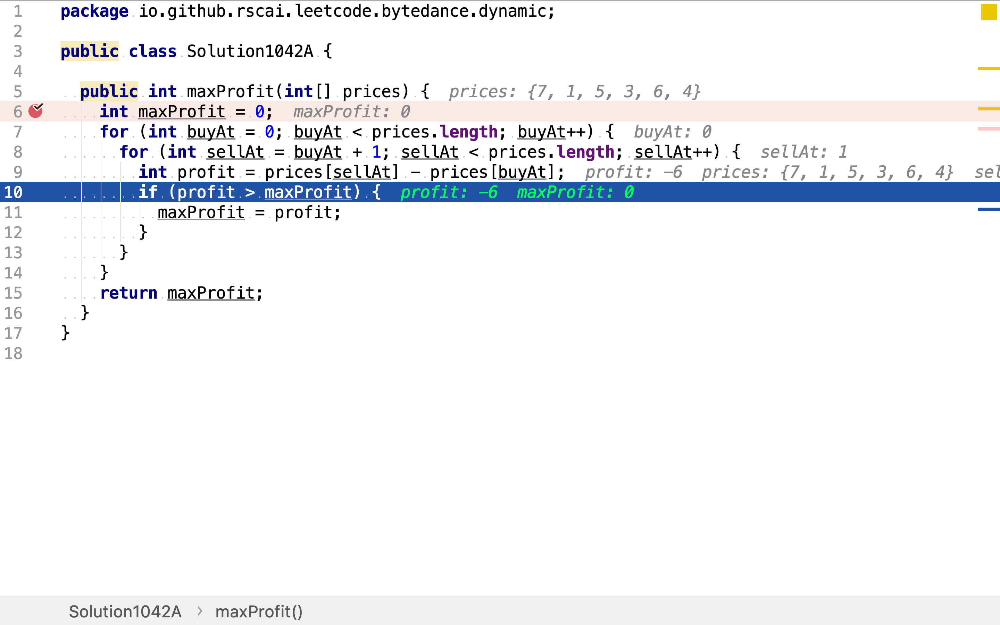
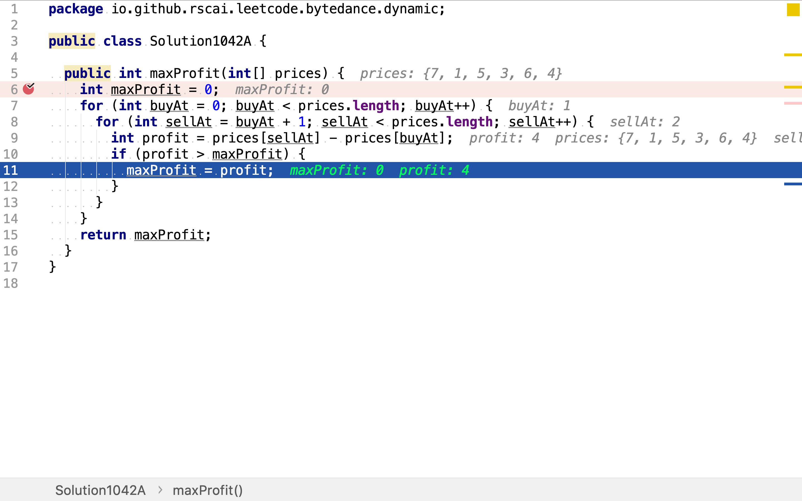

# 買賣股票的最佳時機

## 題目

>給定一個數組，它的第 i 個元素是一支給定股票第 i 天的價格。
>
>如果你最多只允許完成一筆交易（即買入和賣出一支股票），設計一個算法來計算你所能獲取的最大利潤。
>
>注意你不能在買入股票前賣出股票。
>
>**示例 1:**
>
>```
>輸入: [7,1,5,3,6,4]
>輸出: 5
>解釋: 在第 2 天（股票價格 = 1）的時候買入，在第 5 天（股票價格 = 6）的時候賣出，最大利潤 = 6-1 = 5 。
>     注意利潤不能是 7-1 = 6, 因為賣出價格需要大於買入價格。
>```
>
>**示例 2:**
>
>```
>輸入: [7,6,4,3,1]
>輸出: 0
>解釋: 在這種情況下, 沒有交易完成, 所以最大利潤為 0。
>```

## 窮舉法

買賣有一買一賣組成，賣出價與買入價之間的差值即為利潤。窮舉法就是羅列所有買入價和賣出價之間的組合，再算出利潤，取其中最大的利潤。

### 代碼

[include](../../../src/main/java/io/github/rscai/leetcode/bytedance/dynamic/Solution1042A.java)

首先，選取買入價。任意一個價格都可以作為買價。使用for loop遍歷所有價格作為買入價。


賣出動作必需要在買入之後，所以針對不同的買入點，可選的買出點是不同的。比如，當買入點為第一天，則只能在第二天及以後的某一賣出。使用for loop遍歷買入點之後的每一天。兩層for loop就羅列出了所有的買入/賣出組合，再計算每一個買入/賣出組合產成的利潤，留下最大的即是所有求解。





### 複雜度分析

#### 時間複雜度

兩層for loop共產生了$$\frac{n(n-1)}{2}$$次循環。時間複雜度為

$$
\begin{aligned}
C_{time} &= \mathcal{O}(\frac{n(n-1)}{2}) \\
&= \mathcal{O}(n^2)
\end{aligned}
$$

#### 空間複雜度

只使用了兩個變量`maxProfit`和`profit`。空間複雜度為

$$
\begin{aligned}
C_{space} &= \mathcal{O}(2) \\
&= \mathcal{O}(1)
\end{aligned}
$$


## 一次遍歷

當以最低價買入再以最高價賣出時，其利潤是最大的。但有時，最低價出現在最高價之後。當最低價出現在最高價之後時，產生最大利潤的買賣組合一定在以下兩個組合之中：

1. 以最高價出現之前的最低價買入，再以最高價賣出
2. 以最低價買入，再以之後的最高價賣出

用一次for loop就可以遍歷到三個買賣組合，再從中取利潤最大的組合即為全局利潤最大買賣組合。

### 代碼

[include](../../../src/main/java/io/github/rscai/leetcode/bytedance/dynamic/Solution1042B.java)

用一次for loop遍歷所有價格。同時尋找目前為止最低價和最大利潤。

若最低價在最高價之間出現的情況下，當遍歷到最高價時，`minBuyPrice`保存的是最低價。計算出來的價差就是最大利潤。

若最低價出現在最高價之後，則當遍歷到最高價時，`minBuyPrice`保存的是最高之前的局部最低價；當遍歷到最低價之後的局部最高價時，`minBuyPrice`保存的是全局最低價。

所以，一次for loop一定遍歷了三個必然包含最大利潤的組合，再從中取出最大值即為全局最大利潤。


### 複雜度分析

#### 時間複雜度

總共就一次for loop，所以時間複雜度為

$$
C_{time} = \mathcal{O}(n)
$$

#### 空間複雜度

使手了兩個變量`maxProfit`和`minBuyPrice`。空間複雜度為

$$
\begin{aligned}
C_{space} &= \mathcal{O}(2) \\
&= \mathcal{O}(1)
\end{aligned}
$$