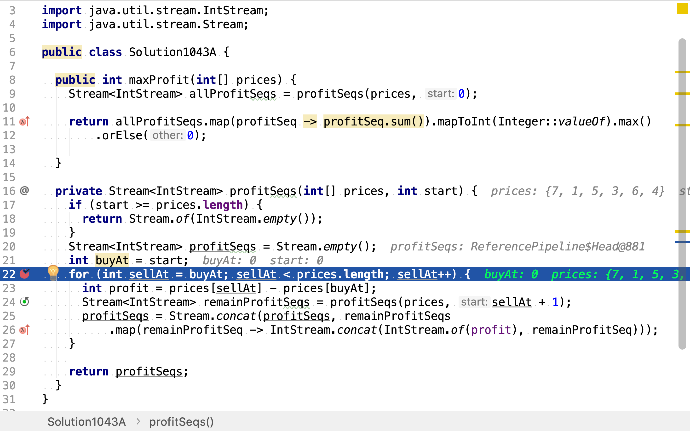
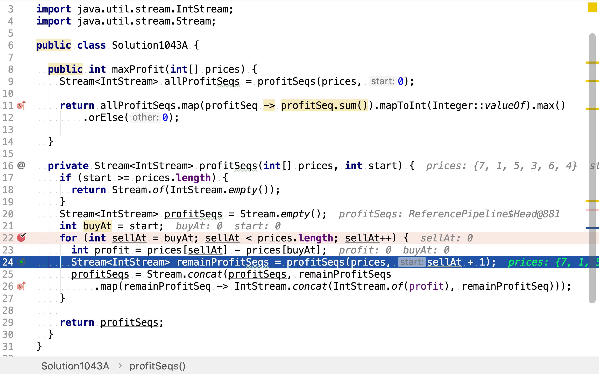
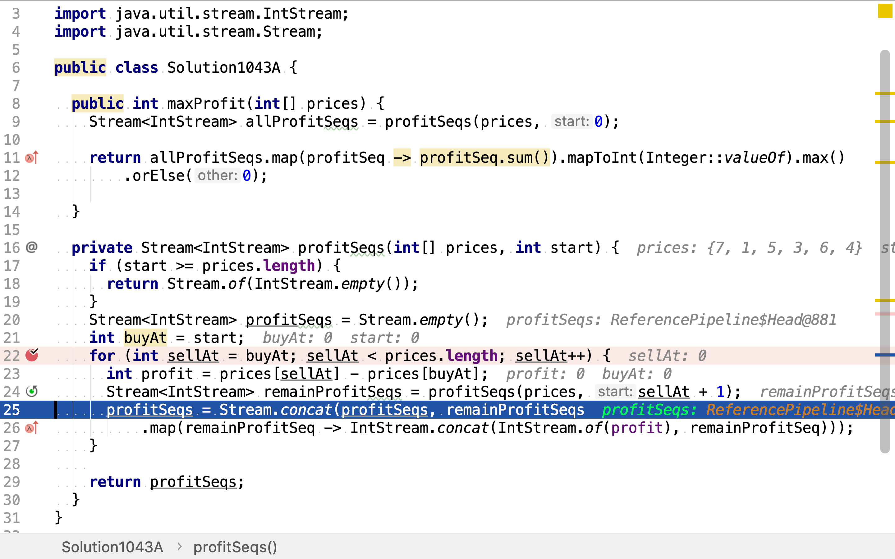
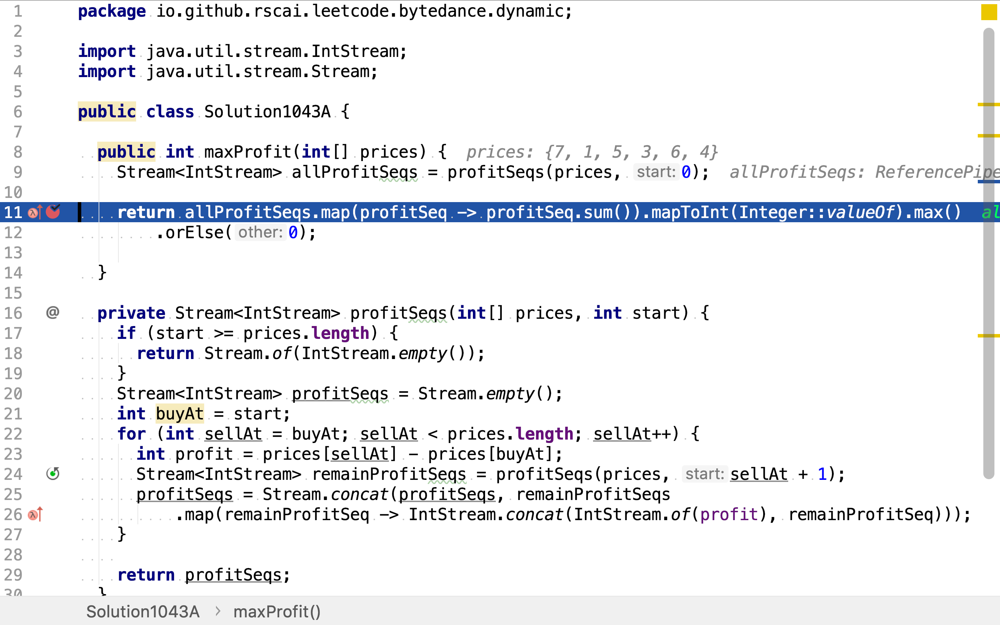
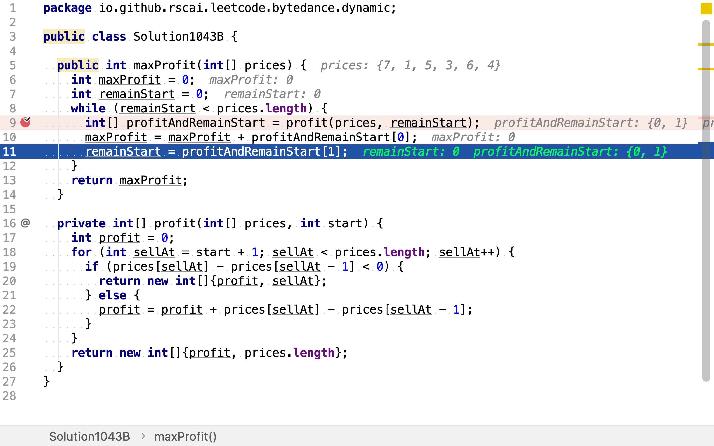
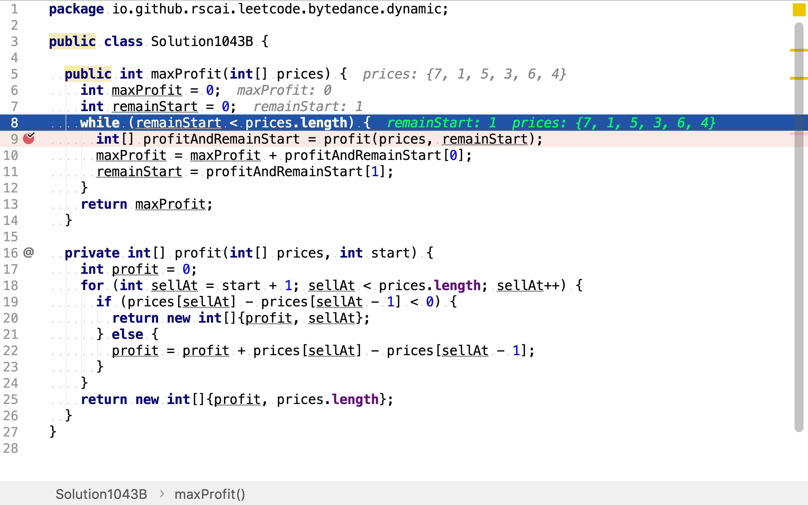
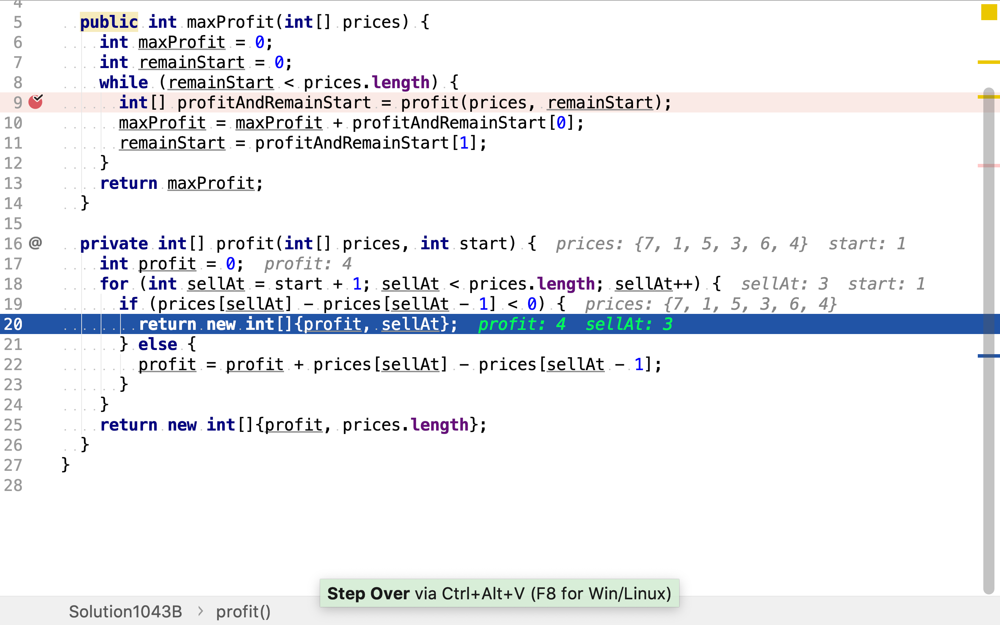

# 買賣股票的最佳時機 II

## 題目

>給定一個數組，它的第 i 個元素是一支給定股票第 i 天的價格。
>
>設計一個算法來計算你所能獲取的最大利潤。你可以盡可能地完成更多的交易（多次買賣一支股票）。
>
>注意：你不能同時參與多筆交易（你必須在再次購買前出售掉之前的股票）。
>
>**示例1：**
>
>```
>輸入: [7,1,5,3,6,4]
>輸出: 7
>解釋: 在第 2 天（股票價格 = 1）的時候買入，在第 3 天（股票價格 = 5）的時候賣出, 這筆交易所能獲得利潤 = 5-1 = 4 。
>     隨後，在第 4 天（股票價格 = 3）的時候買入，在第 5 天（股票價格 = 6）的時候賣出, 這筆交易所能獲得利潤 = 6-3 = 3 。
>```
>
>**示例2：**
>
>```
>輸入: [1,2,3,4,5]
>輸出: 4
>解釋: 在第 1 天（股票價格 = 1）的時候買入，在第 5 天 （股票價格 = 5）的時候賣出, 這筆交易所能獲得利潤 = 5-1 = 4 。
>     注意你不能在第 1 天和第 2 天接連購買股票，之後再將它們賣出。
>     因為這樣屬於同時參與了多筆交易，你必須在再次購買前出售掉之前的股票。
>```
>
>**示例3：**
>
>```
>輸入: [7,6,4,3,1]
>輸出: 0
>解釋: 在這種情況下, 沒有交易完成, 所以最大利潤為 0。
>```

## 窮舉法

羅列所有的買賣組合，再計算其中利潤最大的組合。多次買賣由第一次買賣和後續買賣組成，後續買賣只能在第一次賣出點之後發生。用樹表示所有買賣組合，第一層為可選的第一次買賣組合（根節點為第零層，同一天買賣等同於當天不買賣），第N層為第N次買賣。

舉個例子，給定價格序列`[7, 1, 5, 3, 6, 4]`。第一次買賣有六種選擇：

1. 以7的價格買入，以7的價格賣出。等同於第一天不買賣。
2. 以7的價格買入，以1的價格賣出。
3. 以7的價格買入，以5的價格賣出。
4. 以7的價格買入，以3的價格賣出。
5. 以7的價格買入，以6的價格賣出。
6. 以7的價格買入，以4的價格賣出。

第二次買賣可行的選擇由第一次買賣決定。第二次買賣的買入點一定是第一次買賣的賣出點後一天。依此類推。

```plantuml
digraph d {
    root [label="7,1,5,3,6,4"]
    a [label="7"]
    b [label="7,1"]
    c [label="7,1,5"]
    d [label="7,1,5,3"]
    e [label="7,1,5,3,6"]
    f [label="7,1,5,3,6,4"]
    root -> a
    root -> b
    root -> c
    root -> d
    root -> e
    root -> f

    aa [label="1"]
    ab [label="1,5"]
    ac [label="1,5,3"]
    ad [label="1,5,3,6"]
    ae [label="1,5,3,6,4"]
    a -> aa
    a -> ab
    a -> ac
    a -> ad
    a -> ae

    aaa [label="5"]
    aab [label="5,3"]
    aac [label="5,3,6"]
    aad [label="5,3,6,4"]
    aa -> aaa
    aa -> aab
    aa -> aac
    aa -> aad

    aaaa [label="3"]
    aaab [label="3,6"]
    aaac [label="3,6,4"]
    aaa -> aaaa
    aaa -> aaab
    aaa -> aaac

    aaaaa [label="6"]
    aaaab [label="6,4"]
    aaaa -> aaaaa
    aaaa -> aaaab

    aaaaaa [label="4"]
    aaaaa -> aaaaaa

    aaaba [label="4"]
    aaab -> aaaba

    aaba [label="6"]
    aabb [label="6,4"]
    aab -> aaba
    aab -> aabb

    aabaa [label="4"]
    aaba -> aabaa

    aaca [label="4"]
    aac -> aaca

    aba [label="3"]
    abb [label="3,6"]
    abc [label="3,6,4"]
    ab -> aba
    ab -> abb
    ab -> abc

    abaa [label="6"]
    abab [label="6,4"]
    aba -> abaa
    aba -> abab

    abba [label="4"]
    abb -> abba

    aca [label="6"]
    acb [label="6,4"]
    ac -> aca
    ac -> acb

    acaa [label="4"]
    aca -> acaa

    ada [label="4"]
    ad -> ada

    ba [label="5"]
    bb [label="5,3"]
    bc [label="5,3,6"]
    bd [label="5,3,6,4"]
    b -> ba
    b -> bb
    b -> bc
    b -> bd

    baa [label="3"]
    bab [label="3,6"]
    bac [label="3,6,4"]
    ba -> baa
    ba -> bab
    ba -> bac

    baaa [label="6"]
    baab [label="6,4"]
    baa -> baaa
    baa -> baab

    baaaa [label="4"]
    baaa -> baaaa

    baba [label="4"]
    bab -> baba

    bba [label="6"]
    bbb [label="6,4"]
    bb -> bba
    bb -> bbb

    bbaa [label="4"]
    bba -> bbaa

    bca [label="4"]
    bc -> bca

    ca [label="3"]
    cb [label="3,6"]
    cc [label="3,6,4"]
    c -> ca
    c -> cb
    c -> cc

    caa [label="6"]
    cab [label="6,4"]
    ca -> caa
    ca -> cab

    caaa [label="4"]
    caa -> caaa

    cba [label="4"]
    cb -> cba

    da [label="6"]
    db [label="6,4"]
    d -> da
    d -> db

    daa [label="4"]
    da -> daa

    ea [label="4"]
    e -> ea
}
```

### 代碼

[include](../../../src/main/java/io/github/rscai/leetcode/bytedance/dynamic/Solution1043A.java)

首先，在第一天買進，羅列出所有的賣出選擇　包括當天賣出。



然後，羅列出在剩餘價格序列中的買賣序列組合。剩餘價格序列由這一次賣出點決定。所以不同的當次買賣產生不同的剩餘價格序列，也產了不同的剩餘買賣序列組合。



再然後，組合當次買賣與剩餘買賣序列組合，構成新的買賣序列組合。



最後，合計所有的買賣序列產生的利潤，從中取最大值。



### 複雜度分析

#### 時間複雜度

時間複雜度為：

$$
\begin{aligned}
C_{time} &= \mathcal{O}(\sum_{i=1}^{n}(\sum_{a=1}^{i}a)) \\
&=\mathcal{O}(n^2)
\end{aligned}
$$

#### 空間複雜度

空間複雜度等於樹的最大深度，為

$$
C_{space} = \mathcal{O}(n)
$$

## 貪婪算法

在第一天買入，如果利潤持續增加（第二天的價格大於今天）則持有。若利潤下降（第二天價格低於當天）則賣出。（可同一天買賣，等同於當天不交易）。然後，在剩餘價格序列中重復相同的操作。

舉個例子，給定價格序列`[7, 1, 5, 3, 6, 4]`。

* 第一次，在7買入，在7賣出。等同於不交易。剩餘價格序列`[1, 5, 3, 6, 4]`
* 第二次，在1買入，在5賣出。剩餘價格序列`[3, 6, 4]`
* 第三次，在3買入，在6賣出。剩餘價格序列`[4]`
* 第四次，在4買入，在4賣出。等同於交易。

```plantuml
digraph d {
    root [label="7,1,5,3,6,4"]
    a [label="7"]
    b [label="1,5,3,6,4"]
    root -> a
    root -> b

    ba [label="1,5"]
    bb [label="3,6,4"]
    b -> ba
    b -> bb

    bba [label="3,6"]
    bbb [label="4"]
    bb -> bba
    bb -> bbb
}
```

### 代碼

[include](../../../src/main/java/io/github/rscai/leetcode/bytedance/dynamic/Solution1043B.java)

首先，在第一天買入，在利潤開始下降前賣出（同天買賣等同於不交易）。得到利潤和剩餘價格序列（這𥚃用剩餘價格序列開始下標）。



然後，如果剩餘價格列表不空，則繼續在第一天（剩餘序列中的第一天）買入，在利潤開始下降前賣出。得到利潤和剩餘價格序列。



在第一天買入，如果價格在上升意味着利潤增加，應繼續持有。如果價格下降則意味着利潤下降，應在價格下降前賣出。



### 複雜度分析

#### 時間複雜度

時間複雜度等於`profit`被調用的次數及每次`profit`中遍歷價格序列的長度，其等於整個價格序列的長度。所以，時間複雜度為：

$$
\begin{aligned}
C_{time} &= \mathcal{O}(n)
\end{aligned}
$$

#### 空間複雜度

只有三毎變量`maxProfit`, `remainStart`和`profit`。

$$
\begin{aligned}
C_{space} &=\mathcal{O}(1)
\end{aligned}
$$
