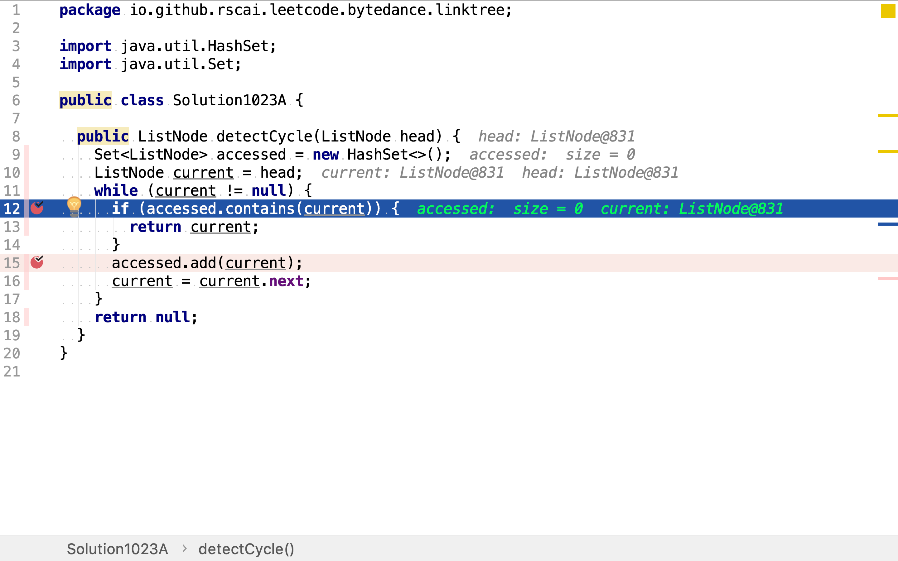
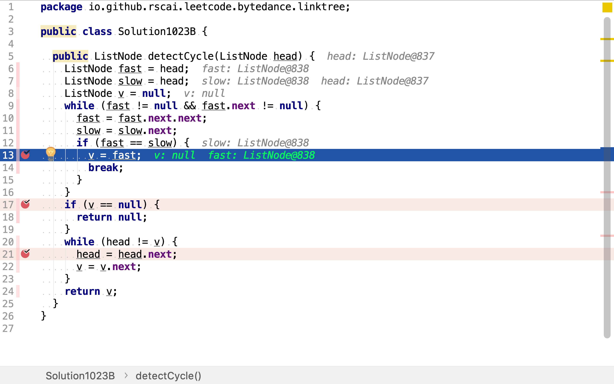
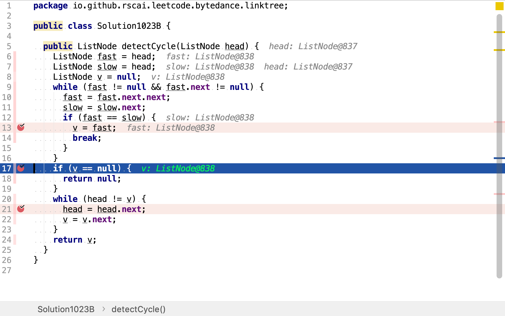
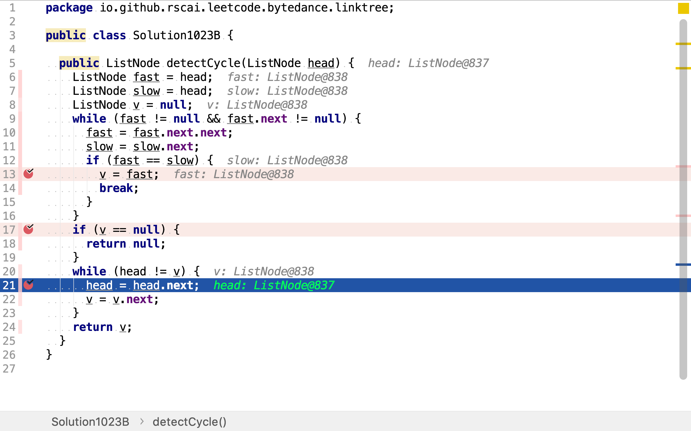

# 環形鏈表 II

## 題目

>給定一個鏈表，返回鏈表開始入環的第一個節點。如果鏈表無環，則返回 null。
>
>為了表示給定鏈表中的環，我們使用整數 pos 來表示鏈表尾連接到鏈表中的位置（索引從 0 開始）。如果 pos 是 -1，則在該鏈表中沒有環。
>
>**說明：**不允許修改給定的鏈表。
>
>**示例1：**
>
>```
>輸入：head = [3,2,0,-4], pos = 1
>輸出：tail connects to node index 1
>解釋：鏈表中有一個環，其尾部連接到第二個節點。
>```
>
>
>
>**示例2：**
>
>```
>輸入：head = [1,2], pos = 0
>輸出：tail connects to node index 0
>解釋：鏈表中有一個環，其尾部連接到第一個節點。
>```
>
>
>
>**示例3：**
>
>```
>輸入：head = [1], pos = -1
>輸出：no cycle
>解釋：鏈表中沒有環。
>```
>
>
>
>**進階：**
>
>你是否可以不用額外空間解決此題？

## 記錄訪問歷史法

將訪問過的節點放入一個集合中。每次訪問節點時，都檢查是否已被訪問過（已在集合中）。若是，則其為環的入口點。

舉個例子，給定如下鏈表：

```plantuml
digraph d {
    a [label=3]
    b [label=2]
    c [label=0]
    d [label="-4"]
    a -> b -> c -> d -> b
    {rank=same;a,b,c,d}
}
```

從頭開始遍歷，並將訪問過的節點加入集合。

```plantuml
digraph d {
    accessed [shape=record, label="3|2|0|-4"]

    a [label=3, style=filled, fillcolor=grey]
    b [label=2, style=filled, fillcolor=grey]
    c [label=0, style=filled, fillcolor=grey]
    d [label="-4", style=filled, fillcolor=grey]
    a -> b -> c -> d -> b
    {rank=same;a,b,c,d}
}
```

當䛀訪問`-4`的`後繼時，發現其後繼`2`已被訪問過。所以`2`就是入環點。

### 代碼

[include](../../../src/main/java/io/github/rscai/leetcode/bytedance/linktree/Solution1040A.java)

從頭開始遍歷，針對每一個元素都先檢查是否已被訪問過。若是，則是入環點。



若不是，則記錄其訪問。


### 複雜度分析

#### 時間複雜度

其只遍歷了一遍鏈表，時間複雜度為$$\mathcal{O}(n)$$。

#### 空間複雜度

其要記錄每個節點的訪問記錄，空間複雜度為$$\mathcal{O}(n)$$。

## Floyd's Tortoise and Hare

>Floyd的循環尋找算法是一種指針算法，它只使用兩個指針，它們以不同的速度在序列中移動。 它也被稱為“烏龜和野兔算法”，暗指伊索寓言中的烏龜和野兔。
>
>該算法的關鍵見解如下：如果存在環，則對於任何整數$$i≥μ$$且$$k≥0，x_i = x_{i +kλ}$$，其中$$λ$$是要找到的環的長度，μ是環的第一個元素的索引。 基於此，當且僅當$$x_i = x_{2i}$$時，可以證明對於某些$$k，i = k \lambda ≥ \mu$$。 因此，該算法僅需要檢查該特殊形式的重複值，即從序列的開始到另一個的兩倍，以找到作為λ的倍數的重複的周期ν。 一旦找到ν，算法就從序列開始回溯序列，找到序列中的第一個重複值$$x_μ$$，使用λ除ν的事實，因此 $$x_{\mu}=x_{\mu+ v}$$。最後，一旦μ的值已知，它 通過搜索$$x_{μ+λ}=x_μ$$的第一位置$$μ+λ$$，找到最短重複週期的長度λ是微不足道的。
>
>因此，算法保持兩個指向給定序列的指針，一個（烏龜）在$$x_i$$，另一個（野兔）在$$x_{2i}$$。 在算法的每一步，它將i增加1，將龜向前移動一步，然後在序列中向前移動兩步，然後比較這兩個指針的序列值。 烏龜和野兔指向相等值的$$i> 0$$的最小值是期望值ν。

然後，分別從頭和$$v$$開始同步長移動。第一個交滙點就是入環點。

舉個例子，給定如下鏈表：

```plantuml
digraph d {
    a [label=3]
    b [label=2]
    c [label=0]
    d [label="-4"]
    a -> b -> c -> d -> b
    {rank=same;a,b,c,d}
    fast [shape=none, label=fast]
    slow [shape=none, label=slow]
    fast -> a [style=dotted]
    slow -> a [style=dotted]
}
```

建立兩個指針`fast`和`slow`，開始都指向頭。`fast`以步長2向前移動，`slow`以步長1向前移動。

```plantuml
digraph d {
    a [label=3]
    b [label=2]
    c [label=0]
    d [label="-4"]
    a -> b -> c -> d -> b
    {rank=same;a,b,c,d}
    fast [shape=none, label=fast]
    slow [shape=none, label=slow]
    fast -> c [style=dotted]
    slow -> b [style=dotted]
}
```

```plantuml
digraph d {
    a [label=3]
    b [label=2]
    c [label=0]
    d [label="-4"]
    a -> b -> c -> d -> b
    {rank=same;a,b,c,d}
    fast [shape=none, label=fast]
    slow [shape=none, label=slow]
    fast -> b [style=dotted]
    slow -> c [style=dotted]
}
```


```plantuml
digraph d {
    a [label=3]
    b [label=2]
    c [label=0]
    d [label="-4"]
    a -> b -> c -> d -> b
    {rank=same;a,b,c,d}
    fast [shape=none, label=fast]
    slow [shape=none, label=slow]
    fast -> b [style=dotted]
    slow -> c [style=dotted]
}
```

最終，它們在`-4`處相遇。此時：

* 指針移動了3次，$$i = 3$$
* `fast`移動了$$2 \times 3 = 6$$步
* `slow`移動了$$1 \times 3 = 3$$步
* 環長$$\lambda = 3$$

```plantuml
digraph d {
    a [label=3]
    b [label=2]
    c [label=0]
    d [label="-4"]
    a -> b -> c -> d -> b
    {rank=same;a,b,c,d}
    fast [shape=none, label=fast]
    slow [shape=none, label=slow]
    fast -> d [style=dotted]
    slow -> d [style=dotted]
}
```

然後，創建兩個指針`head`和`v`。分別以鏈表頭和`-4`為起點，以1為步長，向後移到。

```plantuml
digraph d {
    a [label=3]
    b [label=2]
    c [label=0]
    d [label="-4"]
    a -> b -> c -> d -> b
    {rank=same;a,b,c,d}
    head [shape=none, label=head]
    v [shape=none, label=v]
    head -> a [style=dotted]
    v -> d [style=dotted]
}
```

最終，它們相會與`2`。`2`即是環的入口點。

```plantuml
digraph d {
    a [label=3]
    b [label=2]
    c [label=0]
    d [label="-4"]
    a -> b -> c -> d -> b
    {rank=same;a,b,c,d}
    head [shape=none, label=head]
    v [shape=none, label=v]
    head -> b [style=dotted]
    v -> b [style=dotted]
}
```

### 代碼

[include](../../../src/main/java/io/github/rscai/leetcode/bytedance/linktree/Solution1040B.java)

首先，使用`fast`和`slow`兩個步長分別為2和1的指針找出位置v。



若`fast`和`slow`沒有交會，則說明鏈表中不存在環。



若`fast`和`slow`最終交會，則從交會點和頭分別出發，以步長1向後遍歷鏈表。最終交會點即是環入口點。



### 複雜度分析

#### 時間複雜度

其僅遍歷了鏈表k次（k是常數），所以時間複雜度為$$\mathcal{O}(n)$$。

#### 空間複雜度

使用了三個變量`fast`、`slow`和`v`。空間複雜度為$$\mathcal{O}(1)$$。

## 參考

* [Floyd's Tortoise and Hare](https://en.wikipedia.org/wiki/Cycle_detection#Floyd's_Tortoise_and_Hare)