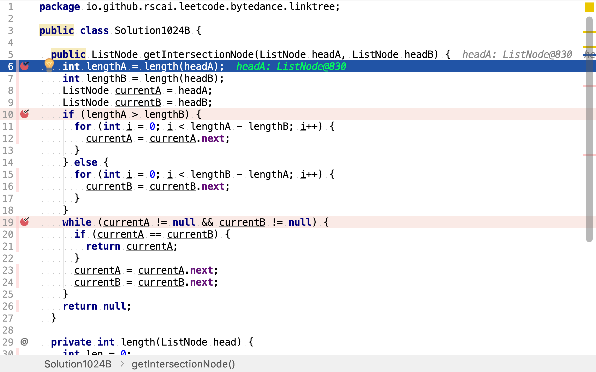
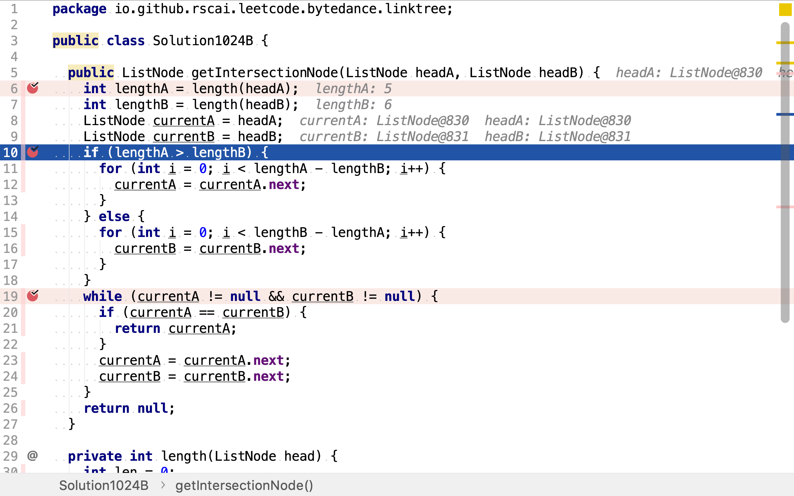
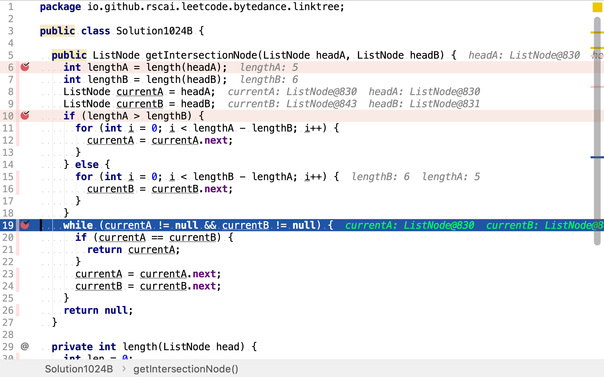

# 相交鏈表

## 題目

>編寫一個程序，找到兩個單鏈表相交的起始節點。
>
>如下面的兩個鏈表：
>
>
>在節點 c1 開始相交。
>
>**示例 1：**
>
>
>
>```
>輸入：intersectVal = 8, listA = [4,1,8,4,5], listB = [5,0,1,8,4,5], skipA = 2, skipB = 3
>輸出：Reference of the node with value = 8
>輸入解釋：相交節點的值為 8 （注意，如果兩個列表相交則不能為 0）。從各自的表頭開始算起，鏈表 A 為 [4,1,8,4,5]，鏈表 B 為 [5,0,1,8,4,5]。在 A 中，相交節點前有 2 個節點；在 B 中，相交節點前有 3 個節點。
>```
>
>**示例2：**
>
>
>
>```
>輸入：intersectVal = 2, listA = [0,9,1,2,4], listB = [3,2,4], skipA = 3, skipB = 1
>輸出：Reference of the node with value = 2
>輸入解釋：相交節點的值為 2 （注意，如果兩個列表相交則不能為 0）。從各自的表頭開始算起，鏈表 A 為 [0,9,1,2,4]，鏈表 B 為 [3,2,4]。在 A 中，相交節點前有 3 個節點；在 B 中，相交節點前有 1 個節點。
>```
>
>**示例3：**
>
>
>
>```
>輸入：intersectVal = 0, listA = [2,6,4], listB = [1,5], skipA = 3, skipB = 2
>輸出：null
>輸入解釋：從各自的表頭開始算起，鏈表 A 為 [2,6,4]，鏈表 B 為 [1,5]。由於這兩個鍊錶不相交，所以 intersectVal 必須為 0，而 skipA 和 skipB 可以是任意值。
>解釋：這兩個鏈表不相交，因此返回 null。
>```
>
>**注意：**
>
>* 如果兩個鍊錶沒有交點，返回 null.
>* 在返回結果後，兩個鍊錶仍須保持原有的結構。
>* 可假定整個鍊錶結構中沒有循環。
>* 程序盡量滿足 O(n) 時間複雜度，且僅用 O(1) 內存。

## 記錄訪問歷史法

先遍歷其中一個鏈表，並把訪問過的節點都記錄到一個集合中。然後，再遍歷另一個鏈表。遍歷第二個鏈表時，每個節點都要檢查是否已在第一個鏈表中被訪問過（已被記錄到集合中）。第二個鏈表中遇到的第一個在第一個鏈表中已被訪問的節點就是兩個鏈表的交會點。

### 代碼

[include](../../../src/main/java/io/github/rscai/leetcode/bytedance/linktree/Solution1040A.java)

### 複雜度分析

#### 時間複雜度

其分別遍歷了兩個鏈表各一次，時間複雜度為$$\mathcal{O}(n)$$。

#### 空間複雜度

其記錄了其中一個鏈表所有節點的訪問紀錄。空間複雜度為$$\mathcal{O}(n)$$。

## 指針偏移法

從鏈表尾部開始計算，相交點在兩個鏈表中的位置是相同的。從鏈表頭開始計算位置，則當兩個鏈表長度相等時，相交點在兩個鏈表中的位置也是相同的。

對於不相同的兩個相交鏈表，如果較長的一方將頭指針向後偏移兩鏈表長度差值，則就轉換成了兩個長度相等且相交的鏈表了。

舉個例子，給定如下相交鏈表。A鏈表長度5，B鏈表長度6。如果將B鏈表的頭指針向後移到1（兩鏈表長度差值為1），則轉換成兩個長度相等且相交的鏈表。

然後，再逐位比較兩個鏈表中的節點。第一個相等的節點即為相交點。

```plantuml
digraph d {
    ha [shape=none, label="head A"]
    hb [shape=none, label="head B"]

    aa [label=4]
    ab [label=1]
    aa -> ab
    {rank=same;aa,ab}

    ca [label=8]
    cb [label=4]
    cc [label=5]
    ca -> cb -> cc
    {rank=same;ca,cb,cc}

    ba [label=5]
    bb [label=0]
    bc [label=1]
    ba -> bb -> bc
    {rank=same;ba,bb,bc}

    ab -> ca [constraint=false]
    bc -> ca [constraint=false]

    ab -> ca -> bc [style=invis]

    ha -> aa [style=dotted]
    hb -> bb [style=dotted]

}
```

### 代碼

[include](../../../src/main/java/io/github/rscai/leetcode/bytedance/linktree/Solution1040B.java)

首先，分別求出兩個鏈表的長度。



 然後，將較長的一個鏈表的頭指針向後移動長度差值。

 

 再然後，比較兩個鏈表相同位置上的節點。第一個相同的節點即為所求相會點。

 

 ### 複雜度分析

 #### 時間複雜度

 `length`遍歷一遍鏈表以求出長度，其時間複雜度為$$\mathcal{O}(n)$$。然後，再依序再遍歷一次兩個鏈表（最壞情況，相會在尾端）。整體時間複雜度為$$\mathcal{O}(n)$$。

 #### 空間複雜度

 使用了四個變量`lengthA`, `lengthB`, `currentA`和`currentB`。空間複雜度為$$\mathcal{O}(1)$$。