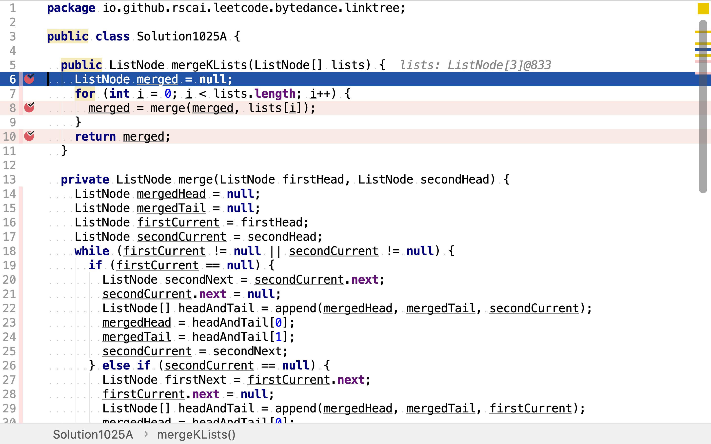
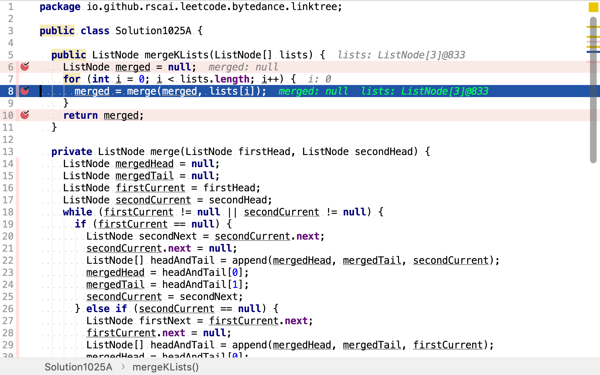
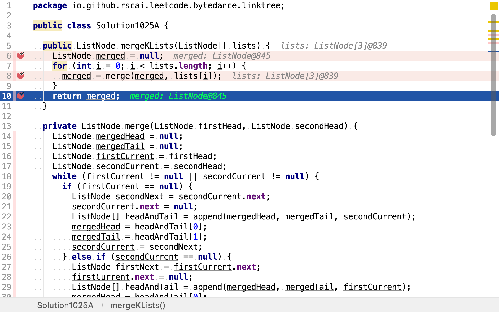

# 合併K個排序鏈表

## 題目

>合併K個排序鏈表，返回合併後的排序鏈表。請分析和描述算法複雜度。
>
>**示例：**
>
>```
>輸入:
>[
>  1->4->5,
>  1->3->4,
>  2->6
>]
>輸出: 1->1->2->3->4->4->5->6
>```

## Fold List 法

>在函數式編程中，fold（也稱為reduce，accumulate，aggregate，compress或inject）指的是一系列高階函數，它們分析遞歸數據結構並通過使用給定的組合操作，重新組合遞歸處理結果的組成部分，建立返回值。 

通常Fold由組合函數、初始值和輪入列表三部份呈現。設組合函數是`f(x,y)`，初始值為`c`，輸入列表為`l`其中元素序列為$$l_0, l_1, ..., l_n$$。Fold先以初始值`c`為`x`，輸入列表第一個元素為`y`，返回值為下一個函數計算的`x`，`l_1`為下一個函數計算的`y`。依此類推。

舉個例子，給定如下鏈表：

```plantuml
digraph d {
    a [shape=record, label="{1|4|5}"]
    b [shape=record, label="{1|3|4}"]
    c [shape=record,label="{2|6}"]
}
```

設初始鏈表為空鏈表，

```plantuml
digraph d {
    m [shape=record, style=filled, fillcolor=green, label=""]
    a [shape=record, label="{1|4|5}"]
    b [shape=record, label="{1|3|4}"]
    c [shape=record,label="{2|6}"]
}
```

先將初始鏈表和第一個鏈表合併，

```plantuml
digraph d {
    m [shape=record, style=filled, fillcolor=green, label="{1|4|5}"]
    b [shape=record, label="{1|3|4}"]
    c [shape=record,label="{2|6}"]
}
```

接着，合併上一步結果鏈表和第二個鏈表，

```plantuml
digraph d {
    m [shape=record, style=filled, fillcolor=green, label="{1|3|4|4|5}"]
    c [shape=record,label="{2|6}"]
}
```

再接着重復上述步驟，合併上中步結果鏈表和第三個鏈表。

```plantuml
digraph d {
    m [shape=record, style=filled, fillcolor=green, label="{1|2|3|4|4|5|6}"]
}
```

### 代碼

[include](../../../src/main/java/io/github/rscai/leetcode/bytedance/linktree/Solution1025A.java)

首先，設置初始值為空鏈表。



然後，逐一合併列表中的元素（鏈表）。上一步的結果作為下一步的輸入之一。



最後一步結果即是最終解。



### 複雜度分析

#### 時間複雜度

其對每一個鏈表都做了一次合併，每次合併都需遍歷一次兩個鏈表中所有的元素。所以，以n表示所有鏈表元素，時間複雜度為$$\mathcal{O}(n)$$。

#### 空間複雜度

共使用了五個變量，`merged`和函數`merge`中的`mergedHead`, `mergedTail`, `firstCurrent`, `secondCurrent`。空間複雜度為$$\mathcal{O}(1)$$。

## 參考

* [Fold (higher-order function)](https://en.wikipedia.org/wiki/Fold_(higher-order_function))
