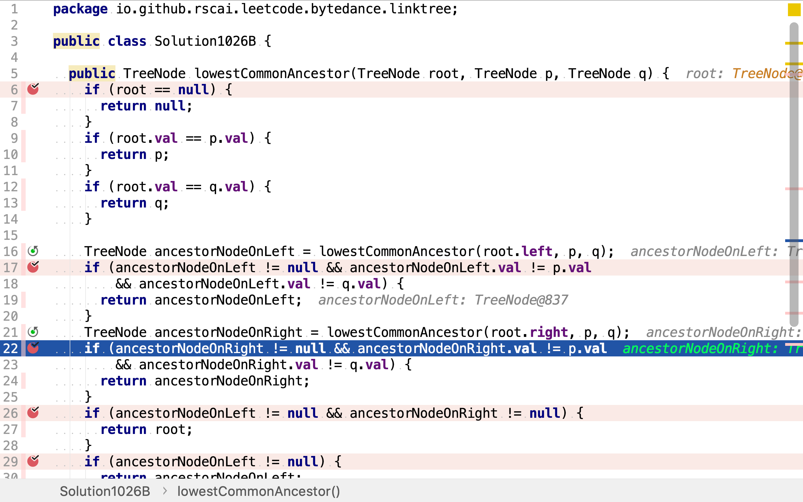
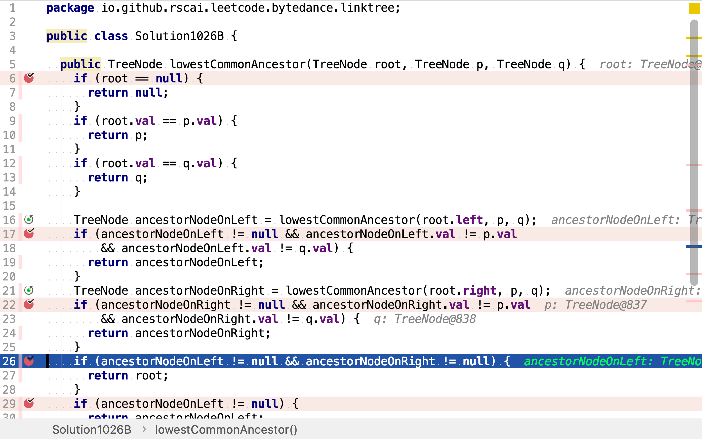

# 二叉樹的最近公共祖先

## 題目

>給定一個二叉樹, 找到該樹中兩個指定節點的最近公共祖先。
>
>百度百科中最近公共祖先的定義為：“對於有根樹T 的兩個結點p、q，最近公共祖先表示為一個結點x，滿足x 是p、q 的祖先且x 的深度盡可能大（一個節點也可以是它自己的祖先）。”
>
>例如，給定如下二叉樹: root = [3,5,1,6,2,0,8,null,null,7,4]
>
>
>
>**示例1：**
>
>```
>輸入: root = [3,5,1,6,2,0,8,null,null,7,4], p = 5, q = 1
>輸出: 3
>解釋: 節點 5 和節點 1 的最近公共祖先是節點 3。
>```
>
>**示例2：**
>
>```
>輸入: root = [3,5,1,6,2,0,8,null,null,7,4], p = 5, q = 4
>輸出: 5
>解釋: 節點 5 和節點 4 的最近公共祖先是節點 5。因為根據定義最近公共祖先節點可以為節點本身。
>```
>
>**說明:**
>
>所有節點的值都是唯一的。
>p、q 為不同節點且均存在於給定的二叉樹中。

## 二叉樹後序遍歷法

給定一棵二叉樹和兩個節點。兩個節點的最近公共祖先只有三種可能：

1. 在左子樹中
2. 在右子樹中
3. 是根節點

後序遍歷二叉樹，自下而上檢測每個節點是否為公共祖先。因為是自下而上，所以第一個遇到的公共祖先就是最近公共祖先。

舉個例子，給定如下二叉樹，求節點`5`和`1`的最近公共祖先。

```plantuml
digraph d {
    root [label=3]
    a [label=5]
    b [label=1]
    root -> a
    root -> b

    aa [label=6]
    ab [label=2]
    a -> aa
    a -> ab

    ba [label=0]
    bb [label=8]
    b -> ba
    b -> bb

    aba [label=7]
    abb [label=4]
    ab -> aba
    ab -> abb
}
```

首先，自上而下探索到葉子節點。再自下而上檢測是否為公共祖先。最底層的`7`和`4`都不是公共祖先。

```plantuml
digraph d {
    root [label=3]
    a [label=5]
    b [label=1]
    root -> a
    root -> b

    aa [label=6]
    ab [label=2]
    a -> aa
    a -> ab

    ba [label=0]
    bb [label=8]
    b -> ba
    b -> bb

    aba [label=7, style=filled, fillcolor=grey]
    abb [label=4, style=filled, fillcolor=grey]
    ab -> aba
    ab -> abb
}
```

向上檢測，`6, 2, 0, 8`都不是公共祖先。

```plantuml
digraph d {
    root [label=3]
    a [label=5]
    b [label=1]
    root -> a
    root -> b

    aa [label=6, style=filled, fillcolor=grey]
    ab [label=2, style=filled, fillcolor=grey]
    a -> aa
    a -> ab

    ba [label=0, style=filled, fillcolor=grey]
    bb [label=8, style=filled, fillcolor=grey]
    b -> ba
    b -> bb

    aba [label=7, style=filled, fillcolor=grey]
    abb [label=4, style=filled, fillcolor=grey]
    ab -> aba
    ab -> abb
}
```

再向上檢測，`5, 1`都不是公共祖先。

```plantuml
digraph d {
    root [label=3]
    a [label=5, style=filled, fillcolor=grey]
    b [label=1, style=filled, fillcolor=grey]
    root -> a
    root -> b

    aa [label=6, style=filled, fillcolor=grey]
    ab [label=2, style=filled, fillcolor=grey]
    a -> aa
    a -> ab

    ba [label=0, style=filled, fillcolor=grey]
    bb [label=8, style=filled, fillcolor=grey]
    b -> ba
    b -> bb

    aba [label=7, style=filled, fillcolor=grey]
    abb [label=4, style=filled, fillcolor=grey]
    ab -> aba
    ab -> abb
}
```

最後，檢測根節點，其是公共祖先。且是第一個發現的公共祖先，所以即是最近的公共祖先。

```plantuml
digraph d {
    root [label=3, style=filled, fillcolor=green]
    a [label=5, style=filled, fillcolor=grey]
    b [label=1, style=filled, fillcolor=grey]
    root -> a
    root -> b

    aa [label=6, style=filled, fillcolor=grey]
    ab [label=2, style=filled, fillcolor=grey]
    a -> aa
    a -> ab

    ba [label=0, style=filled, fillcolor=grey]
    bb [label=8, style=filled, fillcolor=grey]
    b -> ba
    b -> bb

    aba [label=7, style=filled, fillcolor=grey]
    abb [label=4, style=filled, fillcolor=grey]
    ab -> aba
    ab -> abb
}
```

### 代碼

[include](../../../src/main/java/io/github/rscai/leetcode/bytedance/linktree/Solution1026A.java)

首先，從左子樹中尋找最近公共祖先。


然後，從右子樹中尋找最近公共祖先。


最後，檢測根節點是否為公共祖先。


其中，祖先檢測`isAncestorOf`也是以遞歸實現的。先檢測其是否為自身。


再檢測左右子節點是否為其祖先。


### 複雜度分析

#### 時間複雜度

本演算法先自上而下遍歷二叉樹，再自下而上檢測每個節點。最壞情況下，要檢測所有節點。每次檢測是否為祖先都要再次遍歷以其為根節點的子樹。假設整棵二叉樹的節點數為$$n$$，則左右子樹的節點數和為$$\frac{n-1}{2} \times 2 = n - 1$$。

$$
\begin{aligned}
C_{time} &= \sum_{i=1}^{\log{n}}(n-i) \\
&= \frac{(n-1) + (n- \log{n})}{2} \times \log{n} \\
&= \mathcal{O}(n \log{n})
\end{aligned}
$$

#### 空間複雜度

空間複雜度為$$\mathcal{O}(1)$$。

## 重用計算結果

在上一個演算法中，重復遍歷子樹以檢測某節點是否為其它節點的祖先節點。重用這樹子樹檢測結果可以大幅減少計算量。

當自下而上檢測節點時，有四種可能：

1. 其僅是p的祖先
2. 其僅是q的祖先
3. 其是p和q的公共
4. 其即不是p的祖先，也不是q的祖先

我們分別用p, q, 節點自身和null表示上述四種狀態。然後，用這四種狀態去替換整根子樹。

舉個例子，給定如下二叉樹和節點`5, 8`：

```plantuml
digraph d {
    root [label=3]
    a [label=5]
    b [label=1]
    root -> a
    root -> b

    aa [label=6]
    ab [label=2]
    a -> aa
    a -> ab

    ba [label=0]
    bb [label=8]
    b -> ba
    b -> bb

    aba [label=7]
    abb [label=4]
    ab -> aba
    ab -> abb
}
```

自下而上檢測。`7`和`4`即不是`5`的祖先，也不是`8`的祖先。所以替換為null（直接消掉）。

```plantuml
digraph d {
    root [label=3]
    a [label=5]
    b [label=1]
    root -> a
    root -> b

    aa [label=6]
    ab [label=2]
    a -> aa
    a -> ab

    ba [label=0]
    bb [label=8]
    b -> ba
    b -> bb
}
```

然後，檢測`6, 2, 0, 8`。`8`是`8`的祖先。

```plantuml
digraph d {
    root [label=3]
    a [label=5]
    b [label=1]
    root -> a
    root -> b

    bb [label=8, style=filled, fillcolor=green]
    b -> bb
}
```

再然後，檢測`5, 1`。`5`是`5`的祖先，保留為原值；`1`是`8`的祖先，將整棵子樹替換為`8`。

```plantuml
digraph d {
    root [label=3]
    a [label=5, style=filled, fillcolor=green]
    b [label=8, style=filled, fillcolor=green]
    root -> a
    root -> b
}
```

最後，檢測`3`。其是`5, 8`的公共祖先，將整棵子樹替換為公共祖先`3`。

```plantuml
digraph d {
    root [label=3, style=filled, fillcolor=green]
}
```

### 代碼

[include](../../../src/main/java/io/github/rscai/leetcode/bytedance/linktree/Solution1026B.java)

先檢測是否是p或q。是則停止向下遍歷，改為向上歸併。


再在左子樹中搜尋，若找到公共祖先則直接返回。


再在右子樹中搜尋，若找到公共祖先則直接返回。



再然後，檢測當前節點是否為公共祖先。



### 複雜度分析

#### 時間複雜度

本演算法只遍歷了一次二叉樹，時間複雜度為$$\mathcal{O}(n)$$。

#### 空間複雜度

空間複雜度為$$\mathcal{O}(1)$$。
