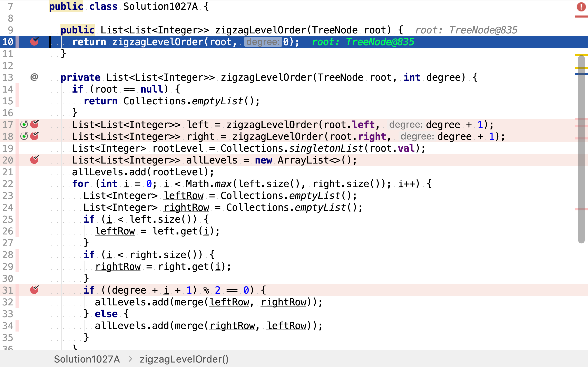
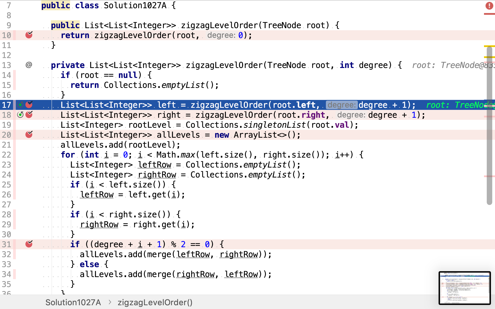
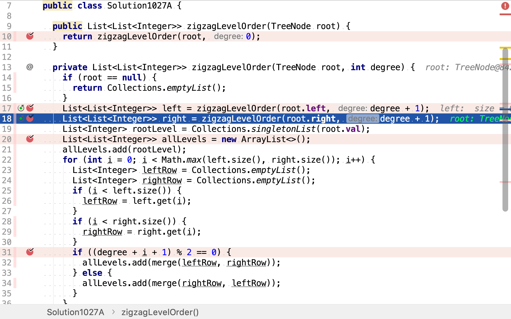
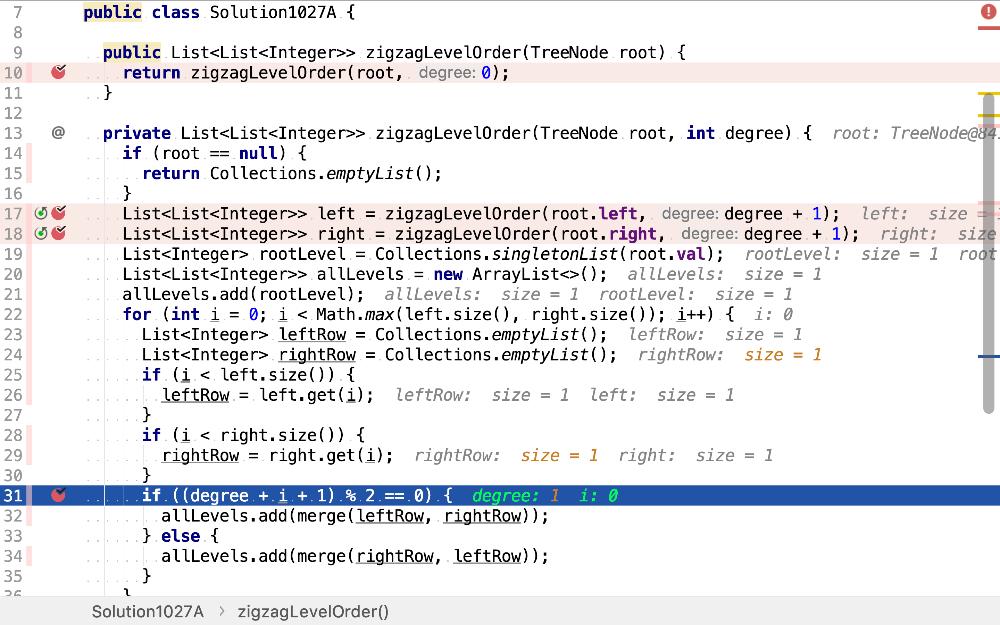

# 二叉樹的鋸齒形層次遍歷

## 題目

>給定一個二叉樹，返回其節點值的鋸齒形層次遍歷。 （即先從左往右，再從右往左進行下一層遍歷，以此類推，層與層之間交替進行）。
>
>例如：
>給定二叉樹 [3,9,20,null,null,15,7],
>
>```
>    3
>   / \
>  9  20
>    /  \
>   15   7
>```
>
>返回鋸齒形層次遍歷如下：
>
>```
>[
>  [3],
>  [20,9],
>  [15,7]
>]
>```

## 依深度定位方向

二叉樹中每一行節點遍歷方向可由其在二叉樹中的深度直接確定。根節點的深度計為0，每往下一層深度加一。當深度為偶數時（0在此當作偶數）節點遍歷順序為從左往右，當深度為奇數時節點遍歷順序為從右往左。

舉個例子，給定如下二叉樹：

```plantuml
digraph d {
    root [label=3]
    a [label=9]
    b [label=20]
    root -> a
    root -> b

    ba [label=15]
    bb [label=7]
    b -> ba
    b -> bb
}
```

先自上而下遍歷到底部，再從下而上歸併。最底層的深度為`2`，這一層的節點需從左往右遍歷。

```plantuml
digraph d {
    d [shape=none, label="d = 2"]
    root [label=3]
    a [label=9]
    b [label=20]
    root -> a
    root -> b

    ba [label=15, style=filled, fillcolor=grey]
    bb [label=7, style=filled, fillcolor=grey]
    b -> ba
    b -> bb

    l [shape=record, style=filled, fillcolor=green, label="{{15|7}}"]
}
```

往上一層深度為`1`，這一層的節點需從右往左遍歷。

```plantuml
digraph d {
    d [shape=none, label="d = 2"]
    root [label=3]
    a [label=9, style=filled, fillcolor=grey]
    b [label=20, style=filled, fillcolor=grey]
    root -> a
    root -> b

    ba [label=15]
    bb [label=7]
    b -> ba
    b -> bb

    l [shape=record, style=filled, fillcolor=green, label="{{20|9}|{15|7}}"]
}
```

再往上一層深度為`0`，這一層的節點需從左往右遍歷。

```plantuml
digraph d {
    d [shape=none, label="d = 2"]
    root [label=3, style=filled, fillcolor=grey]
    a [label=9]
    b [label=20]
    root -> a
    root -> b

    ba [label=15]
    bb [label=7]
    b -> ba
    b -> bb

    l [shape=record, style=filled, fillcolor=green, label="{{3}|{20|9}|{15|7}}"]
}
```

### 代碼

[include](../../../src/main/java/io/github/rscai/leetcode/bytedance/linktree/Solution1027A.java)

將深度作為參數在遞歸函數之間傳遞。在歸併結果的時候，就能通過深度確定合併子問題結果的方向（從左往右/從右往左）。



先遞迴遍歷左子樹，



再遞迴遍歷右子樹。



歸併結果時，根節點層只有一個節點，無論以什麼方向遍歷，結果都一樣。


左右子樹的結果則需按深度確定方向。根節點的深度加其在子樹中的深度再加一（子樹中的相對深度也是從0開始計的）。深度為偶數，則從左往右歸併結果；若深度為奇數，則從右往左歸併結果。



### 複雜度分析

#### 時間複雜度

本演算法遍歷了二叉樹一次，時間複雜度為$$\mathcal{O}(n)$$。

#### 空間複雜度

解中包含了二叉樹中所有的節點，所以空間複雜度為$$\mathcal{O}(n)$$。
