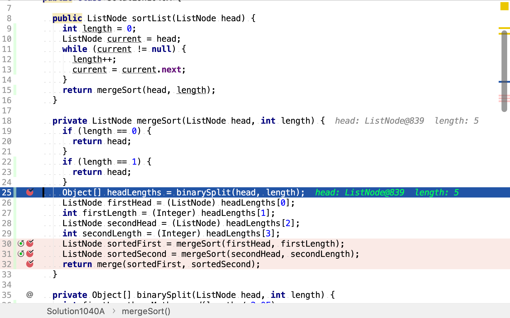
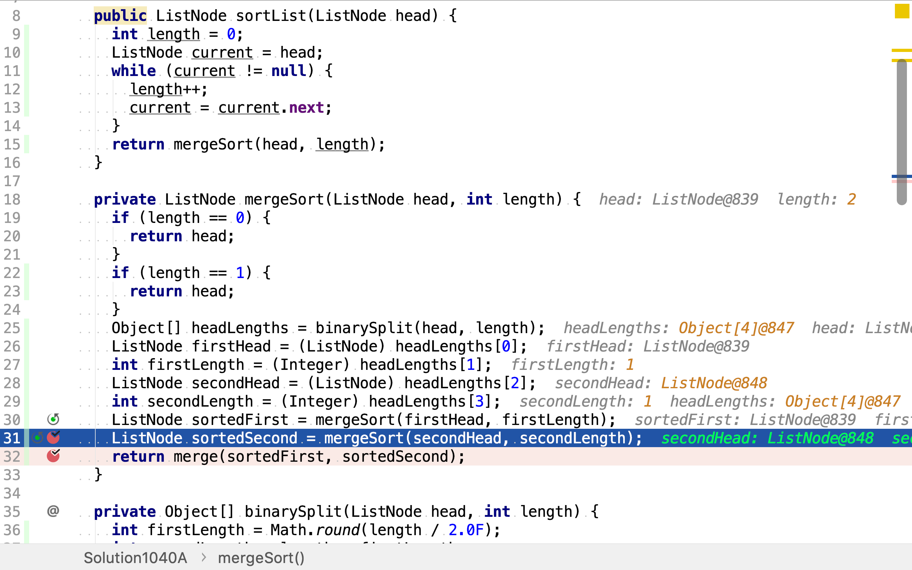
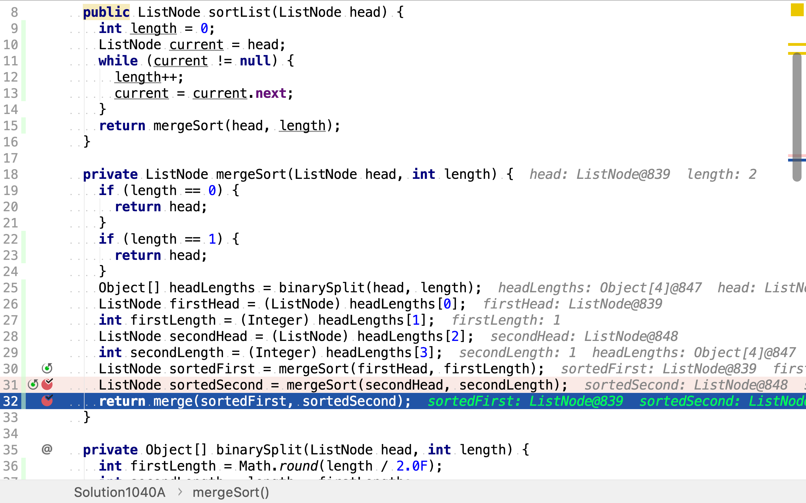
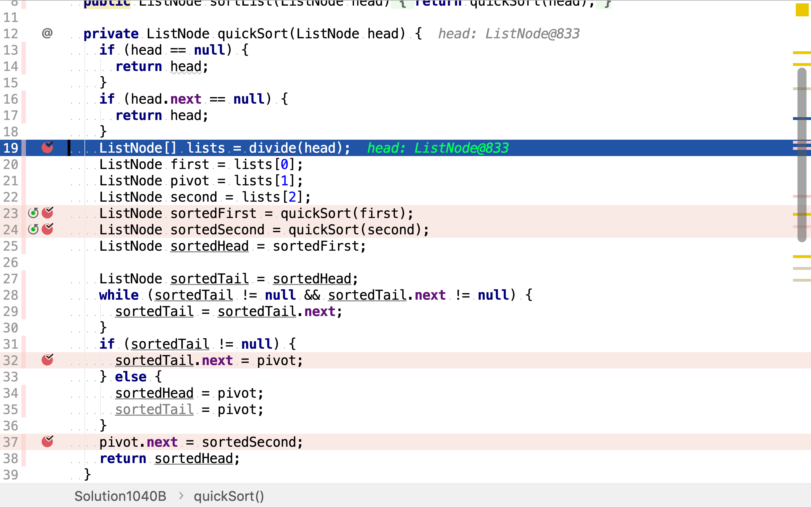
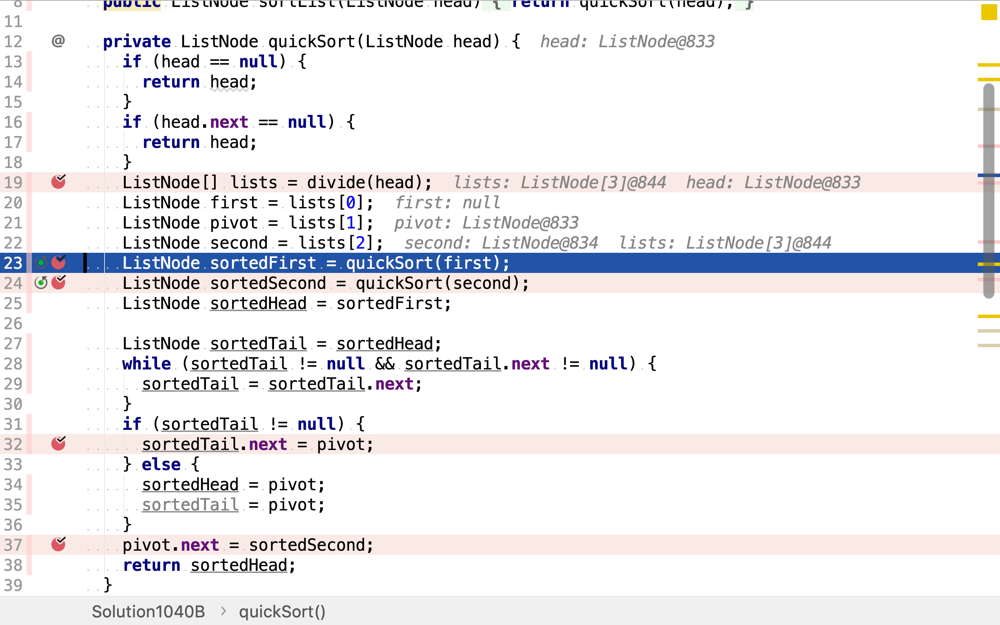
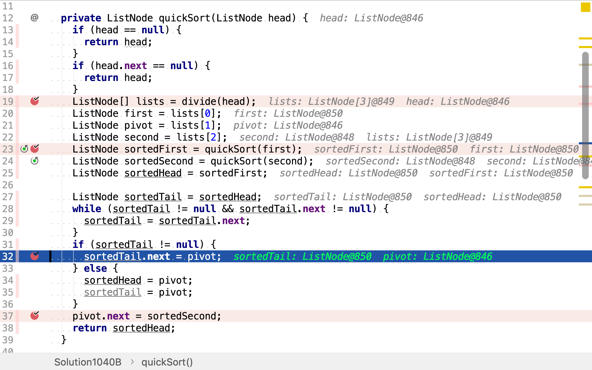
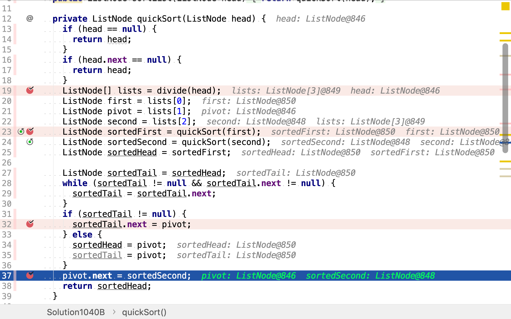

# 排序鏈表

## 題目

>在 O(n log n) 時間複雜度和常數級空間複雜度下，對鏈表進行排序。
>
>**示例：**
>
>```
>輸入: 4->2->1->3
>輸出: 1->2->3->4
>```
>
>**示例：**
>
>```
>輸入: -1->5->3->4->0
>輸出: -1->0->3->4->5
>```

## 合併排序

>合併排序（英語：Merge sort，或mergesort），是建立在合併操作上的一種有效的排序演算法，效率為 $${\displaystyle O(n\log n)}$$（大O符號）。1945年由約翰·馮·紐曼首次提出。該演算法是採用分治法（Divide and Conquer）的一個非常典型的應用，且各層分治遞迴可以同時進行。
>
>### 概述
>
>採用分治法:
>
>* 分割：遞迴地把目前序列平均分割成兩半。
>* 整合：在保持元素順序的同時將上一步得到的子序列整合到一起（合併）。
>
>### 合併操作
>
>合併操作（merge），也叫合併演算法，指的是將兩個已經排序的序列合併成一個序列的操作。合併排序演算法依賴合併操作。
>
>#### 遞迴法（Top-down）
>
>1. 申請空間，使其大小為兩個已經排序序列之和，該空間用來存放合併後的序列
>2. 設定兩個指標，最初位置分別為兩個已經排序序列的起始位置
>3. 比較兩個指標所指向的元素，選擇相對小的元素放入到合併空間，並移動指標到下一位置
>4. 重複步驟3直到某一指標到達序列尾
>5. 將另一序列剩下的所有元素直接複製到合併序列尾
>
>#### 疊代法（Bottom-up）
>
>原理如下（假設序列共有$$n$$個元素）：
>
>1. 將序列每相鄰兩個數字進行合併操作，形成 $${\displaystyle ceil(n/2)}$$個序列，排序後每個序列包含兩/一個元素
>2. 若此時序列數不是1個則將上述序列再次合併，形成$${\displaystyle ceil(n/4)}$$個序列，每個序列包含四/三個元素
>3. 重複步驟2，直到所有元素排序完畢，即序列數為1

舉個例子，給定鏈表`4->2->1->3`。首先，遞迴地將鏈表分割為兩半，直到鏈表長度為1。

```plantuml
digraph d {
    root [shape=record, label="4|2|1|3"]
    a [shape=record, label="4|2"]
    b [shape=record, label="1|3"]
    root -> a
    root -> b

    aa [shape=record, label="4"]
    ab [shape=record, label="2"]
    a -> aa
    a -> ab

    ba [shape=record, label="1"]
    bb [shape=record, label="3"]
    b -> ba
    b -> bb
}
```

再使用疊代法自下而上合併。每兩個鏈表向上合併成一個鏈表。

```plantuml
digraph d {
    root [shape=record, label="1|2|3|4"]
    a [shape=record, label="2|4"]
    b [shape=record, label="1|3"]
    root -> a [dir=back]
    root -> b [dir=back]

    aa [shape=record, label="4"]
    ab [shape=record, label="2"]
    a -> aa [dir=back]
    a -> ab [dir=back]

    ba [shape=record, label="1"]
    bb [shape=record, label="3"]
    b -> ba [dir=back]
    b -> bb [dir=back]
}
```

合併步驟：

1. 先從候選鏈表頭元素中取出最小的一個放入新鏈表，被選中的鏈表頭元素引用向後移一位。
2. 重復步驟1直至兩個鏈表都到達末尾。

以合併`2->4`和`1->3`為例。

```plantuml
graph g {
    a [shape=record, label="2|4"]
    b [shape=record, label="1|3"]
    c [shape=record, label=""]
}
```

比較兩個鏈表的頭元素，`1`小於`2`。將`1`加入新鏈表，並將頭引用後移一位。

```plantuml
graph g {
    a [shape=record, label="2|4"]
    b [shape=record, label="3"]
    c [shape=record, style=filled, fillcolor=green, label="{1}"]
}
```

比較兩個鏈表的頭元素，`2`小於`3。將`2`加入新鏈表，並將頭引用後移一位。

```plantuml
graph g {
    a [shape=record, label="4"]
    b [shape=record, label="3"]
    c [shape=record, style=filled, fillcolor=green, label="{1|2}"]
}
```

比較兩個鏈表的頭元素，`3`小於`4`。將`3`加入新鏈表，並將頭引用後移一位。

```plantuml
graph g {
    a [shape=record, label="4"]
    b [shape=record, label=""]
    c [shape=record, style=filled, fillcolor=green, label="{1|2|3}"]
}
```

比較兩個鏈表的頭元素，其中一個鏈表已空。將另一個鏈表的頭元素`4`加入新鏈表，並將頭引用後移一位。

```plantuml
graph g {
    a [shape=record, label=""]
    b [shape=record, label=""]
    c [shape=record, style=filled, fillcolor=green, label="{1|2|3|4}"]
}
```

兩個鏈表都已空，合併完成。

### 代碼

[include](../../../src/main/java/io/github/rscai/leetcode/bytedance/linktree/Solution1040A.java)

首先，將鏈表分割為長度相等（或長度相差一）的兩半。



然後，遞迴排序兩半鏈表。




最後，將排好序的兩半鏈表合併。



### 複雜度分析

#### 時間複雜度

合併排序的時間複雜度為：

$$
C_{time} = \mathcal{O}(n \log{n})
$$

#### 空間複雜度

所有的分割和合併操作都只是改變`ListNode`的`next`引用，並沒有佔用新的空間。所以空間複雜度為：

$$
C_{sapce} = \mathcal{O}(1)
$$

## 快速排序

>快速排序（英語：Quicksort），又稱劃分交換排序（partition-exchange sort），簡稱快排，一種排序演算法，最早由東尼·霍爾提出。在平均狀況下，排序$$n$$個項目要$${\displaystyle \ O(n\log n)}$$（大O符號）次比較。在最壞狀況下則需要$${\displaystyle O(n^{2})}$$次比較，但這種狀況並不常見。事實上，快速排序$${\displaystyle \Theta (n\log n)}$$通常明顯比其他演算法更快，因為它的內部迴圈（inner loop）可以在大部分的架構上很有效率地達成。
>
>### 演算法
>
>快速排序使用分治法（Divide and conquer）策略來把一個序列（list）分為較小和較大的2個子序列，然後遞迴地排序兩個子序列。
>
>步驟為：
>
>1. 挑選基準值：從數列中挑出一個元素，稱為「基準」（pivot），
>2. 分割：重新排序數列，所有比基準值小的元素擺放在基準前面，所有比基準值大的元素擺在基準後面（與基準值相等的數可以到任何一邊）。在這個分割結束之後，對基準值的排序就已經完成，
>3. 遞迴排序子序列：遞迴地將小於基準值元素的子序列和大於基準值元素的子序列排序。
>
>遞迴到最底部的判斷條件是數列的大小是零或一，此時該數列顯然已經有序。
>
>選取基準值有數種具體方法，此選取方法對排序的時間效能有決定性影響。

舉個例子，給定鏈表`3->2->1->5->4`。

1. 首先，選取頭元素`3`為pivot，將所有其它元素分為比pivot小和比pivot大（或相等）的兩個鏈表。
2. 然後，再遞迴步驟1分割兩個鏈表，直至鏈表長度為一或空。
3. 最後，向上合併。

```plantuml
digraph d {
    root [shape=record, label="3|2|1|5|4"]
    a [shape=record, label="2|1"]
    p [shape=record, label="3", style=filled, fillcolor=grey]
    b [shape=record, label="5|4"]
    root -> a
    root -> p
    root -> b

    aa [shape=record, label="1"]
    ap [shape=record, label="2", style=filled, fillcolor=grey]
    ab [shape=record, label=""]
    a -> aa
    a -> ap
    a -> ab

    ba [shape=record, label="4"]
    bp [shape=record, label="5", style=filled fillcolor=grey]
    bb [shape=record, label=""]
    b -> ba
    b -> bp
    b -> bb
}
```

向上合併時，pivot左右鏈表已經是有序的了，且左邊鏈表元素全小於pivot，右邊鏈表元素都大於（或等於）pivot。所以合併時只需按左邊鏈表、pivot、右邊鏈表的順序拼接即可。

```plantuml
digraph d {
    root [shape=record, label="1|2|3|4|5"]
    a [shape=record, label="1|2"]
    p [shape=record, label="3", style=filled, fillcolor=grey]
    b [shape=record, label="4|5"]
    root -> a [dir=back]
    root -> p [dir=back]
    root -> b [dir=back]

    aa [shape=record, label="1"]
    ap [shape=record, label="2", style=filled, fillcolor=grey]
    ab [shape=record, label=""]
    a -> aa [dir=back]
    a -> ap [dir=back]
    a -> ab [dir=back]

    ba [shape=record, label="4"]
    bp [shape=record, label="5", style=filled fillcolor=grey]
    bb [shape=record, label=""]
    b -> ba [dir=back]
    b -> bp [dir=back]
    b -> bb [dir=back]
}
```

### 代碼

[include](../../../src/main/java/io/github/rscai/leetcode/bytedance/linktree/Solution1040B.java)

首先，將鏈表分割為pivot、小於pivot和大於（或等於）pivot三部份。



然後，遞迴排序小於pivot和大於pivot的鏈表。



最後，將排序後的小於pivot鏈表、pivot和排序後的大於pivot鏈表按序拼接。





### 複雜度分析

#### 時間複雜度

>在最好的情況，每次我們執行一次分割，我們會把一個數列分為兩個幾近相等的片段。這個意思就是每次遞迴呼叫處理一半大小的數列。因此，在到達大小為一的數列前，我們只要作$$\log n$$次巢狀的呼叫。這個意思就是呼叫樹的深度是$${\displaystyle O(\log n)}$$。但是在同一階層的兩個程式呼叫中，不會處理到原來數列的相同部份；因此，程式呼叫的每一階層總共全部僅需要$${\displaystyle O(n)}$$的時間（每個呼叫有某些共同的額外耗費，但是因為在每一階層僅僅只有$${\displaystyle O(n)}$$個呼叫，這些被歸納在$${\displaystyle O(n)}$$係數中）。結果是這個演算法僅需使用$${\displaystyle O(n\log n)}$$時間。

#### 空間複雜度

鏈表的分割與合併都只是改變`ListNode.next`的引用，並沒有佔用新的空間。所以空間複雜度為$$\mathcal{O}(1)$$。

## 參考

* [Sorting algorithm](https://en.wikipedia.org/wiki/Sorting_algorithm)
* [Merge sort](https://en.wikipedia.org/wiki/Merge_sort)
* [Quicksort](https://en.wikipedia.org/wiki/Quicksort)