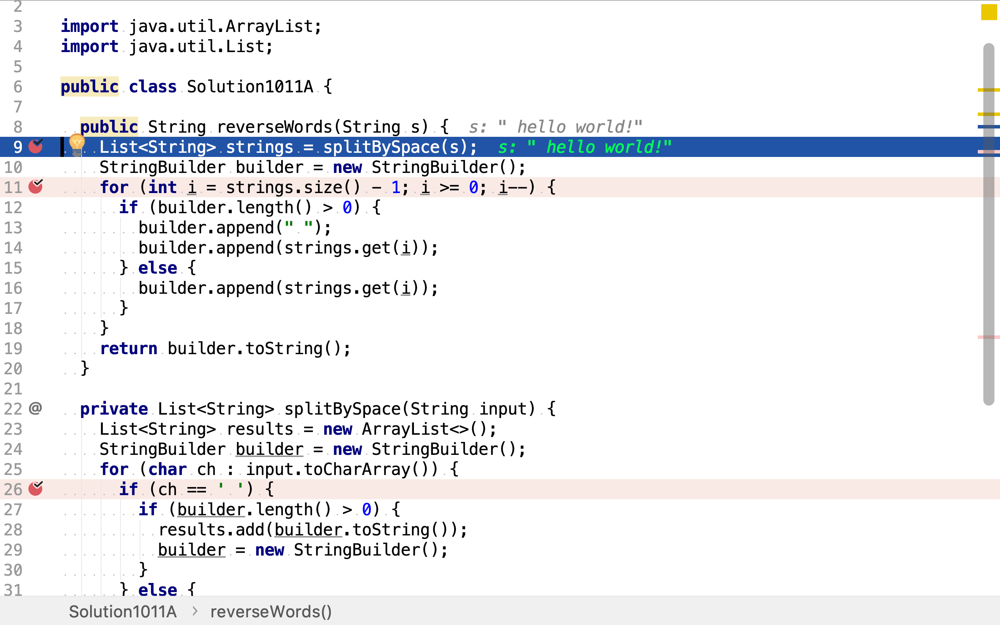
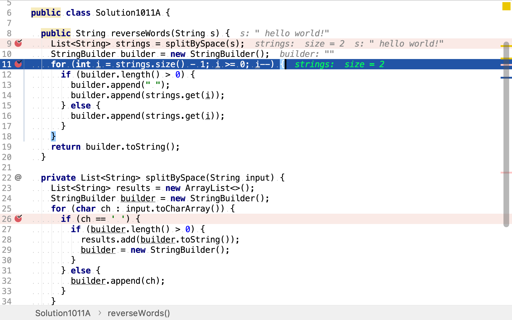
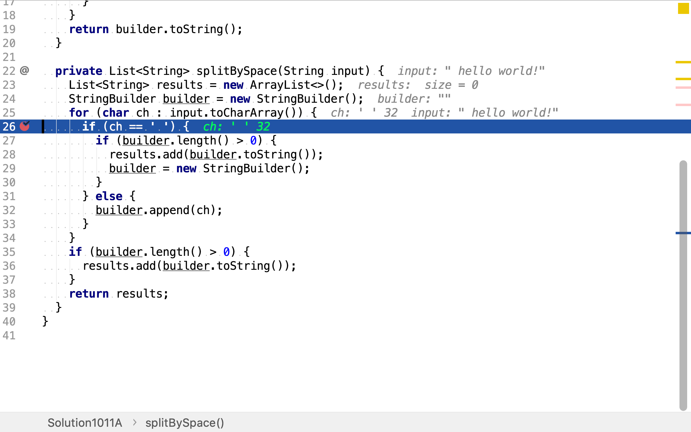

# 翻轉字符串裡的單詞

## 題目

>給定一個字符串，逐個翻轉字符串中的每個單詞。
>
>**示例 1：**
>
>```
>输入: "the sky is blue"
>输出: "blue is sky the"
>```
>
>**示例 2:**
>
>```
>輸入: " hello world! "
>輸出: "world! hello"
>解釋: 輸入字符串可以在前面或者後麵包含多餘的空格，但是反轉後的字符不能包括。
>```
>
>**示例 3：**
>
>```
>輸入: "a good example"
>輸出: "example good a"
>解釋: 如果兩個單詞間有多餘的空格，將反轉後單詞間的空格減少到只含一個。
>```
>
>说明：
>
>* 无空格字符构成一个单词。
>* 输入字符串可以在前面或者后面包含多余的空格，但是反转后的字符不能包括。
>* 如果两个单词间有多余的空格，将反转后单词间的空格减少到只含一个。
>
>进阶：
>
>请选用 C 语言的用户尝试使用 O(1) 额外空间复杂度的原地解法。

## 解柝單詞法

先將字符串中的單詞一一解出，再將單詞反序，最後將反序的單詞拼接成字符串。

### 代碼實現

[include](../../../src/main/java/io/github/rscai/leetcode/bytedance/string/Solution1011A.java)

先將字符串拆分為單詞序列，



再將單詞序列反序，並拼接成新的字符串。



「單詞拆分」使用「確定有限狀態機」實現。



本例中，當遇到字符「空格」時，將暫存在`builder`中的字符較出為單詞；當遇到非空格字符時，將其暫存至`builder`中。



### 複雜度分析

#### 時間複雜度

拆解單詞需遍歷一遍輸入字符串，反序構建字符串時遍歷了一遍所有單詞。所以時間複雜度為$$\mathcal{O}(n)$$。

#### 空間複雜度

使用了變量`strings, builder`，其分別最多佔用n個空間。所以空間複雜度為$$\mathcal{O}(n)$$。
