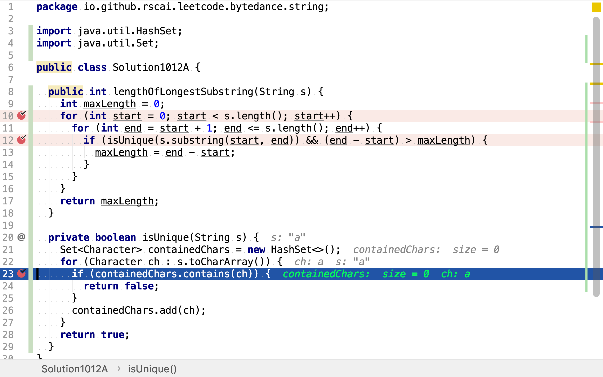
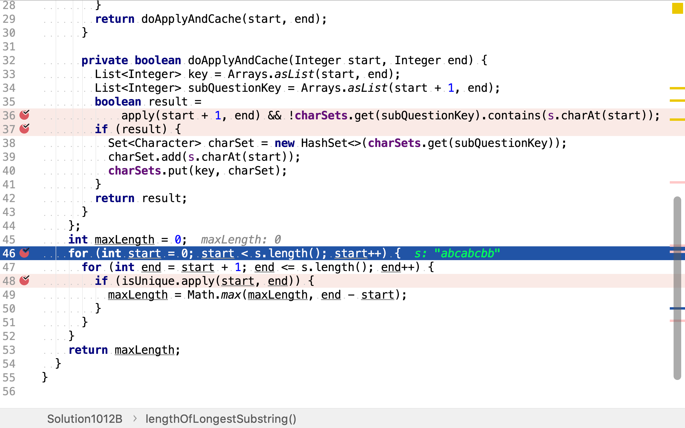
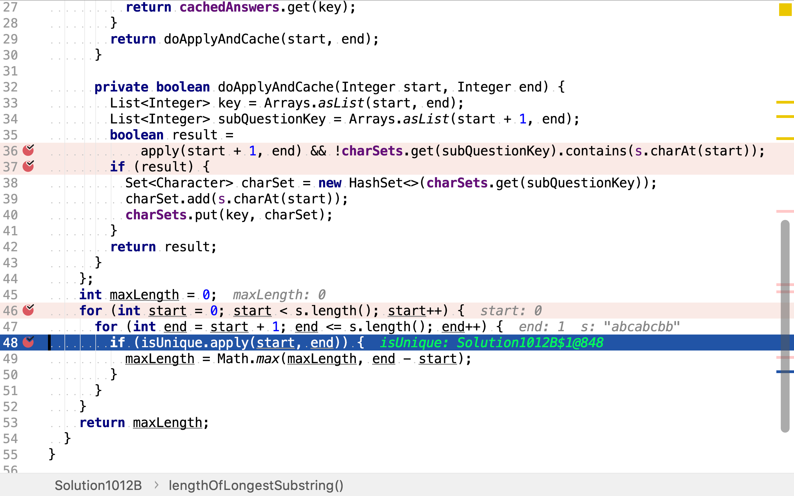
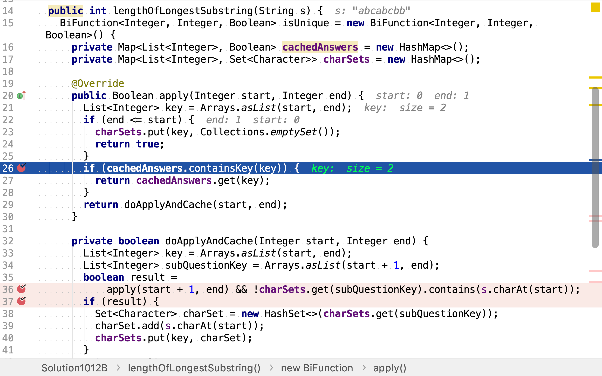
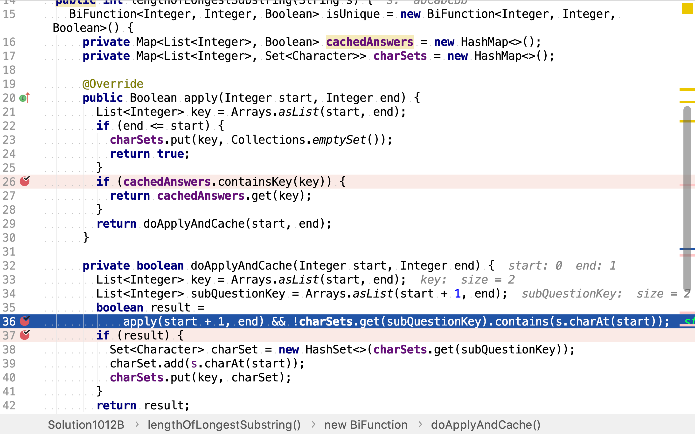
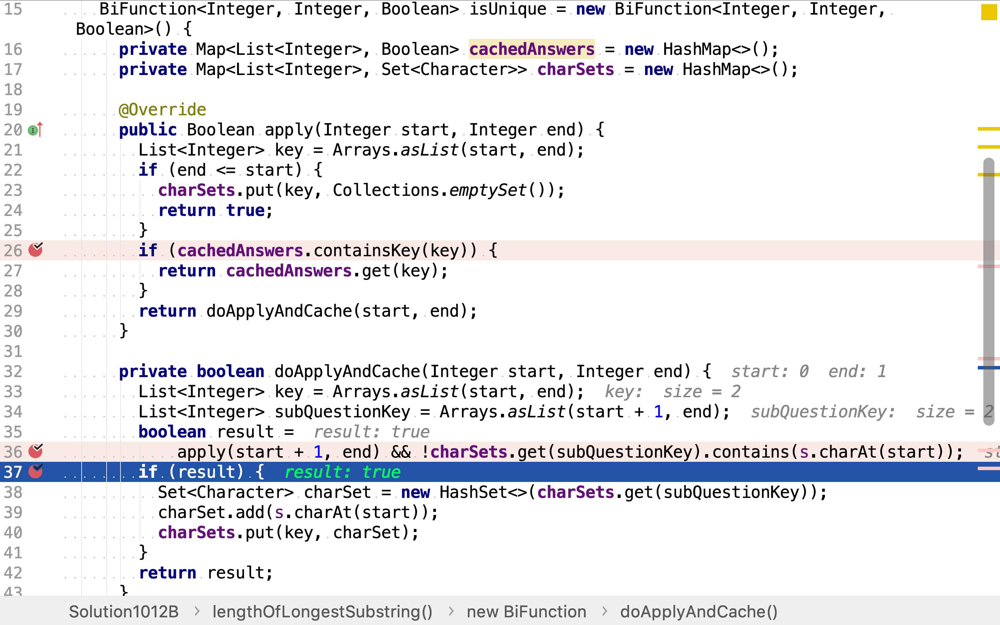
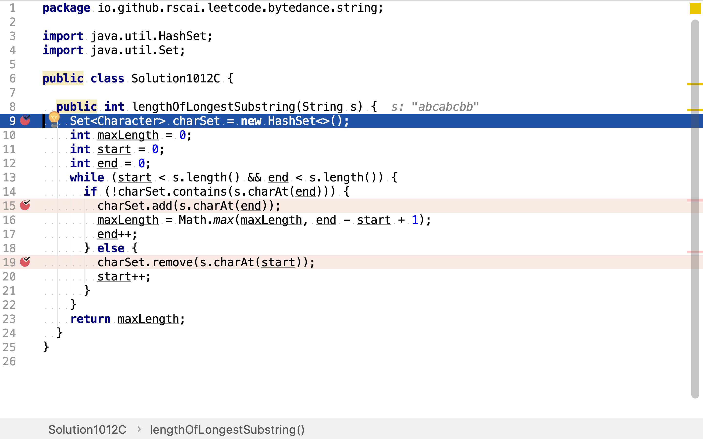
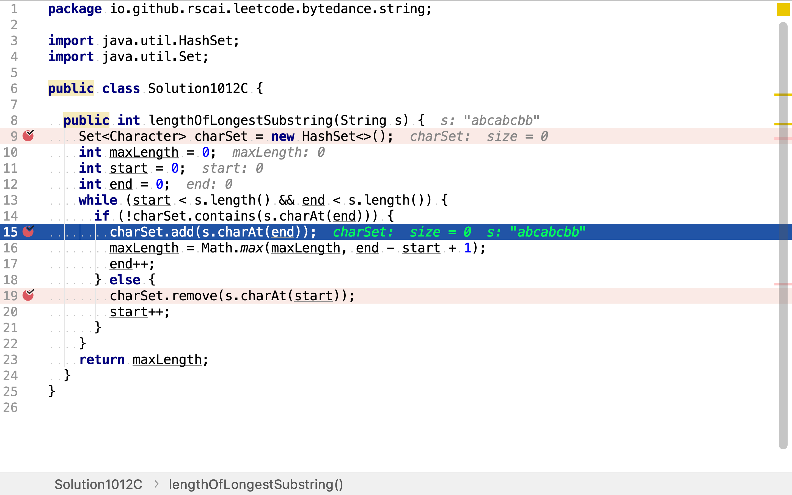
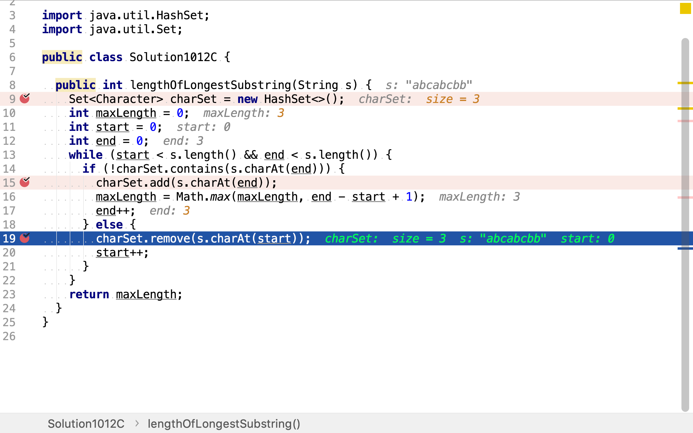

# 無重復字符的最長子串

## 題目

>給定一個字符串，請你找出其中不含有重複字符的 最長子串 的長度。
>
>**示例 1:**
>
>```
>輸入: "abcabcbb"
>輸出: 3
>解釋: 因為無重複字符的最長子串是 "abc"，所以其長度為 3。
>```
>
>**示例 2：**
>
>```
>輸入: "bbbbb"
>輸出: 1
>解釋: 因為無重複字符的最長子串是 "b"，所以其長度為 1。
>```
>
>**示例 3：**
>
>```
>輸入: "pwwkew"
>輸出: 3
>解釋: 因為無重複字符的最長子串是 "wke"，所以其長度為 3。
     請注意，你的答案必須是 子串 的長度，"pwke" 是一個子序列，不是子串。
>```

## 枚舉法

枚舉所有子串，再逐一檢測其是否包含重複元素。

### 代碼實現

[include](../../../src/main/java/io/github/rscai/leetcode/bytedance/string/Solution1012A.java)

使用兩重循環枚舉所有子串。


然後逐一檢測子串，判斷其是否不包含重復字符且長度大於已知最大不重復子串。


在`HashSet`的幫助下，可以在常數複雜度內完成不包含重復字符檢測。



### 複雜度分析

#### 時間複雜度分析

本演算法要遍歷所有子串的所有字符。將子串長度記為起止點的函數$$len(s,e) = e-s$$，所有子串長度和為$$\sum_{s=0}^{n-1} \sum_{e=s+1}^{n}(e-s)$$。時間複雜度為

$$
\begin{aligned}
C_{time} &= \mathcal{O}(\sum_{s=0}^{n-1} \sum_{e=s+1}^{n}(e-s)) \\
&=\mathcal{O}(\sum_{s=0}^{n-1} \frac{(1+n-s)(n-s)}{2}) \\
&=\mathcal{O}(n^3)
\end{aligned}
$$

#### 空間複雜度分析

在檢測子串是否包含重復字符時使用了`HashSet`去存儲子串中所有字符，其最大佔用空間等於最中子串長度$$n$$。所以空間複雜度為$$\mathcal{O}(n)$$。

## 動態規劃法



將所有子串以樹的形式展現，從根節點到葉子節點的路徑為子串，所有的路徑組成了所有子串集合。

```plantuml
digraph d {
    root
    a [label=<char<SUB>0</SUB>>]
    b [label=<char<SUB>1</SUB>>]
    c [label=<char<SUB>...</SUB>>]
    d [label=<char<SUB>n-1</SUB>>]
    root -> a
    root -> b
    root -> c
    root -> d

    at [shape=triangle, label=NIL, style=filled, fillcolor=grey]
    aa [label=<char<SUB>1</SUB>>]
    a -> at
    a -> aa
    aat [shape=triangle, label=NIL, style=filled, fillcolor=grey]
    aaa [label=<char<SUB>...</SUB>>]
    aa -> aat
    aa -> aaa
    aaat [shape=triangle, label=NIL, style=filled, fillcolor=grey]
    aaaa [label=<char<SUB>n-1</SUB>>]
    aaa -> aaat
    aaa -> aaaa

    bt [shape=triangle, label=NIL, style=filled, fillcolor=grey]
    ba [label=<char<SUB>...</SUB>>]
    b -> bt
    b -> ba
    bat [shape=triangle, label=NIL, style=filled, fillcolor=grey]
    baa [label=<char<SUB>n-1</SUB>>]
    ba -> bat
    ba -> baa

    ct [shape=triangle, lable=NIL, style=filled, fillcolor=grey]
    ca [label=<char<SUB>n-1</SUB>>]
    c -> ct
    c -> ca
}
```

可以直觀地發現有很多重疊的子樹，即有很多子串是重疊的。這些重疊的子樹就是可以優化的「重疊子問題」。

無重復字符子串的判定可以以遞歸的形式描述為：

$$
isUnique(s,e) = char_s \notin \{char_{s+1}, ..., char_e\} \land isUnique(s+1,e)
$$

若以s+1為起始、以e為截止的子串無重復子符且第s個字符未在s+1至e之間出現，則以s為起始、以e為截止的子串不包含重復字符。

### 代碼實現

[include](../../../src/main/java/io/github/rscai/leetcode/bytedance/string/Solution1012B.java)

首先，與暴力法相同，枚舉所有子串。



然後，逐一檢測是否包含重復字符。若無且子串長度大於已知最大無重復字符子串長度，則更新之。



使用慝名函數對象實現帶緩存值功能的`isUnique`函數。該函數緩存了兩類值：是否包含重復子串和子串字符集合。該函數首先檢查是否已緩存值，是則返回緩存的值，無需重復計算。



若無緩存值則計算之。根據公式$$isUnique(s,e) = char_s \notin \{char_{s+1}, ..., char_e\} \land isUnique(s+1,e)$$，先計算子串(start+1, end)是否包含重復字符，再檢測在start位置的字符是否已在子串(start+1,end)串出現過。若兩則皆為否，則該子串不包含重復字符。



若某一子串不包含重復字符，則應緩存其字符集合，以便後續使用。



### 複雜度分析

#### 時間複雜度

本演算法依舊用兩層循現致玫舉了很有子串，並針對所有子串都調用了一遍`isUnique`。但`isUnique`緩存了結果，所以實際上時間複雜度為$$\mathcal{O}(n^2)$$。

#### 空間複雜度

`cachedAnswers`最多保存n個值，`charSets`最多保存所有子串，最多$$\sum_{i=1}^{n} n \times (n+1-i)$$。空間複雜度為：

$$
\begin{aligned}
C_{space} &= \mathcal{O}(n + \sum_{i=1}^{n} n \times (n+1-i)) \\
&=\mathcal{O}(n^2)
\end{aligned}
$$

## 滑動窗口法

假設子串a由子串b和c組成，若b包含重復字符，則子串a也必包含重復字符。

將字符串所有子串以樹的形式展現，以上論斷可以描述為：

若很根到某內部節點之間的路徑包含重復字符，則從根節點到以該內部節點為根的任意一個節點之間的路徑都包含重復字符。

```plantuml
digraph d {
    root
    a [label=<char<SUB>0</SUB>>]
    b [label=<char<SUB>1</SUB>>]
    c [label=<char<SUB>...</SUB>>]
    d [label=<char<SUB>n-1</SUB>>]
    root -> a
    root -> b
    root -> c
    root -> d

    at [shape=triangle, label=NIL, style=filled, fillcolor=grey]
    aa [label=<char<SUB>1</SUB>>]
    a -> at
    a -> aa
    aat [shape=triangle, label=NIL, style=filled, fillcolor=grey]
    aaa [label=<char<SUB>...</SUB>>]
    aa -> aat
    aa -> aaa
    aaat [shape=triangle, label=NIL, style=filled, fillcolor=grey]
    aaaa [label=<char<SUB>n-1</SUB>>]
    aaa -> aaat
    aaa -> aaaa

    bt [shape=triangle, label=NIL, style=filled, fillcolor=grey]
    ba [label=<char<SUB>...</SUB>>]
    b -> bt
    b -> ba
    bat [shape=triangle, label=NIL, style=filled, fillcolor=grey]
    baa [label=<char<SUB>n-1</SUB>>]
    ba -> bat
    ba -> baa

    ct [shape=triangle, lable=NIL, style=filled, fillcolor=grey]
    ca [label=<char<SUB>n-1</SUB>>]
    c -> ct
    c -> ca
}
```

由此，我們可以快速排除掉不可能的子串。如下列代碼所示，當發現重復字符，立即放棄對後續以相同字符為起始的子串的探索。

```java
    int maxLength = 0;
    for (int start = 0; start < s.length(); start++) {
      for (int end = start + 1; end <= s.length(); end++) {
        if (isUnique.apply(start, end)) {
          maxLength = Math.max(maxLength, end - start);
        }else{
          continue;
        }
      }
    }
    return maxLength;
```

算法總結為：

* 已包含字符集合初始為空，滑動窗口初始為`(0,0)`
* 若窗口右端字符不在已包含字符集合中，則將窗口向右擴展一位
* 若窗口右端子符在已包含字符集合中，則將窗口左端向右收縮一位

上述「動態規劃法」的空間複雜度也可以進一步優化。

### 代碼實現

[include](../../../src/main/java/io/github/rscai/leetcode/bytedance/string/Solution1012C.java)

首先，初始化已包含字符集合為空，這𥚃使用`HashSet`實現集合以達到常數複雜度檢測集合是否包含字符。初始化滑動窗口為0到0，即僅包含第一個字符。



當窗口右端字符不在已包含字符集合中，則將其加入已包含字符集合，並將窗口右端向右擴展一位。同時檢測當前子串是否長於最大無重復字符子串，是則更新最大無重復字符子串長度為當前子串長度。



當窗口右端字符在已包含字符集合中，則將窗口左端字符移出已包含字符集合，並將窗口左端向右收縮一位。



### 複雜度分析

#### 時間複雜度

唯一的`while`循環中有兩個索引`start`和`end`，最壞情況下，兩個索引分別移動了$$n$$次。每次循環中價執行一次`contains`和`add`或`remove`。這𥚃集合使用`HashSet`實現，`HashSet`的`contains, add, remove`都是常數複雜度運算。所以，總體時間複雜度為：

$$
\begin{aligned}
C_{time} &= \mathcal{O}(2n) \\
&=\mathcal{O}(n)
\end{aligned}
$$

#### 空間複雜度

本演算法總共使用了四個變量`charSet, maxLengthm start, end`。其中，`charSet`只存儲一個子串，而最大子串的長度為$$n$$。所以，空間複雜度為：

$$
\begin{aligned}
C_{space} &=\mathcal{O}(n+1+1+1) \\
&=\mathcal{O}(n)
\end{aligned}
$$
