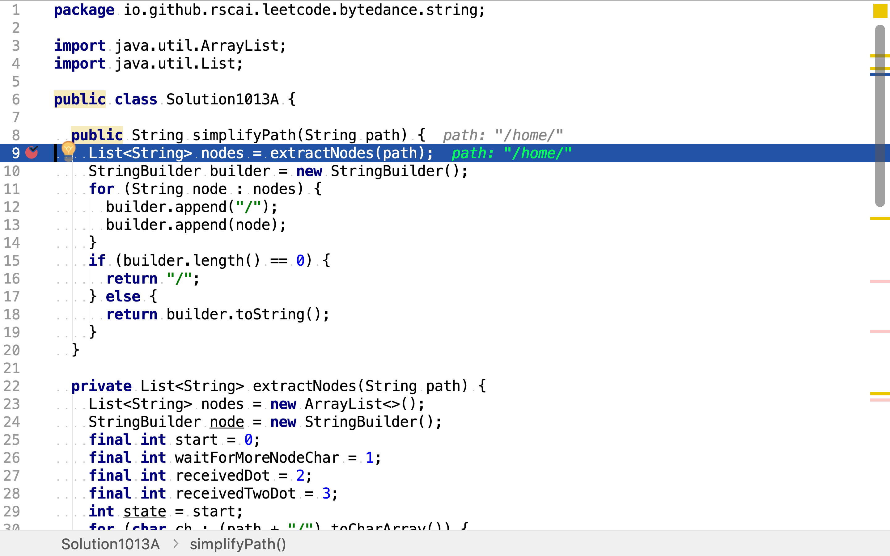
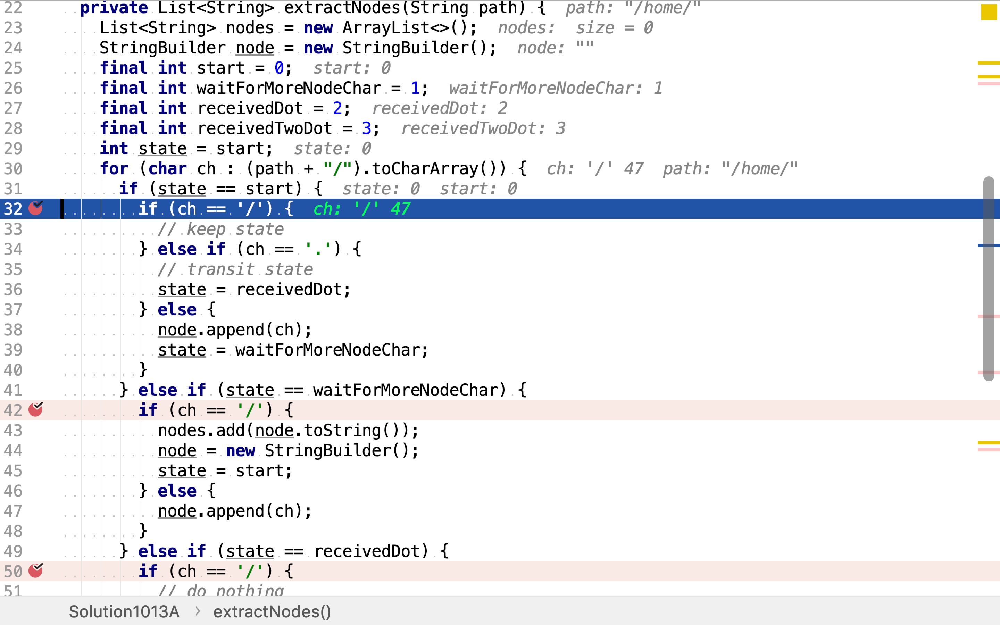
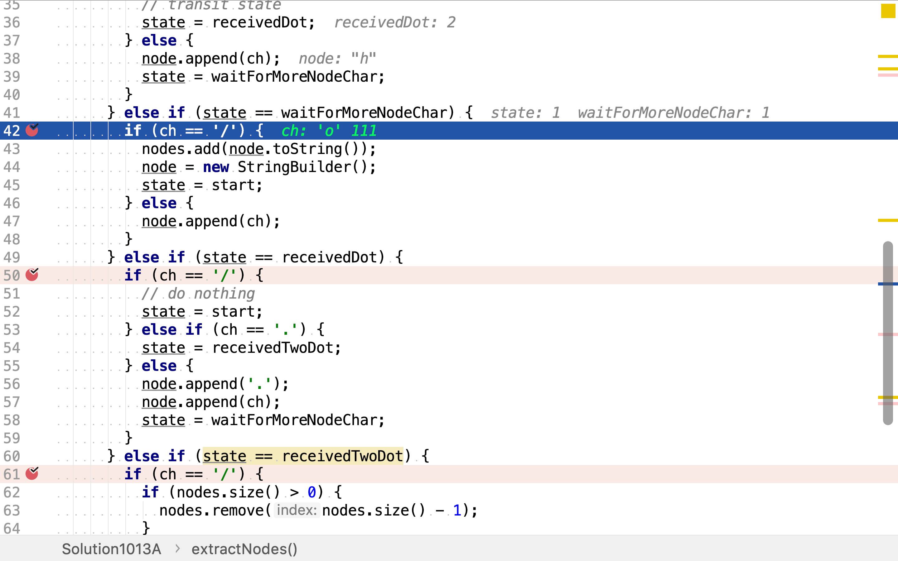
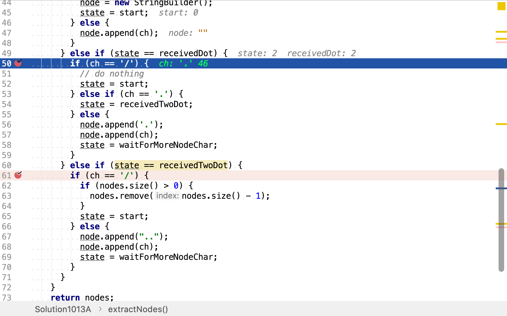

# 簡化路徑

## 題目

>以 Unix 風格給出一個文件的絕對路徑，你需要簡化它。或者換句話說，將其轉換為規範路徑。
>
>在Unix 風格的文件系統中，一個點（`.`）表示當前目錄本身；此外，兩個點（`..`） 表示將目錄切換到上一級（指向父目錄）；兩者都可以是複雜相對路徑的組成部分。更多信息請參閱：Linux / Unix中的絕對路徑 vs 相對路徑
>
>請注意，返回的規範路徑必須始終以斜杠 / 開頭，並且兩個目錄名之間必須只有一個斜杠 /。最後一個目錄名（如果存在）不能以 / 結尾。此外，規範路徑必須是表示絕對路徑的最短字符串。
>
>**示例 1：**
>
>```
>輸入："/home/"
>輸出："/home"
>解釋：注意，最後一個目錄名後面沒有斜杠。
>```
>
>**示例 2：**
>
>```
>輸入："/../"
>輸出："/"
>解釋：從根目錄向上一級是不可行的，因為根是你可以到達的最高級。
>```
>
>**示例 3：**
>
>```
>輸入："/home//foo/"
>輸出："/home/foo"
>解釋：在規範路徑中，多個連續斜杠需要用一個斜杠替換。
>```
>
>**示例 4：**
>
>```
>輸入："/a/./b/../../c/"
>輸出："/c"
>```
>
>**示例 5：**
>
>```
>輸入："/a/../../b/../c//.//"
>輸出："/c"
>```
>
>**示例 6：**
>
>```
>輸入："/a//b////c/d//././/.."
>輸出："/a/b/c"
>```

## 確定有限狀態機法

使用「確定有限狀態機」將路徑中的各級節點解析出來，再重新構造簡化的路徑。



定義,

* 非空有限狀態集合`{start, waitForMoreNodeChar, receivedDot, receivedTwoDot}`
* 輸入字母表`{'/','.',其它}`
* 轉移函數

|        |'/'|'.'|其它
|--------|---|---|----
|start   |start|receivedDot|waitForMoreNodeChar
|waitForMoreNodeChar|start|waitForMoreNodeChar|waitForMoreNodeChar
|receivedDot|start|receivedTwoDot|waitForMoreNodeChar
|receivedTwoDot|start|waitForMoreNodeChar|waitForMoreNodeChar

* 開始狀態`start`
* 接受狀態集合`{start}`

### 代碼實現

[include](../../../src/main/java/io/github/rscai/leetcode/bytedance/string/Solution1013A.java)

先將路徑中的節點都解柝出來，再重新構造簡化的路徑。



路徑解柝使用確定有限狀態機實現。其初始狀態為`start`，當：

* 遇到'/'時，無動作，無狀態轉移
* 遇到'.'時，轉移至狀態`receivedDot`
* 遇到其它字符時，將字符存入`node`緩存，並轉移狀態至`waitForMoreNodeChar`



處於狀態`waitForMoreNodeChar`，當：

* 遇到'/'時，輪出`node`中的緩存的字符為一個新的`node`，並轉移狀態至`start`
* 遇到其它字符時，則將其存入`node`



處於狀態`receivedDot`，當：

* 遇到'/'時，轉移狀態至`start`
* 遇到'.'時，轉移狀態至qreceivedTwoDot`
* 遇到其它字符，則將之前收到的'.'及當前收到的字符存入`node`，並轉移狀態至`waitForMoreNodeChar`



處於狀態`receivedTwoDot`，當：

* 遇到'/'，則移除最後一個已解柝出的節點
* 遇到其它字符，則將之前收到的兩個'.'及當前收到字符一併加入`node`，並轉移狀態至`waitForMoreNodeChar`

[debug-A5](p1013.figure/debug-A5.png)

### 複雜度分析

#### 時間複雜度

`extractNodes`只遍歷了一遍`path`，時間複雜度為$$\mathcal{O}(n)$$。

#### 空間複雜度

使用了變量`nodes, builder`，其最大佔空間都為n。所以空間複雜度為$$\mathcal{O}(n)$$。

