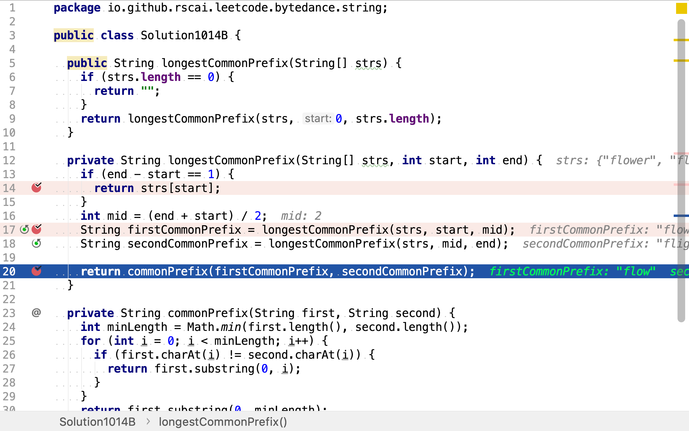

# 最長公共前綴

## 題目

>編寫一個函數來查找字符串數組中的最長公共前綴。
>
>如果不存在公共前綴，返回空字符串 ""。
>
>**示例 1:**
>
>```
>輸入: ["flower","flow","flight"]
>輸出: "fl"
>```
>
>**示例 2:**
>
>```
>輸入: ["dog","racecar","car"]
>輸出: ""
>解釋: 輸入不存在公共前綴。
>```
>
>說明:
>
>所有輸入只包含小寫字母 a-z 。

## 逐列掃描法

把字符串水平放罝並堆疊起來，得到一個行列表。

```plantuml
graph g {
    a [shape=record, label="<h>a0|a1|a2|...|an"]
    b [shape=record, label="<h>b0|b1|b2|...|bn"]
    c [shape=record, label="<h>c0|c1|c2|...|cn"]
    a:h -- b:h -- c:h [style=invis]
}
```

從左往右逐一掃描，當遇到值不相同列時，從頭到該列前一列組成的子串即是最長公共前綴。

舉個例子，給定三個字符串`["flower","flow","flight"]`。將字符中水平放置並堆疊起來，得到：

```plantuml
graph h {
    a [shape=record, label="<h>f|l|o|w|e|r"]
    b [shape=record, label="<h>f|l|o|w"]
    c [shape=record, label="<h>f|l|i|g|h|t"]
    a:h -- b:h -- c:h [style=invis]
}
```

從左往右逐列掃描。第一列中，三個字符串的字符都相同。

```plantuml
graph h {
    a [shape=record, label="<h>f|l|o|w|e|r"]
    b [shape=record, label="<h>f|l|o|w"]
    c [shape=record, label="<h>f|l|i|g|h|t"]
    a:h -- b:h -- c:h [style=invis]
    a:h -- b:h -- c:h [style=dotted,label="="]
}
```

第二列中，三個字符串的字符也都相同。

```plantuml
graph h {
    a [shape=record, label="<h>f|<b>l|o|w|e|r"]
    b [shape=record, label="<h>f|<b>l|o|w"]
    c [shape=record, label="<h>f|<b>l|i|g|h|t"]
    a:h -- b:h -- c:h [style=invis]
    a:h -- b:h -- c:h [style=dotted,label="="]
    a:b -- b:b -- c:b [style=dotted,label="="]
}
```

第三列中，三個字符串的字符不相同。

```plantuml
graph h {
    a [shape=record, label="<h>f|<b>l|<c>o|w|e|r"]
    b [shape=record, label="<h>f|<b>l|<c>o|w"]
    c [shape=record, label="<h>f|<b>l|<c>i|g|h|t"]
    a:h -- b:h -- c:h [style=invis]
    a:h -- b:h -- c:h [style=dotted,label="="]
    a:b -- b:b -- c:b [style=dotted,label="="]
    a:c -- b:c [style=dotted, label="="]
    b:c -- c:c [style=dotted, label="!="]
}
```

所以，最長公共前綴是從頭開始至第二列的子串`fl`。

### 代碼實現

[include](../../../src/main/java/io/github/rscai/leetcode/bytedance/string/Solution1014A.java)

如果輸入的字符串數量是零，則最長公共前綴就是空串。


從頭往後逐列掃描


當遇到第一列字符不相同的列時，就可確定最長公共前綴了：


### 複雜度分析

#### 時間複雜度

最壞情況下，所有字符中都是相同的，則本演算法要遍歷所有字符串中的所有字符。設所有字符串中字符數量和為$$n$$，則時間複雜度為$$\mathcal{O}(n)$$。

#### 空間複雜度

只使用了兩個變量`i, ch`，所以空間複雜度為$$\mathcal{O}(1)$$。

## 分治法

>在電腦科學中，分治法是建基於多項分支遞迴的一種很重要的演算法範式。字面上的解釋是「分而治之」，就是把一個複雜的問題分成兩個或更多的相同或相似的子問題，直到最後子問題可以簡單的直接求解，原問題的解即子問題的解的合併。
>
>這個技巧是很多高效演算法的基礎，如排序演算法（快速排序、合併排序）、傅立葉變換（快速傅立葉變換）。
>
另一方面，理解及設計分治法演算法的能力需要一定時間去掌握。正如以歸納法去證明一個理論，為了使遞迴能夠推行，很多時候需要用一個較為概括或複雜的問題去取代原有問題。而且並沒有一個系統性的方法去適當地概括問題。
>
>分治法這個名稱有時亦會用於將問題簡化為只有一個細問題的演算法，例如用於在已排序的列中尋找其中一項的折半搜尋演算法（或是在數值分析中類似的勘根演算法）。這些演算法比一般的分治演算法更能有效地執行。其中，假如演算法使用尾部遞迴的話，便能轉換成簡單的迴圈。但在這廣義之下，所有使用遞迴或迴圈的演算法均被視作「分治演算法」。因此，有些作者考慮「分治法」這個名稱應只用於每個有最少兩個子問題的演算法。而只有一個子問題的曾被建議使用減治法這個名稱。
>
>分治演算法通常以數學歸納法來驗證。而它的計算成本則多數以解遞迴關係式來判定。
>
>### 優勢
>
>#### 解決困難問題
>
>分治演算法是一個解決複雜問題的好工具，它可以把問題分解成若干個子問題，把子問題逐個解決，再組合到一起形成大問題的答案。比如，漢諾塔問題如果採用分治演算法，可以把高度為n的塔的問題轉換成高度為n-1的塔來解決，如此重複，直至問題化簡到可以很容易的處理為止。
>
>### 實現
>
>#### 迴圈遞迴
>
>在每一層遞迴上都有三個步驟：
>
>1. 分解：將原問題分解為若干個規模較小，相對獨立，與原問題形式相同的子問題。
>2. 解決：若子問題規模較小且易於解決時，則直接解。否則，遞迴地解決各子問題。
>3. 合併：將各子問題的解合併為原問題的解。

舉個例子，給定四個字符串`["flower", "flow", "flexible", "flexion"]`。將其不斷一分為二，直至每一份只包含一個字符串。

```plantuml
digraph d {
    root [label="flower flow flexible flexion"]
    a [label="flower flow"]
    b [label="flexible flexion"]
    root -> a [label=divide]
    root -> b [label=divide]

    aa [label="flower"]
    ab [label="flow"]
    a -> aa [label=divide]
    a -> ab [label=divide]

    ba [label="flexible"]
    bb [label="flexion"]
    b -> ba [label=divide]
    b -> bb [label=divide]
}
```

然後，分別處理「治」每一份：

```plantuml
digraph d {
    root [label="flower flow flexible flexion"]
    a [label="flower flow"]
    b [label="flexible flexion"]
    root -> a [label=divide]
    root -> b [label=divide]

    aa [label="flower", style=filled, fillcolor=green]
    ab [label="flow", style=filled, fillcolor=green]
    a -> aa [label=divide]
    a -> ab [label=divide]

    ba [label="flexible", style=filled, fillcolor=green]
    bb [label="flexion", style=filled, fillcolor=green]
    b -> ba [label=divide]
    b -> bb [label=divide]
}
```

再然後，將每一小份的處理結果向上歸併。「最長公共前綴」問題的歸併就是取兩個字符串的最長公共前綴：

```plantuml
digraph d {
    root [label="fl", style=filled, fillcolor=green]
    a [label="flow", style=filled, fillcolor=green]
    b [label="flex", style=filled, fillcolor=green]
    root -> a [label=reduce, dir=back]
    root -> b [label=reduce, dir=back]

    aa [label="flower", style=filled, fillcolor=green]
    ab [label="flow", style=filled, fillcolor=green]
    a -> aa [label=reduce, dir=back]
    a -> ab [label=reduce, dir=back]

    ba [label="flexible", style=filled, fillcolor=green]
    bb [label="flexion", style=filled, fillcolor=green]
    b -> ba [label=reduce, dir=back]
    b -> bb [label=reduce, dir=back]
}
```

歸併到最後僅剩一個結果時，該結果就是所求解。

### 代碼實現

[include](../../../src/main/java/io/github/rscai/leetcode/bytedance/string/Solution1014B.java)

首先，使用二分法將字符串列表逐漸拆分，並計算拆分後的字符串的最長公共前綴。


當僅剩一條字符串時，停止拆分。一條字符串的最長公共前綴即其自身。



然後，歸併結果。兩組字符串各自最長公共前綴的最長公共前綴即所有字符串的最長公共前綴。


### 複雜度分析

#### 時間複雜度

假設輸入字符串數量為$$n$$，且每條字符串長度都是相同，為$$m$$。則二分樹的深度為$$\log n$$，共有$$\sum_{i=1}^{\log n - 1} \frac{n}{2^i}$$個內部節點，且每個內部節點對應一次「求兩條字符串最長公共前綴」的計算。「求兩條字符串最長公共前綴」使用「列掃描法」，時間複雜度為$$\mathcal{O}(m)$$。總體時間複雜度為：

$$
\begin{aligned}
C_{time} &= \sum_{i=1}^{\log n - 1} \frac{n}{2^i} \times \mathcal{O}(m) \\
&= n \times \mathcal{O}(m) \\
&= \mathcal{O}(nm)
\end{aligned}
$$

#### 空間複雜度

在二分樹中，最寛（最下）一層包含$$\log n$$個內部節點，即同時有$$\log n$$`longestCommonPrefix(String[] strs, int start, int end)`持有局部變量`mid, firstCommonPrefix, secondCommonPrefix`。空間複雜度為：

$$
\begin{aligned}
C_{space} &= \log n \times 3 \times m \\
&= \mathcal{O}(m \log n)
\end{aligned}
$$

其中，n為字符串數量，m為字符串長度。

## 參考

* [分治法](https://zh.wikipedia.org/wiki/分治法)