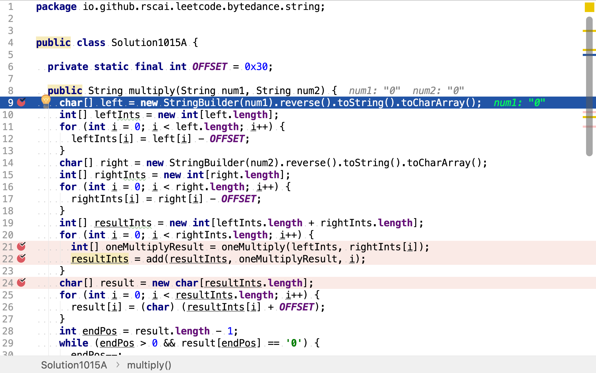
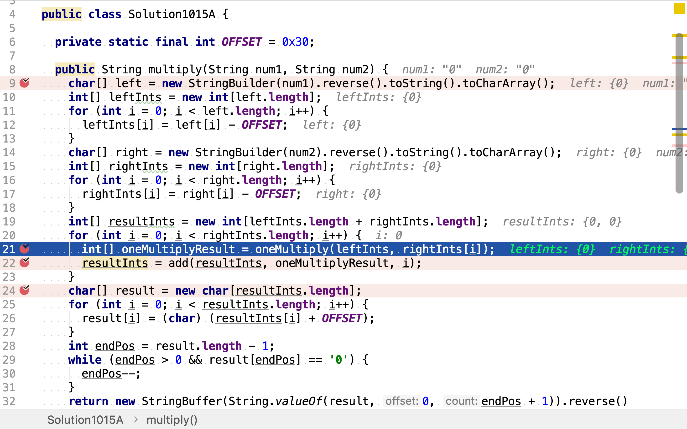
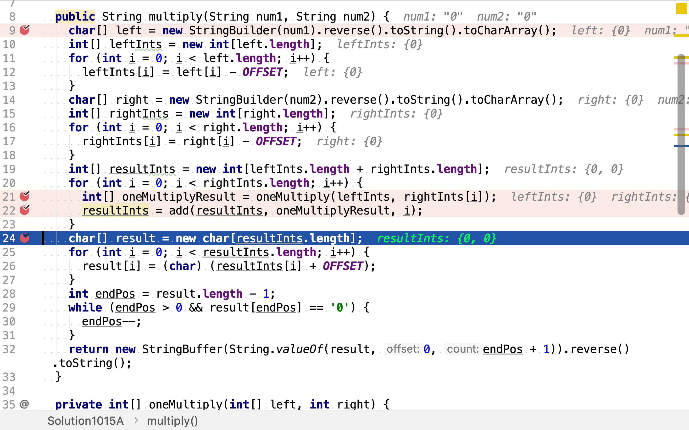
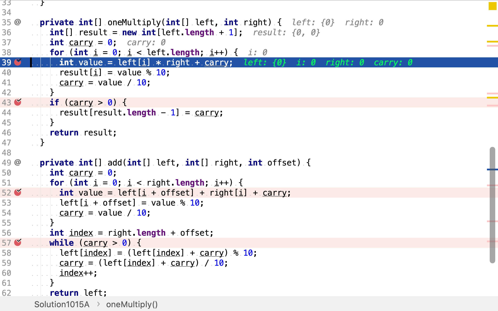
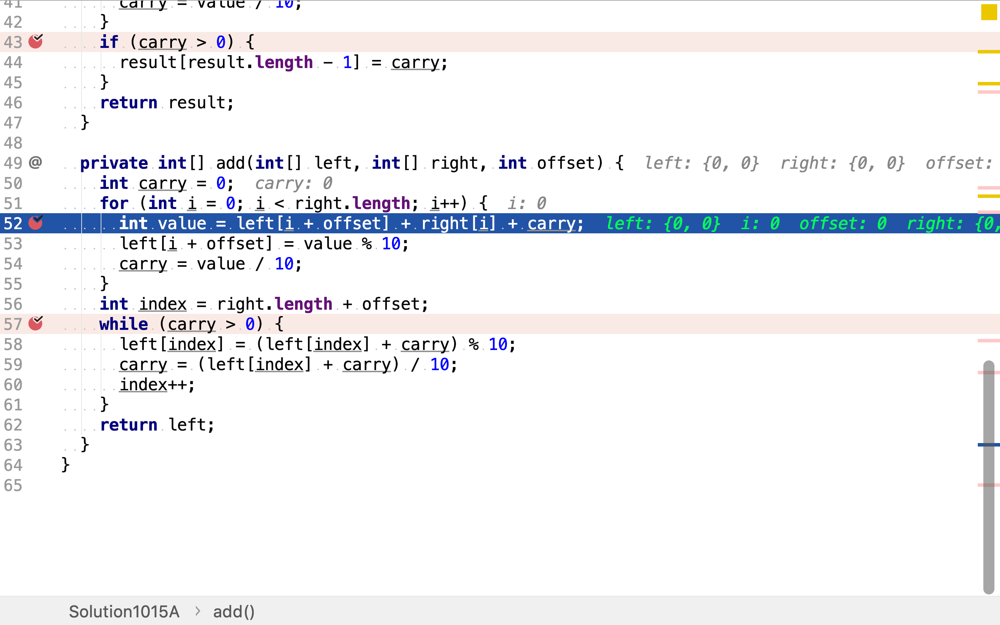

# 字符串相乘

## 題目

>給定兩個以字符串形式表示的非負整數 num1 和 num2，返回 num1 和 num2 的乘積，它們的乘積也表示為字符串形式。
>
>**示例 1:**
>
>```
>輸入: num1 = "2", num2 = "3"
>輸出: "6"
>```
>
>**示例 2:**
>
>```
>輸入: num1 = "123", num2 = "456"
>輸出: "56088"
>```
>
>说明：
>
>1. num1 和 num2 的长度小于110。
>2. num1 和 num2 只包含数字 0-9。
>3. num1 和 num2 均不以零开头，除非是数字 0 本身。
>4. 不能使用任何标准库的大数类型（比如 BigInteger）或直接将输入转换为整数来处理。

## 乘法分配律

>乘法分配律，也叫做乘法分配性質、十字相乘法或十字交乘法，公式是： $${\displaystyle (a+b)(c+d)=ac+ad+bc+bd}$$。
>
>### 基本驗證
>
>和平方可直接利用因式分解驗證。公式如下：
>
$$
\begin{aligned}
(a+b)(c+d) &=a(c+d)+b(c+d) \\
&=ac+ad+bc+bd
\end{aligned}
$$

### 代碼實現

[include](../../../src/main/java/io/github/rscai/leetcode/bytedance/string/Solution1015A.java)

先將字串表示的整數轉化為整型數組並反序存儲。乘法和加法都要考慮進位，從低位往高位處理會便於進位操作，所以將反序存儲。



然後，應用「秉法分配律」將第二個乘數拆解為多個整數相加的多項式，再用多項式中的每一項分別乘第一個乘數。將得到的結果再累加起來。



最後，再加整數數組形式的結果轉化為字符串形式。



用一位整數乘多位整數時，用一位整數逐位乘多位整數中的每一位，若值大於10則進位，模10後的結果為當前位的結果。



累加單項乘結果是要考慮級數和進位。



### 複雜度分析

#### 時間複雜度

假設兩個乘數位數都是n，則需執行n次`oneMultiply`和`add`。每次`oneMultiply`需用一位整數去乘第一個n位乘數中的每一位。每次`add`都需逐次累加n位整數的每一位。所以，整體時間複雜度為$$\mathcal{O}(n^2)$$。

#### 空間複雜度

空間複雜度為$$\mathcal{O}(n)$$。

## 參考

* [乘法分配律](https://zh.wikipedia.org/wiki/乘法分配律)