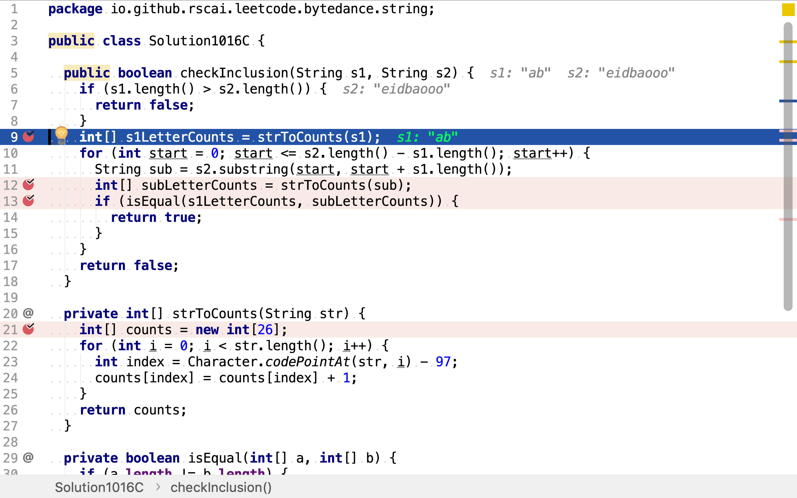

# 字符串的排列

## 題目

>給定兩個字符串 s1 和 s2，寫一個函數來判斷 s2 是否包含 s1 的排列。
>
>換句話說，第一個字符串的排列之一是第二個字符串的子串。
>
>**示例1:**
>
>```
>輸入: s1 = "ab" s2 = "eidbaooo"
>輸出: True
>解釋: s2 包含 s1 的排列之一 ("ba").
>```
>
>**示例2:**
>
>```
>輸入: s1= "ab" s2 = "eidboaoo"
>輸出: False
>```
>
>**注意：**
>
>1.輸入的字符串只包含小寫字母
>2.兩個字符串的長度都在 [1, 10,000] 之間

## 枚舉法

首先，羅列第一條字符串中字符的所有排列，再逐一檢測是否被第二條字符串包含。

羅列所有排列可以遞歸的形式描述為：

* 從有序序列中取出一個元素，再求由剩餘元素組成的所有排列
* 將第一個元素分別拼接剩餘元素的所有排列

舉個例子，給定字符串`abc`。排列中的第一個元素有三種選擇`a, b, c`。當選擇`a`時，剩餘元素為`b, c`；當選擇`b`時，剩餘元素為`a, c`；當選擇`c`時，剩餘元素為`a, b`。依此類推，當從剩餘元素`b, c`中選取排列中第二個元素時有兩種選擇`b, c`。當選擇`b`時，剩餘元素`c`；當選擇`c`時，剩餘`b`。

從根節點到葉子節點的路徑即是一種排列。

```plantuml
digraph d {
    root [label=""]
    a [label="a, [b, c]"]
    b [label="b, [a, c]"]
    c [label="c, [a, b]"]
    root -> a
    root -> b
    root -> c

    aa [label="b, [c]"]
    ab [label="c, [b]"]
    a -> aa
    a -> ab
    aaa [label="c,[]"]
    aa -> aaa
    aba [lable="b, []"]
    ab -> aba

    ba [label="a, [c]"]
    bb [label="c, [a]"]
    b -> ba
    b -> bb
    baa [label="c, []"]
    ba -> baa
    bba [label="a, []"]
    bb -> bba

    ca [label="a, [b]"]
    cb [label="b, [a]"]
    c -> ca
    c -> cb
    caa [label="b, []"]
    ca -> caa
    cba [label="a, []"]
    cb -> cba
}
```

### 代碼實現

[include](../../../src/main/java/io/github/rscai/leetcode/bytedance/string/Solution1016A.java)

羅列所有排列，再逐一檢測是否被第二條字符串包含。


「羅列所有排列」以遞歸的方式實現。先羅列第一個字符的所有可能，


再羅列剩餘字符的所有排列，最後再將第一個字符的所有可能和剩餘字符所有排列作全組合，就得到所有排列。


遞歸終止條件為剩餘字符為空。


### 複雜度分析

#### 時間複雜度

排列數量公式為:

$$
P(n,r) = \frac{n!}{(n-r)!}
$$

本演算法使用`String.contains`檢測試是否包含，`String.contains`的時間複雜度為$$\mathcal{O}(n)$$。所以整體時間複雜度為$$\mathcal{O}(n!)$$。

#### 空間複雜度

其要先羅列所有排列，再逐一檢測。所以空間複雜度為$$\mathcal{O}(n!)$$。

## 迴溯法



當一個字符串不包含另一個字符串時，以別一個字符串為前綴的任意字符串都不被該字符所包含。

舉個例子，給定字符串`abc`。假如另一個字符串S不包含`a`，則其一定不包含以`a`開始任何字串。也就是說，在羅列排列時，如點發現目標字符串不包含排列的開始部份，則無需再羅列或檢測其餘拥有相同開始部份的排列。

```plantuml
digraph d {
    root [label=""]
    a [label="a, [b, c]"]
    b [label="b, [a, c]"]
    c [label="c, [a, b]"]
    root -> a
    root -> b
    root -> c

    aa [label="b, [c]"]
    ab [label="c, [b]"]
    a -> aa
    a -> ab
    aaa [label="c,[]"]
    aa -> aaa
    aba [lable="b, []"]
    ab -> aba

    ba [label="a, [c]"]
    bb [label="c, [a]"]
    b -> ba
    b -> bb
    baa [label="c, []"]
    ba -> baa
    bba [label="a, []"]
    bb -> bba

    ca [label="a, [b]"]
    cb [label="b, [a]"]
    c -> ca
    c -> cb
    caa [label="b, []"]
    ca -> caa
    cba [label="a, []"]
    cb -> cba
}
```

### 代碼實現

[include](../../../src/main/java/io/github/rscai/leetcode/bytedance/string/Solution1016B.java)

回溯法與枚舉法大體相同，只是在每一個節點探索時都判斷從根至當前節點的路徑構成的部份解是否違反條件約束。若部份解已違返約束，則無需再探索由此部份解組成的其餘完整解了。


## 字符數量比較法

重新審題，「s2包含s1的任一排列」可以轉換為「s2的任一子串與s1包含相同字符集合相同且每個字符出現的次數也相同」。若要兩個字符串包含字符集合相同且字符出現的次數相同，則兩個字符串長度必相同。所以，問題就轉化為：s2是否包含長度等於s1的長度，且字符集合與s1相同，且字符出現次數與s1相同。

至此，只需要羅列s2中長度與s1相同的子串，計算子串和s1中字符出現次數並比較。

羅列一個字符串所有指定長度的子串其實就是羅列子串開始位罝。假設字符串長度為m，子串長度為n，則子串數量為`m-n+1`。

舉個例子，給定s1`ab`,s2`eidbaooo`。則s2長度為2的子串為：

* `ei`
* `id`
* `db`
* `ba`
* `ao`
* `oo`
* `oo`

### 代碼實現

[include](../../../src/main/java/io/github/rscai/leetcode/bytedance/string/Solution1016C.java)

計算s1中字符出現次數。



然後，羅列所有長度等於s1的子串，並計算字符出現次數。


最後，比較s1與子串字符出現次數是否相同。若字符出現次數相同，則一定能排列出相同的字符串。


小寫英文字母的ANSII或UNICODE編碼都是連續的，所以可以用連續的長度為26的數組存儲字符出現次數。


### 複雜度分析

#### 時間複雜度

假設s1長度為m，s2長度為n。s2中長度為m的子串數量為`n-m+1`。

$$
\begin{aligned}
C_{time} &= strToCounts(m) + (n-m+1) \times strToCounts(m) + isEqual(26 \times 2) \\
&= \mathcal{O}(m) + \mathcal{O}(m(n-m+1)) + \mathcal{O}(52) \\
&=\mathcal{O}(n^2)
\end{aligned}
$$

#### 空間複雜度

使用了兩個長度為26的數組`s1LetterCounts, subLetterCounts`和長度為s1長度的`sub`。空間複雜度為$$\mathcal{O}(n)$$。

## 滑動窗口

上述「字符數量比較法」中，s2中長度跟s1相等的子串，相鄰的相差僅有兩個字符。所以，在計算子串中字符出現次數時，無需遍歷整個子串，而僅需在前一個子串的字符出現次數結果中加減各一次。

舉個例子，給定s1`ab`,s2`eidbaooo`。則s2長度為2的子串為：

* `ei`
* `id`
* `db`
* `ba`
* `ao`
* `oo`
* `oo`

假設已得到子串`ei`的字符出現次數字典`mapA`，下一個子串`id`相較與`ei`，減少了一個`e`且增加了一個`d`。以`mapA`為基礎，將`e`的計數減一，將`d`的計數加一，即得到了子串`id`的字符出現次數字典`mapB`。依此類推，子串`db`的出現次數字典可以在`mapB`的基礎上，將`i`計數減一，將`b`計數加一得到。

### 代碼實現

[include](../../../src/main/java/io/github/rscai/leetcode/bytedance/string/Solution1016D.java)

先計算第一個子串中字符出現次數，並比較是否與s1的相同。


再依次以消減一個字符計數和增加一個字符計數的方式計算後續子串的字符出現次數，並比較是否與s1的相同。


### 複雜度分析

#### 時間複雜度

本演算法只遍歷了第一個子串，求得字符出現次數。其餘子串的字符出現次數都是通過一次加、一次減求得的。所以時間複雜度為$$\mathcal{O}(n)$$。

#### 空間複雜度

與上述「字符數量比較法」相同，為$$\mathcal{O}(n)$$。
