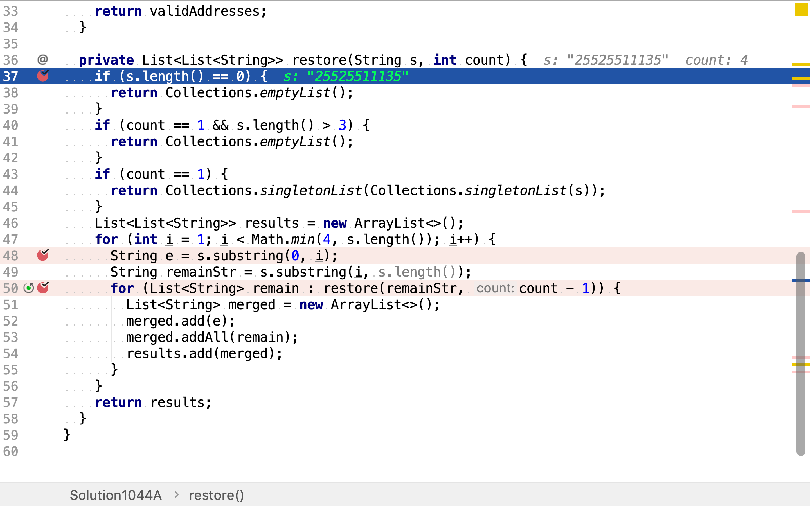

# 復原IP地址

## 題目

>給定一個只包含數字的字符串，復原它並返回所有可能的 IP 地址格式。
>
>**示例:**
>
>```
>輸入: "25525511135"
>輸出: ["255.255.11.135", "255.255.111.35"]
>```

## 枚舉法

IP地址有四段組成，每一段都是0至255的整數。使用枚舉法將字符串拆分為四個長度介於1和3之間的字符串，再校驗每一段是否有效。

舉個例子，給定字符串`010010`。將其拆分組合以深度為4的樹展示：

```plantuml
digraph d {
    root [label=""]
    a [label=0]
    b [label=01]
    c [label=010]
    root -> a
    root -> b
    root -> c

    aa [label=1]
    ab [label=10]
    ac [label=100]
    a -> aa
    a -> ab
    a -> ac

    aaa [label=0]
    aab [label=00]
    aac [label=001]
    aa -> aaa
    aa -> aab
    aa -> aac

    aaaa [label=010]
    aaa -> aaaa
    aaba [label=10]
    aab -> aaba
    aaca [label=0]
    aac -> aaca

    aba [label=0]
    abb [label=01]
    abc [label=010]
    ab -> aba
    ab -> abb
    ab -> abc

    abaa [label=10]
    aba -> abaa
    abba [label=0]
    abb -> abba

    aca [label=1]
    acb [label=10]
    ac -> aca
    ac -> acb
    acaa [label=0]
    aca -> acaa

    ba [label=0]
    bb [label=00]
    bc [label=001]
    b -> ba
    b -> bb
    b -> bc

    baa [label=0]
    bab [label=01]
    ba -> baa
    ba -> bab

    baaa [label=10]
    baa -> baaa
    baba [label=0]
    bab -> baba
    
    bba [label=1]
    bbb [label=10]
    bb -> bba
    bb -> bbb
    bbaa [label=0]
    bba -> bbaa

    bca [label=0]
    bc -> bca

    ca [label=0]
    cb [label=01]
    cc [label=010]
    c -> ca
    c -> cb
    c -> cc
    
    caa [label=1]
    cab [label=10]
    ca -> caa
    ca -> cab
    caaa [label=0]
    caa -> caaa

    cba [label=0]
    cb -> cba
}
```

從根節點到第四層節點之間的路徑就是一種將字符串分為四段三位以內整數的分法。

### 代碼實現

[include](../../../src/main/java/io/github/rscai/leetcode/bytedance/string/Solution1044A.java)

首先，羅列出從字符串中解出四個三位以內整數的所有組合。


然後，過濾不符合要求的組合。IP地址每一段都是0至255之間的整數，且除了0之外所有整數的最高位都不是`0`。


最後，再把所有地址格式成題目要求的格式。


從字符串中解出四個整數所有組合使用遞歸方式實現。先從字符串中解出一個整數，


再從剩餘字符串解出其餘的整數，並拼接在一起


遞歸的終止條件有：

1. 剩餘字符串為空
2. 其餘整數個數為1且剩餘字符串長度大於3
3. 剩餘整數個數為1



### 複雜度分析

#### 時間複雜度

IP中四段整數最大的組合數量為$$3^4$$。因為輸入字符串的長度上限固定為12，所以時間複雜度為$$\mathcal{O}(1)$$。

#### 空間複雜度

空間複雜度為$$\mathcal{O}(1)$$。

## 回溯法

上述枚舉法可以通過回溯法優化。羅列字符串拆解為四個整數的組合可以建模為深度優先遍歷樹。當四整數組合的一部不滿足IP地址規格約束時，就可以判定整個組合不滿足約束。映射到樹遍歷模型，就是當發現從根到葉子節點路徑的一部份不滿足解的要求，則以這段路徑為一部份其它所有路徑都是不滿足解要求的。

舉個例子，給定字符串`010010`。當第一個整數解出為`01`時，就可以判定`01`不是一個正确的整數形式（除了0之外的整數，最高位都不是`0`）。所以`01`以下的子樹都無需遍歷了。

```plantuml
digraph d {
    root [label=""]
    a [label=0]
    b [label=01, style=filled, fillcolor=red]
    c [label=010]
    root -> a
    root -> b
    root -> c

    aa [label=1]
    ab [label=10]
    ac [label=100]
    a -> aa
    a -> ab
    a -> ac

    aaa [label=0]
    aab [label=00]
    aac [label=001]
    aa -> aaa
    aa -> aab
    aa -> aac

    aaaa [label=010]
    aaa -> aaaa
    aaba [label=10]
    aab -> aaba
    aaca [label=0]
    aac -> aaca

    aba [label=0]
    abb [label=01]
    abc [label=010]
    ab -> aba
    ab -> abb
    ab -> abc

    abaa [label=10]
    aba -> abaa
    abba [label=0]
    abb -> abba

    aca [label=1]
    acb [label=10]
    ac -> aca
    ac -> acb
    acaa [label=0]
    aca -> acaa

    ba [label=0, style=filled, fillcolor=grey]
    bb [label=00, style=filled, fillcolor=grey]
    bc [label=001, style=filled, fillcolor=grey]
    b -> ba
    b -> bb
    b -> bc

    baa [label=0, style=filled, fillcolor=grey]
    bab [label=01, style=filled, fillcolor=grey]
    ba -> baa
    ba -> bab

    baaa [label=10, style=filled, fillcolor=grey]
    baa -> baaa
    baba [label=0, style=filled, fillcolor=grey]
    bab -> baba
    
    bba [label=1, style=filled, fillcolor=grey]
    bbb [label=10, style=filled, fillcolor=grey]
    bb -> bba
    bb -> bbb
    bbaa [label=0, style=filled, fillcolor=grey]
    bba -> bbaa

    bca [label=0, style=filled, fillcolor=grey]
    bc -> bca

    ca [label=0]
    cb [label=01]
    cc [label=010]
    c -> ca
    c -> cb
    c -> cc
    
    caa [label=1]
    cab [label=10]
    ca -> caa
    ca -> cab
    caaa [label=0]
    caa -> caaa

    cba [label=0]
    cb -> cba
}
```

### 代碼實現

[include](../../../src/main/java/io/github/rscai/leetcode/bytedance/string/Solution1044B.java)

回溯法的實現大體與枚舉法相同，只是在遞歸調用之前，判斷訖今為止的部份解是否已違反了解的約束。若是，則無需再探索以不合格部份解為共同部份的解。


### 複雜度分析

#### 時間複雜度

因輸入數據量是常數，所以時間複雜度為常數$$\mathcal{O}(1)$$。

#### 空間複雜度

空間複雜度為$$\mathcal{O}(1)$$。
